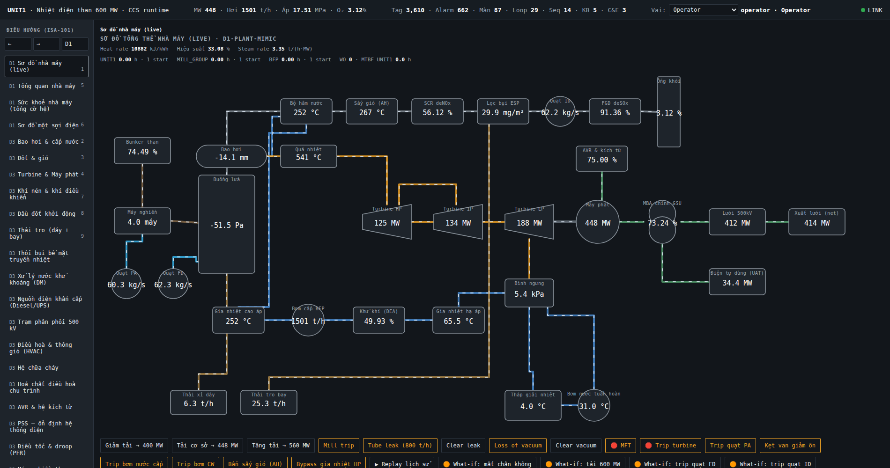
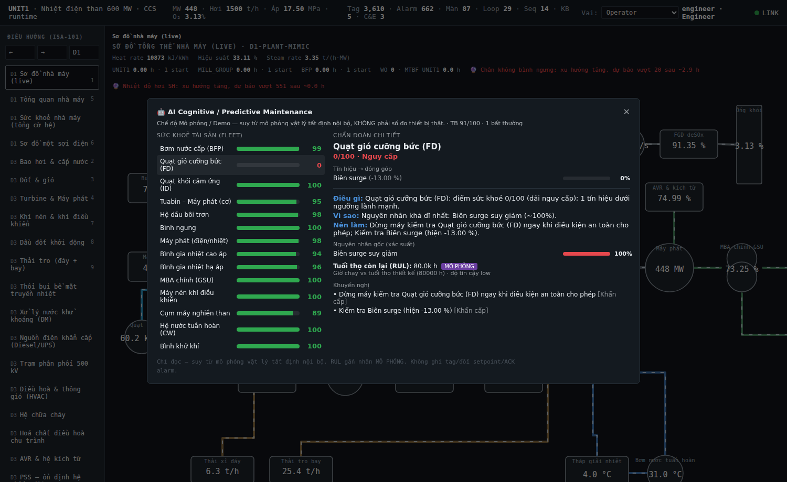
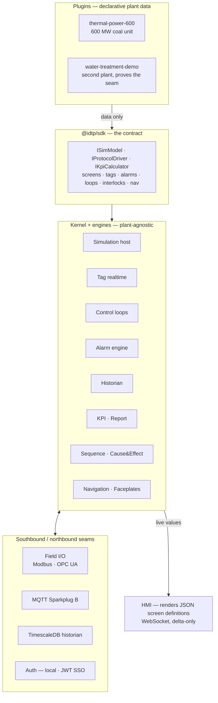

# IDTP — Industrial Digital Twin Platform

A **kernel + plugin** industrial digital twin. The kernel is a generic, plant-agnostic runtime;
every plant is just a plugin of declarative data. Plugin #1 is a full **600 MW subcritical, drum-type,
reheat coal-fired power unit** — simulated from coal on the belt to megawatts on the 500 kV bus.

**3,610 tags · 662 alarms · 150 HMI screens · 30 closed control loops · 48 physics models · 625 tests**



*The live plant mimic: coal → mills → furnace → drum → superheater → HP/IP/LP turbine → generator → GSU → 500 kV grid,
with the flue-gas path (SCR → ESP → ID fan → FGD → stack) and the condensate/feedwater loop closing underneath.
Every number is produced by a physics model, not a random number generator.*

---

## Why this exists

Most "digital twin" demos are a dashboard wired to fake data. This one is built the other way round:

1. **The physics comes first.** 48 simulation models compute a closed plant-wide mass and energy balance.
   Burn more coal → more steam → more MW → more flue gas → hotter stack → worse heat rate. Every screen
   reads from that one physical truth.
2. **The kernel knows nothing about power plants.** Screens, tags, alarms, control loops, interlocks and
   navigation are all *declarative data* shipped by a plugin. Adding a second plant means adding a plugin —
   not editing the kernel. A second plugin (`water-treatment-demo`) exists to prove the seam holds.
3. **It behaves like a real control system.** ISA-18.2 alarm state machines with deadband and delay,
   ISA-101 screen conventions, ISA-95 asset hierarchy, RBAC with two-step confirmation and an audit trail
   on every write, and an operator training simulator (freeze, snapshot/restore, malfunction injection).

## What you can do with it

| | |
|---|---|
| **Operate** | Change unit load, switch loops between MAN / AUTO / CASCADE, acknowledge and shelve alarms — all gated by role, confirmed twice, and written to an audit journal. |
| **Train (OTS)** | Freeze the sim, take a snapshot, inject a malfunction (boiler tube leak, loss of condenser vacuum, mill trip, fan surge, stuck attemperator), then restore and try again. |
| **Investigate** | Historian with replay, trend charts, sequence-of-events log, Cause & Effect matrices for Master Fuel Trip and turbine trip, live SFC sequences. |
| **Diagnose** | Rule-based asset health and predictive maintenance across 18 assets, with a WHAT / WHY / HOW explanation for every finding. |
| **Report** | Shift reports and plant KPIs (heat rate, efficiency, steam rate, availability), exportable to CSV and PDF. |



*Cognitive maintenance. Note the labelling: **Simulation / Demo mode**, **read-only**, and the RUL figure explicitly
tagged as simulated. The advisory layer can never write a tag, change a setpoint, or acknowledge an alarm.*

---

## Architecture



**The rule that makes it work:** a plugin may never contain kernel logic, and the kernel may never know
a plugin's name. Plugins import `@idtp/sdk` and nothing else. Screens are JSON documents rendered by a
generic renderer — there is no plant-specific React component anywhere in the codebase.

### Engineering constraints held throughout

- **No `Math.random()` in the process path.** Every process value traces back to a deterministic model, so
  snapshot → restore → replay reproduces exactly. Simulation time comes from a time service, never `Date.now()`.
- **Advisory layers are strictly read-only.** Diagnostics and predictive maintenance can recommend; they can
  never write a tag, move a setpoint, or acknowledge an alarm.
- **Every alarm has deadband and delay** (EEMUA 191 anti-chattering); every write command has RBAC,
  two-step confirmation, and an audit record.
- **Numbers are sourced or flagged.** Anything not traceable to the 600 MW design basis is marked as an
  explicit assumption and registered in [`docs/25-assumptions-open-issues.md`](docs/25-assumptions-open-issues.md).
- **Disconnected external adapters never fabricate data.** The field I/O, SSO and third-party integration
  seams are shipped disconnected by default; when unconfigured they refuse cleanly instead of inventing values.

---

## Quick start

Requires **Node ≥ 20** and **pnpm 9.7.0**.

```bash
corepack enable            # if you don't have pnpm

pnpm install
pnpm --filter @idtp/app-thermal-runtime serve
```

Open **http://localhost:8080**. The simulation, control loops, alarm engine and WebSocket all run on
that one port. Use a different port with `PORT=3010 pnpm --filter @idtp/app-thermal-runtime serve`.

The server signs you in as **Operator** on connect. Demo users (password `p`) cover all six RBAC roles:
`viewer` · `operator` · `supervisor` · `engineer` · `maint` · `admin`.

### No-install option

`docs/dashboard/twin.html` is a self-contained digital twin that runs entirely client-side — open the
file in a browser. The `apps/web-static` build produces the same HMI as a static site, running the real
runtime in-browser over an in-process bus rather than a WebSocket.

---

## What's inside

| Area | Scale |
|---|---|
| Tag registry | **3,610** tags across 18 ISA-95 cells, four scan classes (fast 435 · process 2,060 · slow 491 · diagnostic 624) |
| Alarms | **662** rationalized alarms, ISA-18.2 state machine, deadband + on/off delay, shelving, EEMUA priority distribution |
| HMI screens | **150** declarative screen definitions, multi-layer drill-down navigation |
| Simulation | **46** physics models for the thermal plant + **2** for the water plant |
| Control | **30** closed PID loops (cascade, feedforward, split-range, reverse-acting) |
| Sequences | **14** SFC sequences · **5** scenarios · **3** Cause & Effect matrices |
| Faceplates | **29** equipment faceplates with live trend |
| Historian | **484** recorded tags; in-memory by default, TimescaleDB optional (benchmarked ≥ 50,000 points/s) |
| Diagnostics | **18** assets under rule-based health scoring and predictive maintenance |
| Documentation | **36** design documents |

<details>
<summary><b>The 46 thermal simulation models</b></summary>

**Steam/water side —** boiler island · economizer & drum internals · drum swell/shrink · reheat cycle ·
feedwater train · feedwater drains · heater detail · regenerative balance · BFP cavitation & NPSH ·
condenser & circulating water · condenser performance · cooling tower · bypass & air removal ·
drum (reference model)

**Combustion & gas side —** flue gas & air · fan system · pulverizer mills · coal handling ·
ash handling · soot blower · fouling & air ingress · combustion optimisation · emissions ·
emissions control · CEMS (Hg/CO) · fuel oil

**Turbine & electrical —** turbine–generator · turbine thermal stress · exhaust hood · lube oil system ·
generator capability · ANSI protection relays · electrical · switchyard · AVR & excitation ·
PSS stabilizer · governor droop · AGC secondary control

**Balance of plant —** compressed air · water treatment · chemical dosing · emergency power · HVAC ·
fire fighting · plant balance · calibration

</details>

---

## Repository layout

```
packages/
  sdk/        # the plugin contract: types + interfaces only
  kernel/     # time service, plugin host
  engines/    # simulation host, tags, control loops, alarms, historian, KPI, nav, …
plugins/
  thermal-power-600/     # plugin #1 — the 600 MW unit
  water-treatment-demo/  # plugin #2 — proves the kernel is plant-agnostic
apps/
  thermal-runtime/   # server + HMI client (port 8080)
  water-runtime/     # second plant runtime (port 8090)
  web-static/        # static build — runtime in the browser
  walking-skeleton/  # minimal end-to-end reference
docs/                # design documents 00–27 + design basis + workflow
```

## Build and test

```bash
pnpm build      # TypeScript build, 9 packages
pnpm test       # vitest — 625 tests across 189 files
pnpm typecheck  # tsc --noEmit
```

CI runs the build and the full test suite on Node 20 and 22, plus a headless-Chromium end-to-end smoke
test of the HMI, on every push and pull request.

### Optional: TimescaleDB historian

```bash
docker compose up -d   # Timescale 2.17-pg16 — see docker-compose.yml and docs/benchmark.md
```

---

## Documentation

Design documents **00–27** live in [`docs/`](docs/): platform architecture, plugin contract, ISA-95 asset
model and UNS, tag standard, alarm philosophy, control narrative and Cause & Effect, simulation models,
HMI style guide, screen inventory, navigation model, database design, MQTT/UNS, API spec, IEC 62443
security, historian and replay, KPI and reporting, and the test plan.

Two are worth reading first:

- [`docs/annex-A-thermal-design-basis.md`](docs/annex-A-thermal-design-basis.md) — the 600 MW design basis
  every number in the simulation is anchored to.
- [`docs/WORKFLOW-SYSTEM-BUILD.md`](docs/WORKFLOW-SYSTEM-BUILD.md) — the engineering process used to build
  each plant system out to real-plant depth: research the real equipment, tabulate the gap against the twin,
  then design, build, self-audit and finish one system before starting the next.

---

## Scope — stated honestly

This is **v1**, and v1 is deliberately bounded:

- **Digital twin maturity is L1 (descriptive) + L2 (diagnostic).** In practice that makes it an operator
  training simulator and a virtual commissioning environment — not a predictive plant-optimisation product.
- **The AI layer is rule-based**, not a language model. Retrieval-augmented diagnostics are v2 work. The
  advisory layer is read-only by design and is labelled as simulated wherever it appears in the HMI.
- **It is not connected to a real plant.** The field I/O layer (Modbus TCP/RTU, OPC UA) exists as a working
  seam with a disconnected default; pointed at real hardware it would scan and write, but nothing here
  fabricates field data to look connected.

Design documents are written in Vietnamese; all code, identifiers and comments are in English.
