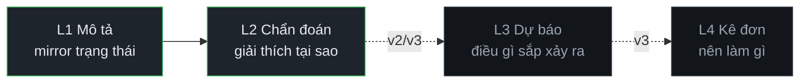
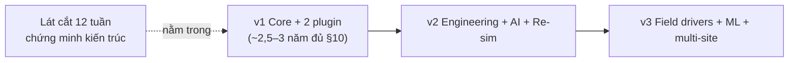

# 00 — Vision & Scope (Tầm nhìn & Phạm vi)

> Tài liệu #00 trong bộ 00–25 (`docs/00-master-prompt.md` §14). **Chuẩn hoá** nội dung §2 và các
> quyết định GIAI ĐOẠN 0 từ `docs/scope-reality-and-phase0.md`; từ đây doc 00 là **nguồn chốt**.
> Mọi số công sức là `[GIẢ ĐỊNH]` (không có trong Design Basis) → đăng ký `docs/25-assumptions-open-issues.md`.
> Ngôn ngữ: tiếng Việt, thuật ngữ kỹ thuật giữ tiếng Anh.

**Mục lục:** 1 Tuyên bố sản phẩm · 2 Luận điểm kiến trúc · 3 Định vị (DT/SCADA/OTS) ·
4 Công sức thực tế (§2.1) · 5 Không đạt PCS7/800xA (§2.2) · 6 Đạt/vượt (§2.3) ·
7 Phân phiên bản v1/v2/v3 · 8 Lát cắt 12 tuần · 9 Quyết định GIAI ĐOẠN 0 ·
10 Nghiệm thu plugin #1 · 11 Chỉ tiêu hiệu năng · 12 Quyết định kiến trúc & phương án loại bỏ ·
13 Giả định & vấn đề mở.

---

## 1. Tuyên bố sản phẩm — "cái gì" và "KHÔNG phải cái gì"

IDTP là **nền tảng Digital Twin công nghiệp kiến trúc kernel + plugin**: kernel cung cấp engine lõi
(tag, alarm, historian, graphics, sim, control, RBAC…); mỗi nhà máy là **một plugin dữ liệu khai báo**.
Plugin #1 = `thermal-power-600` (nhiệt điện than 600 MW subcritical, drum‑type, reheat).

| PHẢI là | KHÔNG phải |
|---|---|
| Giao diện CCR: P&ID sống, mật độ thông tin cao, không trang trí | IoT / business dashboard (card bo tròn, gradient, shadow, emoji) |
| Dữ liệu từ **process simulation có mô hình vật lý** | Demo tĩnh / `Math.random()` |
| Alarm · interlock · trip đúng nguyên lý nhà máy thật (ISA‑18.2, NFPA 85) | Hệ điều khiển thời gian thực **có chứng nhận** (SIL) |
| **SCADA‑style HMI + OTS engine** (virtual twin, chưa ghép tài sản vật lý) | DCS controller (PCS7/800xA cấp AS) |
| Kiến trúc production‑grade: thay Sim bằng OPC UA/Modbus **không sửa frontend** | Sản phẩm khoá cứng vào một giao thức/nhà cung cấp |

> **Loại trừ hẳn (§1 prompt cha):** I&C nhà máy điện hạt nhân (IEC 61513 / class 1E). Không tuyên
> bố năng lực, không sinh nội dung an toàn hạt nhân.

---

## 2. Luận điểm kiến trúc — "mọi nhà máy chỉ là một plugin"

Toàn bộ giá trị nền tảng đứng hay sập ở chỗ: plugin định nghĩa được bằng **dữ liệu khai báo + vài
interface**, không chứa logic kernel; kernel không biết tên plugin cụ thể.

| Quyết định | Chọn | Phương án đã loại bỏ | Lý do loại bỏ |
|---|---|---|---|
| Cấu trúc sản phẩm | **Kernel + plugin** | Ứng dụng monolith / nhà máy | Không nhân bản được sang nhà máy khác; mỗi dự án viết lại từ đầu |
| Màn hình process | **JSON khai báo, kernel render** | Component React hardcode | Không hot‑load, plugin phải chứa code UI → vỡ plugin contract |
| Nguồn dữ liệu process | **Simulation vật lý** | `Math.random()` | Không có swell/shrink, không kiểm chứng được vòng điều khiển |
| Cây thiết bị vs điều hướng | **Tách ISA‑95 ≠ ISA‑101**, có bảng N‑N | Gộp một cây | Trộn hai mối quan tâm; sai chuẩn Purdue/ISA‑95 |

---

## 3. Định vị hệ thống — Digital Twin / SCADA / OTS

**Digital Twin 4 mức, v1 = L1 + L2** (định nghĩa đầy đủ → doc 01):



Đây là **virtual twin** (chưa ghép cặp tài sản vật lý) → về bản chất là **Operator Training Simulator
(OTS) + Virtual Commissioning platform**.

| Khái niệm | Hệ này là | Hệ này KHÔNG là |
|---|---|---|
| **SCADA** | HMI kiểu SCADA (giám sát, hiển thị, alarm) | — |
| **DCS** | — | Controller thời gian thực có chứng nhận |
| **OTS** | Engine mô phỏng + malfunction injection + snapshot/restore | — |

---

## 4. §2.1 — Ước lượng công sức thực tế (person‑month) `[GIẢ ĐỊNH]`

Bottom‑up theo tầng (person‑month của **1 senior**, đúng độ sâu bộ 26 tài liệu):

| Tầng | PM | Trong v1? |
|---|---:|---|
| L1 Kernel (UNS · Asset · Plugin Loader · Config · Audit · Time) | 9 | ✔ |
| L2 Engines (12 engine) | 28 | ✔ (AI = rule‑based; Report designer → v2) |
| L0 Integration (MQTT v1 · OPC UA/Modbus/61850 v3) | 6 | 2 |
| L4 Presentation (Operator · Video Wall · Mobile v2 · Report viewer) | 5 | 4 |
| L5 Engineering (Screen/Tag Builder · Rationalizer · SDK — phần lớn v2) | 7 | 1 |
| Plugin #1 Thermal (40 hệ · 3.000 tag · sim · 70 màn hình · 600 alarm · 25 loop · 8 seq) | 18 | ✔ |
| Plugin #2 `water-treatment-demo` | 1 | ✔ |
| Cross‑cutting (loadgen · benchmark · CI · 26 docs · e2e) | 8 | ~5 |
| **TỔNG đầy đủ v1+v2+v3** | **~82** (75–95) | |
| **Riêng v1** (Core + thermal đủ §10 + plugin #2) | **~63** (60–70) | |

Quy đổi cho **1 người + AI** — giả định: 1 senior full‑time; hệ số AI `[GIẢ ĐỊNH]` **1,8–2,5×**
(cao ở scaffolding/schema/docs/test, **thấp** ở sim physics, alarm rationalization, control tuning,
kiến trúc); **không song song hoá**:

| Mốc | PM senior | ÷ AI (~2×) | Thời gian lịch solo |
|---|---:|---:|---|
| Đầy đủ v1+v2+v3 | ~82 | ~40 hiệu dụng | **~3–3,5 năm** |
| Riêng v1 (đủ §10) | ~63 | ~31 hiệu dụng | **~2,5–3 năm** |
| **Lát cắt 12 tuần** | — | ~6 hiệu dụng | **12 tuần** |

> **Kết luận thẳng:** §10 acceptance (40 hệ · 3.000 tag · 70 màn hình · 600 alarm) **không khả thi
> trong 12 tuần** với 1 người + AI (~2,5–3 năm solo). ⇒ **Lát cắt 12 tuần = chứng minh kiến trúc**,
> không phải v1 đầy đủ (xem §8).

---

## 5. §2.2 — KHÔNG đạt ngang PCS7 / 800xA trong v1 (không hứa)

| Hạng mục | PCS7 / 800xA | IDTP v1 | Vì sao |
|---|---|---|---|
| An toàn SIL 2/3 (IEC 61508/61511), F‑System | Có, chứng nhận TÜV | **Không** | IDTP read‑only, không phải hệ an toàn |
| Redundancy hot‑standby cấp controller (failover < ms) | Có | **Không** | Không có controller vật lý |
| Real‑time cứng ≤ 10 ms tại I/O, tất định | Có (RTOS/firmware) | **Không** (soft RT 250 ms–1 s) | Chạy Node/web |
| Hệ sinh thái driver phần cứng (ET200, Profibus/Profinet) | Có | v1 chỉ **Sim + MQTT** | OPC UA/Modbus/61850 thật = **v3** |
| Kiểm định FAT/SAT & installed base | Có track record | **Không** | Sản phẩm mới |
| Hậu mãi/spare 20 năm, service toàn cầu | Có | **Không** | Chưa có mạng lưới |
| MTBF/availability thực | Có số thực | **Không** | Chưa có dữ liệu vận hành thực |

---

## 6. §2.3 — Đạt hoặc VƯỢT PCS7 / 800xA (v1)

| Hạng mục | Lợi thế IDTP | So với legacy DCS |
|---|---|---|
| Web thin‑client zero‑install | Mở màn hình mọi thiết bị / 4K wall qua browser | Client cài đặt nặng, khoá HĐH |
| UNS + Sparkplug B first‑class | KKS↔UNS↔Sparkplug↔tag id chuẩn hoá từ lõi | Retrofit UNS chật vật |
| Replay **+ Re‑simulation what‑if** | Snapshot → chạy lại mô phỏng vào nhánh riêng | Đa số chỉ trend replay |
| AI advisor read‑only có guardrail | Giải thích alarm/SOP kèm nguồn (tag+thời gian+SOP) | Gần như không có |
| Tốc độ engineering | Màn hình = JSON; nhà máy mới = plugin (ngày, không phải tháng) | License theo tag, engineering nặng |
| Chi phí | Stack open‑source (TimescaleDB/PostgreSQL/Mosquitto/Node) | License 6–7 chữ số |
| Triển khai | Docker / cloud / on‑prem / **air‑gap** | Phần cứng độc quyền |
| Minh bạch & mở rộng | Config đọc được, SDK có tài liệu, không vendor lock‑in | Nhị phân độc quyền |

---

## 7. Phân phiên bản v1 / v2 / v3

| Phiên bản | Mục tiêu | Tiêu chí kết thúc |
|---|---|---|
| **v1 — Core + 2 plugin** | Kernel + engine lõi, plugin Thermal 600 MW đầy đủ, plugin #2 nhỏ chứng minh generic | **Thêm plugin mới không sửa 1 dòng code kernel** |
| **v2 — Engineering & AI** | Screen/Tag Builder, Alarm Rationalizer, Plugin CLI, AI advisor thật (RAG C&E+SOP), Re‑simulation what‑if, predictive rule‑based, mobile viewer, report designer | Người không biết code tạo được 1 màn hình mới |
| **v3 — Scale & Field** | Driver thật OPC UA/Modbus/IEC 61850, redundancy, multi‑site, ML predictive (≥ 6 tháng dữ liệu thật), tối ưu vận hành định lượng | Chạy song song DCS thật ở chế độ **read‑only** |



**Cấm** bắt đầu bất kỳ engine v2/v3 nào khi v1 chưa đạt tiêu chí kết thúc.

---

## 8. Lát cắt v1 (MVP) — **12 tuần** = chứng minh kiến trúc

Mục tiêu = **tiêu chí kết thúc v1** (*"thêm plugin không sửa 1 dòng kernel"*), **không** phải §10.
Chiến lược: **depth trước breadth** — đi sâu một vertical Boiler Island. Chi tiết sprint → doc 24.

| Pha | Tuần | Trọng tâm |
|---|---|---|
| **A — Nền + skeleton** | W1–W4 | monorepo/CI · kernel + Plugin Loader · **walking skeleton** (sim→MQTT→WS→SVG động) |
| **B — Sim + đồ hoạ** | W5–W7 | sim Boiler Island + PID (anti‑windup/bumpless) · Graphics Runtime đọc `*.screen.json` (8–10 màn hình) |
| **C — Alarm + lịch sử + bảo mật** | W8–W10 | Alarm ISA‑18.2 (~40–60 alarm) · Historian + **DATA REPLAY** (banner tím) · RBAC 6 vai |
| **D — Generic + đóng gói** | W11–W12 | **plugin #2** (test generic) · loadgen/benchmark · OTS cơ bản · e2e |

**6 tiêu chí kết thúc lát cắt (đo được):**

1. Thêm `water-treatment-demo` **không sửa** `packages/kernel` & `apps/*`.
2. Màn hình **100% JSON khai báo**, kernel render.
3. Chuỗi **sim → MQTT → historian → WS → HMI** khép kín, **không `Math.random()`**.
4. Alarm **ISA‑18.2** có deadband + delay + audit.
5. **DATA REPLAY** banner tím, seek < 2 s, đồng bộ màn hình + trend + alarm.
6. **RBAC 6 vai** + lệnh ghi có audit bất biến + xác nhận 2 bước.

**Cố ý loại khỏi 12 tuần → đẩy sang v1‑complete:** 34 hệ BoP còn lại · đủ 3.000 tag/70 màn hình/600
alarm · sim đầy đủ turbine/generator/electrical/switchyard · kịch bản full `cold‑start→…→coast down` ·
**Re‑simulation what‑if (banner cam)** · CEMS/FGD · mobile viewer.

---

## 9. Quyết định GIAI ĐOẠN 0 (đã chốt — người dùng duyệt "OK" 2026‑07‑23)

| # | Hạng mục | Giá trị đã chốt |
|---|---|---|
| 1 | Cấu hình tổ máy | **1 × 600 MW** (khớp Design Basis §3 Phụ lục A) |
| 2 | Plugin thứ hai (test generic §5.4) | **`water-treatment-demo`** (~60 tag, 3 màn hình, 2 bơm, 1 bể, 1 PID mức, 8 alarm) |
| 3 | Ngôn ngữ HMI | **Song ngữ VI/EN** |
| 4 | Triển khai | **Docker Compose on‑prem** |
| 5 | Độ phân giải & video wall | **2 × 4K + fallback 1920×1080** |
| 6 | OTS/AI trong lát cắt | **OTS cơ bản** (freeze/snapshot/restore + 3 malfunction) trong slice; **rule‑based diagnostics tối thiểu** ở W12. *(CLAUDE.md đã khoá: AI = rule‑based; DT = L1+L2)* |
| 7 | SSO/LDAP & số client | **RBAC local 6 vai, KHÔNG SSO ở v1**; **20 client** đồng thời (gồm 2 video wall 4K) |
| 8 | Ưu tiên | **Kiến trúc‑trước qua walking‑skeleton W1–W4** |

---

## 10. Tiêu chí nghiệm thu plugin #1 (mục tiêu **v1‑complete**, không phải lát cắt)

Neo vào Design Basis §3 (Phụ lục A): 1 × 600 MW subcritical, drum‑type, reheat, balanced draft;
gộp 600 MW / tinh ~558 MW; heat rate ~9.200 kJ/kWh (η ≈ 39%); BMCR 2.008 t/h; SH 17,5 MPa(g)/541 °C.

| Chỉ tiêu | Ngưỡng | Nguồn |
|---|---:|---|
| Số hệ thống phân tích | ≥ 40 | §10 |
| Tag | ≥ 3.000 | §10 (capacity thermal plugin: 15.000 — §11) |
| Alarm đã rationalize | ≥ 600 | §10 |
| Control loop | ≥ 25 | §10 |
| Sequence | ≥ 8 | §10 |
| Màn hình | ≥ 70 | §10 |
| Kịch bản chạy được | `Cold start → purge → light‑off → sync → ramp 0→600 MW → mill trip → runback → MFT → coast down` | §10 |

---

## 11. Chỉ tiêu hiệu năng & quy mô chốt (tham chiếu §9 prompt cha)

| Chỉ tiêu | Mục tiêu v1 |
|---|---|
| Tag định nghĩa trong hệ / hoạt động/giây / thermal plugin | 200.000 / 50.000 / 15.000 |
| Chu kỳ quét | 250 ms fast · 500 ms process · 1 s slow · 5 s diagnostic |
| Trễ sim → pixel (p95) · screen call‑up · first paint | < 500 ms · < 1 s · < 2 s |
| Ghi historian · truy vấn 24h/8 tag · seek replay | ≥ 50.000 điểm/s · < 2 s · < 2 s |
| Nạp plugin mới · client đồng thời | < 10 s không restart kernel · 20 (gồm 2 video wall 4K) |

> Chi tiết đo & test tải → `docs/benchmark.md` + doc 22. Ngưỡng đầy đủ → doc 05/09.

---

## 12. Quyết định kiến trúc cấp tầm nhìn & phương án đã loại bỏ

| Quyết định | Chọn | Loại bỏ | Lý do |
|---|---|---|---|
| Phạm vi lát cắt 12 tuần | Chứng minh kiến trúc (1 vertical + plugin #2) | Làm đủ §10 trong 12 tuần | Infeasible (~2,5–3 năm solo, §4) |
| Quyền AI | **Read‑only tuyệt đối** | AI ghi tag/đổi setpoint/ACK | Môi trường công nghiệp: sai 1 lần mất niềm tin (§11) |
| Driver hiện trường | MQTT Sparkplug ở v1 | OPC UA/Modbus/61850 thật ngay v1 | Chưa có phần cứng field; công sức 4 PM → v3 |
| An toàn chức năng | Tuyên bố **không** SIL | Nhắm chứng nhận SIL v1 | Không phải hệ an toàn; không có đường chứng nhận |
| Twin ở v1 | L1 + L2 (OTS + Virtual Commissioning) | L3/L4 (dự báo/kê đơn) ngay | Chưa đủ dữ liệu vận hành thực; đẩy v2/v3 |

---

## 13. Giả định & vấn đề mở (→ `docs/25-assumptions-open-issues.md`)

| Mã | Giả định `[GIẢ ĐỊNH]` |
|---|---|
| GĐ‑01 | Hệ số tăng tốc AI 1,8–2,5× cho khối lượng công việc này |
| GĐ‑02 | Person‑month theo tầng (bảng §4) — ước lượng bottom‑up, chưa hiệu chỉnh bằng đo thực |
| GĐ‑03 | §10 acceptance ≈ 2,5–3 năm lịch solo → 12 tuần chỉ đủ lát cắt chứng minh kiến trúc |

**Vấn đề mở:** (a) hiệu chỉnh GĐ‑02 sau khi đo velocity thực ở Pha A; (b) mốc chuyển tiếp lát cắt →
v1‑complete cần lập lịch riêng trong doc 24; (c) chọn cụ thể 3 malfunction cho OTS W12 (đề xuất:
mill trip · tube leak · loss of vacuum) — chốt ở doc 10.

---

```
TRẠNG THÁI: Tài liệu 00 — Vision & Scope (00-vision-scope.md).
ĐÃ XONG: Tuyên bố sản phẩm; luận điểm kernel+plugin; định vị DT L1+L2 / SCADA / OTS; §2.1 công sức
        (~82 PM full / ~63 PM v1, quy đổi 1 người+AI ≈ 2,5–3 năm); §2.2 không đạt / §2.3 đạt‑vượt
        PCS7/800xA; phân phiên bản v1/v2/v3 + tiêu chí kết thúc; lát cắt 12 tuần (4 pha, 6 tiêu chí);
        chốt 8 quyết định GIAI ĐOẠN 0; nghiệm thu plugin #1; chỉ tiêu hiệu năng; bảng quyết định
        kiến trúc + phương án loại bỏ; sổ giả định GĐ‑01..03.
GIẢ ĐỊNH MỚI: GĐ‑01 (hệ số AI), GĐ‑02 (PM theo tầng), GĐ‑03 (12 tuần = lát cắt) — trỏ doc 25.
XUNG ĐỘT / RỦI RO: §10 acceptance vs "12 tuần" → đã tách "lát cắt chứng minh kiến trúc" khỏi
        "v1‑complete"; velocity thực chưa đo (rủi ro trượt Pha A).
CẦN QUYẾT ĐỊNH TỪ ANH: [PHÊ DUYỆT TÀI LIỆU 00?] — nếu OK, sang doc 01 (01-glossary-standards.md).
BƯỚC TIẾP THEO: sinh doc 01 (glossary + danh mục chuẩn áp dụng), rồi tóm tắt ≤ 15 dòng → chờ duyệt.
```
