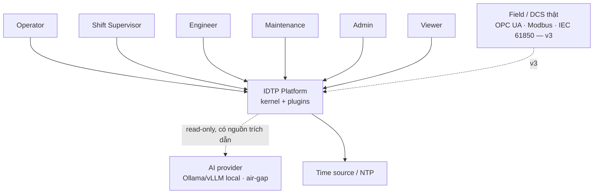
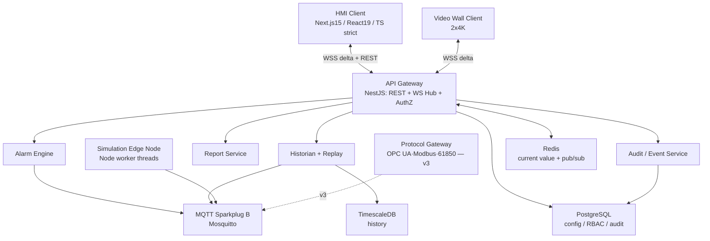
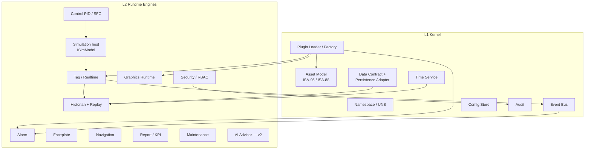
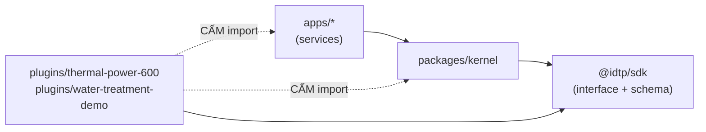
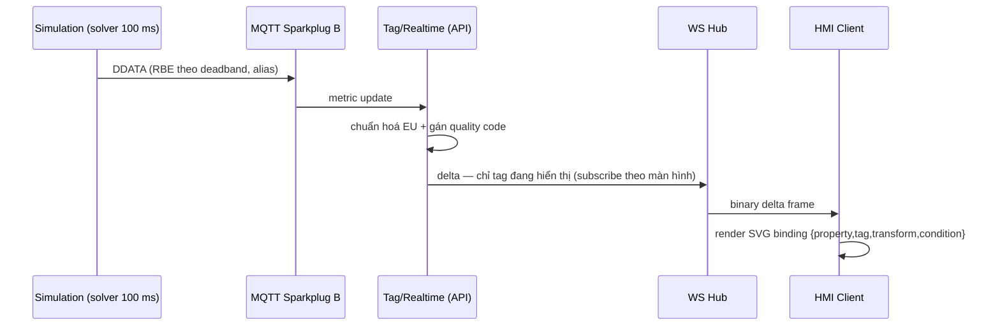

# 02 — Platform Architecture (Kiến trúc nền tảng)

> Tài liệu #02/00–25. Chốt **kiến trúc phân tầng L0–L5** + **C4 Level 1–3** + **bảng ánh xạ 20
> "Engine" gốc → tầng + phiên bản** (§4 prompt cha). Nội dung *internals* từng engine → doc 05.
> Tech stack & triển khai theo GIAI ĐOẠN 0 đã chốt (Docker Compose on‑prem). Ngôn ngữ: tiếng Việt,
> thuật ngữ giữ tiếng Anh.

**Mục lục:** 1 Nguyên tắc · 2 C4‑L1 Context · 3 C4‑L2 Container · 4 Phân tầng L0–L5 ·
5 C4‑L3 Component (Kernel + Engines) · 6 Ánh xạ 20 engine · 7 Ranh giới kernel↔plugin ·
8 Luồng dữ liệu sim→pixel · 9 Mô hình triển khai · 10 Quyết định & phương án loại bỏ · 11 Giả định.

---

## 1. Nguyên tắc kiến trúc (đã chốt)

| # | Nguyên tắc | Hệ quả |
|---|---|---|
| N1 | Kernel + plugin; **kernel không biết tên plugin** | Thêm nhà máy = thêm plugin |
| N2 | Màn hình process = **JSON khai báo**, kernel render | Cấm hardcode màn hình trong React |
| N3 | Tách **model (sim) ≠ transport (mqtt/ws) ≠ view (react)** | Component HMI không biết giao thức |
| N4 | Tách **cây thiết bị ISA‑95 ≠ cây điều hướng ISA‑101** | Hai cây, bảng ánh xạ N‑N |
| N5 | Nguồn dữ liệu = **simulation vật lý**, thay được bằng OPC UA/Modbus không sửa frontend | Cùng data contract cho sim/field |
| N6 | Mọi ranh giới I/O validate **Zod**; lệnh ghi có **audit + xác nhận 2 bước** | Không tin dữ liệu client |

---

## 2. C4 — Level 1: System Context



**Ranh giới hệ thống:** IDTP là supervisory/HMI (Purdue Level 2). Actor = **6 vai RBAC**. AI provider
**read‑only** và cắm‑rút được (không khoá nhà cung cấp). Field/DCS thật chỉ nối ở **v3**, một chiều.

---

## 3. C4 — Level 2: Container (deployable)



| Container | Công nghệ | Vai trò | Store |
|---|---|---|---|
| `hmi` | Next.js 15 / React 19 | Operator client, SVG graphics, Zustand | — |
| `api` | NestJS | REST + WS hub + AuthZ + Tag/Realtime | Redis, PG |
| `sim-engine` | Node worker threads | Simulation edge node (solver 100 ms) | — |
| `alarm-engine` | Node/NestJS | ISA‑18.2 state machine | PG |
| `historian` | Node | write batch/COPY + rollup + replay | TimescaleDB |
| `gateway` | Node (**v3**) | OPC UA / Modbus / IEC 61850 bridge | — |
| `mosquitto` | Eclipse Mosquitto | MQTT Sparkplug B broker | — |
| `timescaledb` | TimescaleDB | history hypertable + continuous aggregate | — |
| `postgres` | PostgreSQL | config / RBAC / audit | — |
| `redis` | Redis | current value + pub/sub fanout | — |

---

## 4. Kiến trúc phân tầng L0–L5

| Tầng | Tên | Thành phần | Phiên bản |
|---|---|---|---|
| **L5** | Engineering & Tooling | Screen Builder · Tag Builder · Alarm Rationalizer · Plugin SDK/CLI | v2 (v1: schema + validate CLI) |
| **L4** | Presentation | Operator Client · Video Wall · Mobile Viewer · Report Viewer | v1 (mobile → v2) |
| **L3** | Domain Plugins | `thermal-power-600` · `water-treatment-demo` · … (**chỉ dữ liệu + mô hình**) | v1 |
| **L2** | Runtime Engines | Tag/Realtime · Alarm · Historian+Replay · Graphics Runtime · Faceplate · Navigation · Simulation · Control · Security/RBAC · Report/KPI · Maintenance · AI Advisor | v1 (AI → v2) |
| **L1** | Platform Kernel | Namespace/UNS · Asset Model · Data Contract · Event Bus · Plugin Loader · Config Store · Audit · Time Service | v1 |
| **L0** | Integration | MQTT Sparkplug B · OPC UA · Modbus · IEC 61850 · BACnet · REST/WS | v1 (MQTT), v3 (field thật) |

> **Digital Twin Engine bị xoá** khỏi kiến trúc: nó không phải engine riêng mà là **kết quả tổng hợp**
> của Simulation + Historian + Asset Model.

---

## 5. C4 — Level 3: Component (zoom Kernel L1 + Runtime Engines L2)



Trách nhiệm rút gọn (đầy đủ 10 mục/engine → doc 05):

| Engine (L2) | Ranh giới KHÔNG thuộc engine |
|---|---|
| Tag/Realtime | Không lưu lịch sử (đó là Historian); không render (Graphics) |
| Graphics Runtime | Không chứa nội dung màn hình (plugin JSON) |
| Simulation host | Không chứa mô hình vật lý cụ thể (plugin `ISimModel`) |
| Control | Không tự sinh dữ liệu process (đọc từ Tag) |
| AI Advisor | Không ghi tag/đổi setpoint/ACK (read‑only) |

---

## 6. Ánh xạ 20 "Engine" gốc → Tầng + Phiên bản (§4 — xuất đầy đủ)

> Yêu cầu gốc liệt kê ~20 "Engine" ngang hàng. Bảng dưới **hợp nhất/định vị lại**: một số engine bị
> tách (SCADA → Tag/Realtime + Graphics = 2), một số bị gộp (PLC/OPC UA/MQTT → 1 Protocol Gateway),
> một số bị xoá (Digital Twin Engine).

| Engine gốc | Tầng | Phiên bản | Ghi chú |
|---|---|---|---|
| SCADA Engine | L2 | v1 | = Tag/Realtime + Graphics Runtime, **tách làm 2** |
| Alarm Engine | L2 | v1 | ISA‑18.2 state machine đầy đủ |
| Trend Engine | L4 | v1 | Là **client component**, không phải service |
| Historian Engine | L2 | v1 | **Gộp Replay** vào đây |
| Animation Engine | L4 | v1 | Runtime binding trong Graphics, không tách service |
| Navigation Engine | L2 | v1 | Do **plugin khai báo**, kernel render |
| Faceplate Engine | L2 | v1 | 4 tab cố định |
| Permission Engine | L1 | v1 | Đổi tên: **Security/RBAC + Audit** |
| Engineering Engine | L5 | **v2** | v1 chỉ có schema JSON + validate CLI |
| Simulation Engine | L2 | v1 | Interface `ISimModel`, **mô hình nằm trong plugin** |
| PLC Comm / OPC UA / MQTT Engine | L0 | v1 (MQTT), **v3** (OPC UA/Modbus thật) | Gộp thành **Protocol Gateway + driver** |
| Report Engine | L2 | v1 (template cố định), **v2** (designer) | |
| AI Engine | L2 | **v2** | v1 chỉ **rule‑based diagnostics** |
| Digital Twin Engine | — | — | **Không phải engine riêng** — xoá khỏi kiến trúc |
| Database Engine | L1 | v1 | Đổi tên: **Data Contract + Persistence Adapter** |
| Plugin Factory Engine | L1 | v1 | **Quan trọng nhất** (§7) |

---

## 7. Ranh giới kernel ↔ plugin (dependency rule)



| Luật | Nội dung |
|---|---|
| L‑P1 | Plugin **chỉ** import từ `@idtp/sdk` — cấm từ `apps/*`, `packages/kernel` |
| L‑P2 | Plugin **không** chứa component React màn hình process (ngoại lệ: `ICustomSymbol`) |
| L‑P3 | Plugin **không** ghi thẳng DB — chỉ qua SDK |
| L‑P4 | Hot‑load/unload không được làm đổ engine |
| L‑P5 | Hai plugin cách ly namespace, không đụng tag của nhau |

> **Bài test generic (§5.4 / lát cắt W11):** thêm `water-treatment-demo` **không sửa 1 dòng**
> `packages/kernel` & `apps/*`. Sai → kiến trúc sai, quay lại doc 03. (Contract đầy đủ → doc 03.)

---

## 8. Luồng dữ liệu runtime — sim → pixel (p95 < 500 ms)



Tách chu kỳ: solver **100 ms** ≠ chu kỳ publish (theo scan class 250 ms/500 ms/1 s/5 s). Không dùng
`Math.random()` làm nguồn process (N5).

---

## 9. Mô hình triển khai (Docker Compose on‑prem — GIAI ĐOẠN 0)

| Nhóm | Container | Ghi chú |
|---|---|---|
| Client | `hmi`, (video wall dùng chung `hmi`) | zero‑install browser |
| App | `api`, `sim-engine`, `alarm-engine`, `historian`, (`gateway` v3) | Node/NestJS |
| Infra | `mosquitto`, `timescaledb`, `postgres`, `redis` | 1 compose network |

Yêu cầu vận hành: reconnect tự động; **store‑and‑forward** khi mất kết nối; nạp plugin mới < 10 s
không restart kernel; hỗ trợ **air‑gap** (AI model local). Chi tiết infra & CI → doc 23.

---

## 10. Quyết định kiến trúc & phương án đã loại bỏ

| Quyết định | Chọn | Loại bỏ | Lý do |
|---|---|---|---|
| Data bus | **MQTT Sparkplug B** | OPC UA pub/sub trực tiếp ở v1 | Sparkplug nhẹ, RBE + state (birth/death) sẵn, air‑gap dễ; OPC UA thật → v3 |
| History store | **TimescaleDB** | InfluxDB / plain PostgreSQL | SQL + continuous aggregate + compression; đồng bộ hệ với PG config |
| Current value | **Redis** | Đọc thẳng TimescaleDB | Latency thấp cho realtime + pub/sub fanout tới WS |
| Repo | **Monorepo (pnpm + Turborepo)** | Polyrepo | Chia sẻ `contracts`/`tag-model`, thay đổi atomic |
| Realtime transport | **WSS binary delta** | REST polling / full snapshot | Băng thông thấp, đạt p95 < 500 ms |
| AI provider | **Cắm‑rút (Ollama/vLLM/cloud)** | Khoá 1 nhà cung cấp | Air‑gap + tránh lock‑in (§11) |
| Kernel↔plugin | **Kernel không biết plugin** | Kernel import plugin | Genericity + hot‑load |

---

## 11. Giả định

| Mã | `[GIẢ ĐỊNH]` |
|---|---|
| GĐ‑05 | Redis dùng cho current value + pub/sub (Phụ lục A §7.1 nêu Redis; chi tiết cache policy chốt ở doc 15) |
| GĐ‑06 | Video wall dùng chung image `hmi` với chế độ hiển thị riêng (chưa tách container) — xác nhận ở doc 12 |

---

```
TRẠNG THÁI: Tài liệu 02 — Platform Architecture (02-platform-architecture.md).
ĐÃ XONG: 6 nguyên tắc kiến trúc; C4‑L1 System Context (6 vai + AI read‑only + field v3); C4‑L2
        Container (10 container + bảng công nghệ/store); phân tầng L0–L5; C4‑L3 Component (Kernel
        L1 + 12 engine L2 + ranh giới); **bảng ánh xạ 16 engine gốc → tầng+phiên bản đầy đủ (§4)**;
        dependency rule kernel↔plugin (5 luật) + Mermaid; sequence sim→pixel; mô hình triển khai
        Docker Compose on‑prem; 7 quyết định + phương án loại bỏ.
GIẢ ĐỊNH MỚI: GĐ‑05 (Redis), GĐ‑06 (video wall dùng chung image) → doc 25.
XUNG ĐỘT / RỦI RO: không xung đột số liệu với doc 00/01; Digital Twin Engine đã xoá đúng §4;
        OPC UA/Modbus/61850 đẩy v3 (nhất quán doc 00).
CẦN QUYẾT ĐỊNH TỪ ANH: [PHÊ DUYỆT TÀI LIỆU 02?] — nếu OK, sang doc 03 (03-plugin-contract-sdk.md).
BƯỚC TIẾP THEO: sinh doc 03 (manifest schema + 8 interface `ISimModel`…`IAiKnowledgeSource` + ví dụ),
        rồi tóm tắt ≤ 15 dòng → chờ duyệt.
```
