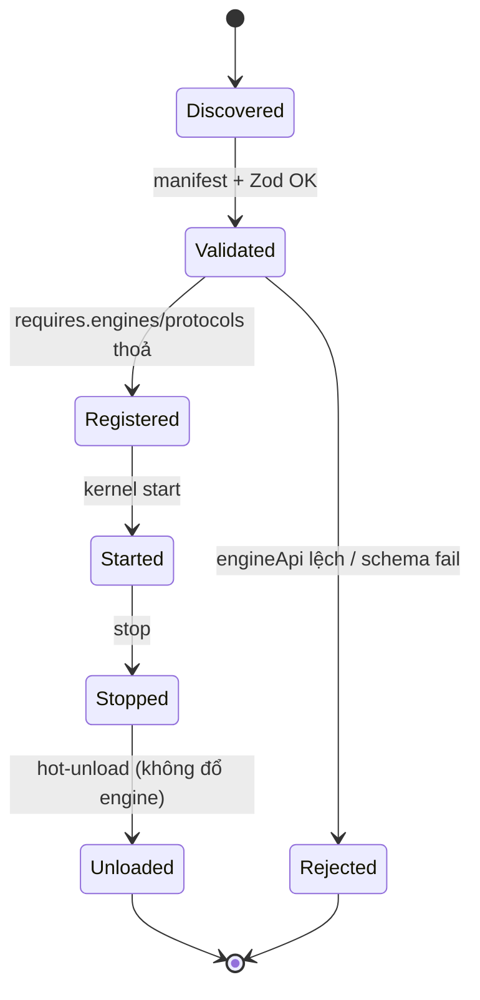

# 03 — Plugin Contract & SDK (Hợp đồng plugin & SDK)

> Tài liệu #03/00–25 — **trái tim platform** (§5 prompt cha). Chốt **manifest schema** + **8
> extension point** (chữ ký TypeScript đầy đủ, hợp đồng vòng đời, ví dụ tối thiểu, test kép).
>
> **Phạm vi được phép (luật cứng):** doc này chỉ chứa *JSON/YAML schema · chữ ký interface · ví dụ
> tối thiểu/mock trong tài liệu đặc tả*. Các file `@idtp/sdk` thật tạo ở **pha code** (sau doc 24).
> Ngôn ngữ: tiếng Việt; code/identifier tiếng Anh.

**Mục lục:** 1 Nguyên tắc hợp đồng · 2 Manifest YAML · 3 Manifest schema (Zod) · 4 Vòng đời plugin ·
5 Shared types · 6 Tám extension point · 7 SDK surface · 8 Bài test generic · 9 Quyết định · 10 Giả định.

---

## 1. Nguyên tắc hợp đồng plugin

Plugin = **dữ liệu khai báo + vài interface**, không chứa logic kernel. Luật cứng (recap doc 02 §7):

| # | Luật |
|---|---|
| L‑P1 | Plugin **chỉ** import từ `@idtp/sdk` — cấm `apps/*`, `packages/kernel` |
| L‑P2 | Plugin **không** chứa component React màn hình process (ngoại lệ: `ICustomSymbol`) |
| L‑P3 | Plugin **không** ghi thẳng DB — chỉ qua SDK |
| L‑P4 | Hot‑load/unload **không** làm đổ engine |
| L‑P5 | Hai plugin **cách ly namespace**, không đụng tag của nhau |

---

## 2. Manifest bắt buộc (`plugin.yaml`)

```yaml
plugin:
  id: thermal-power-600
  version: 1.0.0
  engineApi: "^1.0.0"          # semver — kernel từ chối nạp nếu không khớp
  domain: power.thermal.coal
  displayName: { vi: "Nhiệt điện than 600 MW", en: "Coal Thermal 600 MW" }

provides:
  assetModel:  model/isa95.yaml          # cây thiết bị ISA-95
  tagRegistry: tags/**/*.yaml            # tag: EU, dải, deadband, scan class
  alarms:      alarms/**/*.yaml          # định nghĩa + priority + rationalization
  simulation:  sim/index.ts              # implements ISimModel
  control:     control/*.yaml            # PID loop, cascade, SFC sequence
  graphics:    screens/*.screen.json     # KHÔNG phải component React
  symbols:     symbols/*.symbol.json     # + ICustomSymbol nếu đặc thù
  faceplates:  faceplates/*.fp.json
  navigation:  nav/tree.yaml
  reports:     reports/*.rpt.json
  kpi:         kpi/*.yaml
  sop:         sop/*.md                  # nguồn cho AI advisor
  i18n:        i18n/{vi,en}.json
  scenarios:   scenarios/*.yaml          # kịch bản đào tạo/demo

requires:
  engines:   [tag, alarm, historian, graphics, sim, control, report]
  protocols: [mqtt-sparkplug]
  minTagCapacity: 15000
```

---

## 3. Manifest schema (Zod — validate lúc nạp)

```typescript
import { z } from 'zod';

export const LocalizedText = z.object({ vi: z.string().min(1), en: z.string().min(1) });

export const PluginManifest = z.object({
  plugin: z.object({
    id: z.string().regex(/^[a-z0-9-]+$/),
    version: z.string().regex(/^\d+\.\d+\.\d+$/),
    engineApi: z.string(),                       // semver range
    domain: z.string().regex(/^[a-z0-9.]+$/),
    displayName: LocalizedText,
  }),
  provides: z.object({
    assetModel: z.string(),
    tagRegistry: z.string(),
    alarms: z.string().optional(),
    simulation: z.string().optional(),
    control: z.string().optional(),
    graphics: z.string(),
    symbols: z.string().optional(),
    faceplates: z.string().optional(),
    navigation: z.string(),
    reports: z.string().optional(),
    kpi: z.string().optional(),
    sop: z.string().optional(),
    i18n: z.string(),
    scenarios: z.string().optional(),
  }),
  requires: z.object({
    engines: z.array(z.enum([
      'tag','alarm','historian','graphics','sim','control','report','faceplate','navigation','maintenance','ai',
    ])),
    protocols: z.array(z.string()),
    minTagCapacity: z.number().int().positive(),
  }),
});
export type PluginManifest = z.infer<typeof PluginManifest>;
```

---

## 4. Vòng đời plugin



| Giai đoạn | Kernel làm gì | Thất bại → |
|---|---|---|
| Discovered | quét `plugins/*/plugin.yaml` | bỏ qua thư mục không manifest |
| Validated | parse Zod + kiểm `engineApi` khớp kernel semver | **Rejected** (ghi audit) |
| Registered | cấp namespace riêng, nạp assetModel/tagRegistry/alarms | rollback, không đụng plugin khác |
| Started | khởi tạo `ISimModel`, driver, control | dừng plugin này, engine vẫn chạy (L‑P4) |
| Stopped/Unloaded | gỡ subscribe, `dispose()`, giải phóng namespace | — |

---

## 5. Shared types (`@idtp/sdk`)

```typescript
export type TagId = string;              // UUID/số nội bộ — khoá tham chiếu duy nhất
export type Iso8601 = string;            // UTC + offset
export type Quality = 'Good' | 'Uncertain' | 'Bad' | 'Substituted';
export type LoopMode = 'MAN' | 'AUTO' | 'CASCADE';

export interface EngineeringUnit { readonly symbol: string; }        // 'MPa','°C','t/h'
export interface TagValue { tagId: TagId; value: number | boolean | string; quality: Quality; ts: Iso8601; }
export interface IWriteCommand { tagId: TagId; value: number | boolean; user: string; reason: string; }
export type WriteResult = { ok: true } | { ok: false; blockedReason: string };
```

> **Nguyên tắc chung:** hàm `step`/`render`/`evaluate` phải **thuần** (không I/O trực tiếp, không
> `Date.now()` — dùng context). Lệnh ghi trả `WriteResult` có `blockedReason` để HMI **hiện lý do
> bị chặn** (không throw im lặng). Lệnh ghi bị **chặn cứng** khi ở chế độ Replay.

---

## 6. Tám extension point

### 6.1 `ISimModel` (L2 Simulation — quan trọng nhất)

```typescript
export interface ISimModelContext {
  readonly dtMs: number;                 // solver step = 100 ms
  getTag(tagId: TagId): number;          // đọc input (SP/OP từ Control)
  now(): Iso8601;                        // từ Time Service (không dùng Date.now)
}
export interface ISimStepResult { outputs: ReadonlyArray<{ tagId: TagId; value: number; quality: Quality }>; }
export interface ISimSnapshot { readonly state: Readonly<Record<string, number>>; }
export interface IMalfunction { readonly id: string; readonly params?: Readonly<Record<string, number>>; }

export interface ISimModel {
  readonly id: string;                                   // 'thermal-boiler-island'
  readonly tagsProvided: ReadonlyArray<TagId>;
  init(ctx: ISimModelContext, config: unknown): void;    // gọi 1 lần trước step
  step(ctx: ISimModelContext): ISimStepResult;           // gọi mỗi 100 ms; thuần
  snapshot(): ISimSnapshot;                              // Historian snapshot 5'
  restore(snapshot: ISimSnapshot): void;                 // re-simulation
  injectMalfunction(m: IMalfunction): void;              // OTS
  clearMalfunction(id: string): void;
  dispose(): void;
}
```

**Hợp đồng vòng đời:** `init` một lần → `step` lặp lại (tất định, dùng `ctx.now()`) → `snapshot`/
`restore` cho replay/re‑sim → `inject/clearMalfunction` cho OTS → `dispose` khi unload.

**Ví dụ tối thiểu** (dùng bởi `water-treatment-demo` — bể 1 mức, có leak malfunction):

```typescript
class TankLevelModel implements ISimModel {
  readonly id = 'wtp-tank-1';
  readonly tagsProvided = ['wtp.tank1.level'];
  private level = 50;      // %
  private leak = 0;        // m3/h
  private area = 0.8;      // 1/tiết diện bể [GIẢ ĐỊNH] — số thật ở doc 10
  init(): void { this.level = 50; this.leak = 0; }
  step(ctx: ISimModelContext): ISimStepResult {
    const inflow = ctx.getTag('wtp.pump1.flow');
    const outflow = ctx.getTag('wtp.valve1.flow');
    const dtH = ctx.dtMs / 3_600_000;
    this.level += (inflow - outflow - this.leak) * dtH * this.area;
    this.level = Math.max(0, Math.min(100, this.level));
    return { outputs: [{ tagId: 'wtp.tank1.level', value: this.level, quality: 'Good' }] };
  }
  snapshot(): ISimSnapshot { return { state: { level: this.level, leak: this.leak } }; }
  restore(s: ISimSnapshot): void { this.level = s.state.level; this.leak = s.state.leak; }
  injectMalfunction(m: IMalfunction): void { if (m.id === 'tank-leak') this.leak = m.params?.rate ?? 5; }
  clearMalfunction(id: string): void { if (id === 'tank-leak') this.leak = 0; }
  dispose(): void {}
}
```

**Test kép (mock)** — kiểm tra kernel gọi đúng vòng đời, không cần physics:

```typescript
class FakeSimModel implements ISimModel {
  readonly id = 'fake'; readonly tagsProvided = ['x'];
  calls: string[] = [];
  init() { this.calls.push('init'); }
  step(): ISimStepResult { this.calls.push('step'); return { outputs: [{ tagId: 'x', value: 1, quality: 'Good' }] }; }
  snapshot(): ISimSnapshot { return { state: {} }; }
  restore() { this.calls.push('restore'); }
  injectMalfunction() {} clearMalfunction() {} dispose() { this.calls.push('dispose'); }
}
```

> Mẫu test kép trên (một `Fake<Name>` ghi lại thứ tự gọi + trả hằng số tất định) áp dụng cho **cả 8
> interface**; các mục dưới chỉ nêu điểm khác biệt để không lặp.

### 6.2 `IProtocolDriver` (L0 — MQTT v1, OPC UA/Modbus v3)

```typescript
export interface IProtocolDriverContext {
  publish(values: ReadonlyArray<TagValue>): void;   // đẩy vào Tag/Realtime
  logAudit(entry: Readonly<Record<string, unknown>>): void;
}
export interface IProtocolDriver {
  readonly id: string;                               // 'mqtt-sparkplug'
  connect(ctx: IProtocolDriverContext, config: unknown): Promise<void>;
  subscribe(tagIds: ReadonlyArray<TagId>): Promise<void>;
  write(cmd: IWriteCommand): Promise<WriteResult>;   // blockedReason khi interlock/replay
  disconnect(): Promise<void>;
  readonly isConnected: boolean;
}
```

**Vòng đời:** `connect` → `subscribe` → nhận dữ liệu → `ctx.publish` (RBE theo deadband) →
`write` (trả `blockedReason` nếu bị chặn) → `disconnect`. **Test kép:** `FakeDriver` publish giá trị
kịch bản, `write` luôn trả `{ ok:false, blockedReason:'replay' }` khi test chế độ Replay.

### 6.3 `IKpiCalculator` (L2 Report/KPI)

```typescript
export type Aggregate = 'avg' | 'min' | 'max' | 'last' | 'total';
export interface IKpiInput {
  readonly range: { from: Iso8601; to: Iso8601 };
  read(tagId: TagId, agg: Aggregate): Promise<number>;
}
export interface IKpiResult { readonly kpiId: string; readonly value: number; readonly unit: EngineeringUnit; }
export interface IKpiCalculator {
  readonly kpiId: string;                            // 'heat-rate'
  readonly unit: EngineeringUnit;
  compute(input: IKpiInput): Promise<IKpiResult>;
}
```

**Ví dụ:** `heat-rate = fuelHeatInput / netPower` (kJ/kWh) — công thức đầy đủ ở doc 21. **Test kép:**
`input.read` trả bảng cố định → assert `value`.

### 6.4 `IReportSection` (L2 Report)

```typescript
export interface IReportContext {
  read(tagId: TagId, agg: Aggregate, range: { from: Iso8601; to: Iso8601 }): Promise<number>;
}
export type ReportBlock =
  | { kind: 'table'; headers: ReadonlyArray<string>; rows: ReadonlyArray<ReadonlyArray<string>> }
  | { kind: 'text'; text: string; authoredByAi?: boolean }
  | { kind: 'trend'; tagIds: ReadonlyArray<TagId>; range: { from: Iso8601; to: Iso8601 } };
export interface IReportSection {
  readonly sectionId: string;
  readonly title: { vi: string; en: string };
  render(ctx: IReportContext): Promise<ReadonlyArray<ReportBlock>>;
}
```

> Phần nhận xét do AI viết **phải** đặt `authoredByAi: true` (§11). **Test kép:** `render` trả block
> tĩnh, assert cấu trúc.

### 6.5 `ICustomSymbol` (L4 Graphics — ngoại lệ duy nhất của L‑P2)

```typescript
export interface ISymbolState { value: number | boolean; quality: Quality; mode?: LoopMode; alarmState?: string; }
export type SvgPrimitive =
  | { kind: 'rect'; x: number; y: number; w: number; h: number; fill: string }
  | { kind: 'line'; x1: number; y1: number; x2: number; y2: number; stroke: string }
  | { kind: 'text'; x: number; y: number; text: string; fill: string }
  | { kind: 'path'; d: string; fill?: string; stroke?: string };
export interface ICustomSymbol {
  readonly symbolId: string;                         // 'thermal.pulverizer'
  readonly bbox: { w: number; h: number };
  render(state: ISymbolState): ReadonlyArray<SvgPrimitive>;   // thuần, không side-effect
}
```

> **Quyết định:** trả **danh sách SvgPrimitive** thay vì chuỗi SVG thô → tránh injection, độc lập
> framework, tôn trọng N2/N3. **Test kép:** gọi `render` với các `state`, assert số primitive/màu.

### 6.6 `IAlarmShelvingPolicy` (L2 Alarm)

```typescript
export interface IShelveRequest { alarmId: string; user: string; durationMin: number; reason: string; }
export type ShelveDecision = { allow: true; expiresAt: Iso8601 } | { allow: false; reason: string };
export interface IAlarmShelvingPolicy {
  readonly policyId: string;
  readonly maxDurationMin: number;                   // ≤ 480 (8 h)
  evaluate(req: IShelveRequest, now: Iso8601): ShelveDecision;
}
```

> `evaluate` **bắt buộc** ép `durationMin ≤ maxDurationMin` và luôn có `expiresAt` (tự bung + audit,
> §10.2). **Test kép:** yêu cầu 600' → `{ allow:false }`; 120' → `{ allow:true, expiresAt }`.

### 6.7 `ISequenceStep` (L2 Control — SFC, theo tinh thần IEC 61131-3)

```typescript
export type StepStatus = 'pending' | 'active' | 'done' | 'failed';
export interface ISequenceContext {
  getTag(tagId: TagId): number | boolean;
  command(cmd: IWriteCommand): Promise<WriteResult>;
  elapsedMs(): number;
}
export interface ISequenceStep {
  readonly stepId: string;                           // 'purge-airflow-30pct'
  readonly permissive: ReadonlyArray<string>;        // mô tả điều kiện (tham chiếu tag)
  enter(ctx: ISequenceContext): void;
  evaluate(ctx: ISequenceContext): StepStatus;       // gọi mỗi chu kỳ
  onFail(ctx: ISequenceContext): void;               // hành động an toàn khi fail
}
```

> Ví dụ NFPA 85 purge: `evaluate` giữ `active` tới khi airflow ≥ 30% BMCR đủ thời gian purge, rồi
> `done`; mất gió → `failed` → `onFail` cắt trình tự. **Test kép:** giả lập tag, assert chuyển trạng thái.

### 6.8 `IAiKnowledgeSource` (L2 AI Advisor — v2, read‑only)

```typescript
export interface IKnowledgeDoc {
  readonly docId: string;
  readonly title: { vi: string; en: string };
  readonly kind: 'sop' | 'cause-effect' | 'narrative';
  readonly text: string;                             // nguồn để trích dẫn nguyên văn
  readonly tagRefs: ReadonlyArray<TagId>;
}
export interface IAiKnowledgeSource {
  readonly sourceId: string;
  list(): Promise<ReadonlyArray<IKnowledgeDoc>>;      // AI CHỈ đọc — không có API ghi tag
}
```

> **Read‑only tuyệt đối** (§11): interface **không** phơi bày bất kỳ hàm ghi tag/đổi setpoint/ACK.
> Mọi câu trả lời AI phải trích `docId` + `tagRefs` + khoảng thời gian. **Test kép:** `list` trả 2 doc,
> assert AI trích đúng nguồn.

---

## 7. SDK surface (`@idtp/sdk` export)

| Nhóm | Export |
|---|---|
| Types | `TagId · Iso8601 · Quality · LoopMode · TagValue · IWriteCommand · WriteResult · EngineeringUnit` |
| Manifest | `PluginManifest` (Zod) |
| Interfaces | 8 extension point ở §6 |
| Helpers | `defineSimModel()·defineSymbol()·defineKpi()` (factory kiểu hoá, không chứa logic kernel) |

> Plugin **chỉ** thấy `@idtp/sdk`. Kernel giữ implementation; SDK chỉ là **chữ ký + schema + factory**.

---

## 8. Bài test tính generic (bắt buộc — lát cắt W11)

`water-treatment-demo`: ~60 tag · 3 màn hình · 2 bơm · 1 bể · 1 vòng PID mức · 8 alarm.

| Tiêu chí đạt | Đo bằng |
|---|---|
| Thêm plugin **không sửa** `packages/kernel` & `apps/*` | `git diff --stat` = 0 dòng ngoài `plugins/` |
| Chỉ dùng `@idtp/sdk` | lint rule cấm import chéo |
| Hot‑load < 10 s, engine không đổ | test tải + health check |

Sai bất kỳ tiêu chí → **kiến trúc sai**, quay lại §1.

---

## 9. Quyết định & phương án đã loại bỏ

| Quyết định | Chọn | Loại bỏ | Lý do |
|---|---|---|---|
| Custom symbol | Danh sách `SvgPrimitive` | Chuỗi SVG thô / component React | Tránh injection; độc lập framework; giữ L‑P2 |
| Manifest | YAML khai báo + Zod validate | Đăng ký bằng code (`register()`) | Kernel không chạy code plugin để biết nó cung cấp gì |
| `step`/`render` | Hàm **thuần**, dùng context | Cho phép I/O / `Date.now()` | Tất định → replay/re‑sim tái lập được |
| Lệnh ghi | Trả `WriteResult{blockedReason}` | `throw` khi bị chặn | HMI hiện "lý do bị chặn" (§9 Phụ lục A) |
| AI knowledge | `list()` read‑only | Query hook có thể ghi tag | §11 read‑only tuyệt đối |

---

## 10. Giả định

| Mã | `[GIẢ ĐỊNH]` |
|---|---|
| GĐ‑07 | Hằng số `area = 0.8` trong ví dụ `TankLevelModel` chỉ minh hoạ — số thật ở doc 10 |
| GĐ‑08 | Danh sách `requires.engines` enum (11 engine) — chốt cuối ở doc 05 |
| GĐ‑09 | `SvgPrimitive` gồm 4 kind (rect/line/text/path) đủ cho symbol v1; bổ sung nếu doc 14 cần |

---

```
TRẠNG THÁI: Tài liệu 03 — Plugin Contract & SDK (03-plugin-contract-sdk.md).
ĐÃ XONG: 5 luật hợp đồng; manifest YAML đầy đủ + schema Zod validate; state machine vòng đời plugin
        (Discovered→…→Unloaded) + bảng thất bại; shared types (@idtp/sdk); **8 extension point** đủ
        chữ ký TypeScript + hợp đồng vòng đời + ví dụ tối thiểu (ISimModel: TankLevelModel có leak)
        + test kép; SDK surface; bài test generic water-treatment-demo (tiêu chí đo được); 5 quyết
        định + phương án loại bỏ.
GIẢ ĐỊNH MỚI: GĐ‑07 (area demo), GĐ‑08 (enum engines), GĐ‑09 (SvgPrimitive 4 kind) → doc 25.
XUNG ĐỘT / RỦI RO: không xung đột; giữ đúng luật cứng (chỉ schema/chữ ký/ví dụ, chưa tạo file SDK
        thật); AI interface read‑only tuyệt đối (không phơi API ghi).
CẦN QUYẾT ĐỊNH TỪ ANH: [PHÊ DUYỆT TÀI LIỆU 03?] — nếu OK, sang doc 04 (04-asset-model-uns.md).
BƯỚC TIẾP THEO: sinh doc 04 (cây ISA‑95 + UNS + ánh xạ KKS 3 chiều), rồi tóm tắt ≤ 15 dòng → chờ duyệt.
```
