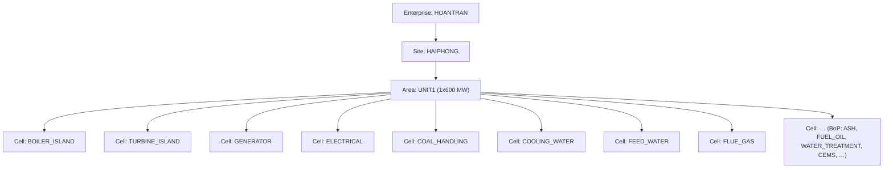
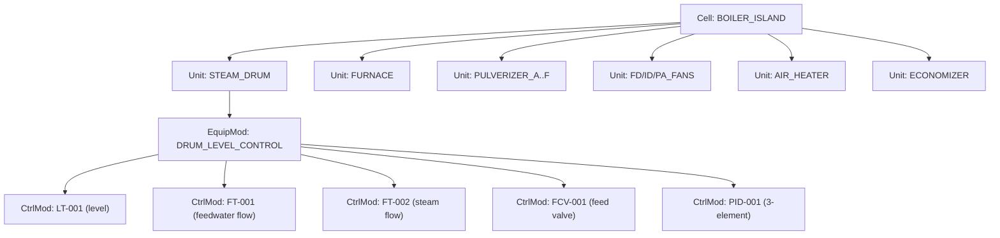

# 04 — Asset Model & UNS (Mô hình tài sản & Unified Namespace)

> Tài liệu #04/00–25 (§6 prompt cha). **Registry chốt** — doc 07/08/11/12/13 phải khớp. Chốt:
> cây thiết bị ISA‑95/88 (tách khỏi cây điều hướng ISA‑101), UNS, ánh xạ 4 chiều KKS↔UNS↔Sparkplug↔
> tag id, bản ghi tag chuẩn. Số liệu neo Design Basis (Phụ lục A §3). KKS: chỉ assert cái đã verified.
> Ngôn ngữ: tiếng Việt; identifier tiếng Anh.

**Mục lục:** 1 Hai cây tách biệt · 2 Cây thiết bị ISA‑95 · 3 Boiler Island chi tiết · 4 UNS ·
5 Ánh xạ 4 chiều · 6 Bản ghi tag chuẩn · 7 asset_id & cách ly namespace · 8 Quyết định · 9 Giả định.

---

## 1. Hai cây TÁCH BIỆT — ISA‑95 (thiết bị) ≠ ISA‑101 (điều hướng)

| Tiêu chí | Cây thiết bị (ISA‑95/88) | Cây điều hướng (ISA‑101) |
|---|---|---|
| Trả lời | *Thiết bị nằm ở đâu trong nhà máy?* | *Người vận hành mở màn hình nào?* |
| Nút | Enterprise→Site→Area→Cell→Unit→EquipmentModule→ControlModule | D1 Plant→D2 Area→D3 Equipment→D4 Diagnostic + S |
| Định danh | `asset_id` | `screen_id` |
| Tài liệu chốt | **Doc 04 (đây)** | Doc 13 |
| Quan hệ | **N–N** với cây điều hướng | N–N với cây thiết bị |

**Ví dụ N–N:** màn hình D3 `Steam Drum` hiển thị nhiều asset (LT‑001, FCV‑001, FT‑001…); asset
`LT‑001` xuất hiện trên nhiều màn hình (D3 Steam Drum, D3 Drum Level Control, S Trend). Bảng ánh xạ
`asset ↔ screen` đầy đủ → doc 13.

> **Cấm** (§17): gộp hai cây làm một. **Cấm** dùng "Level 0–4" cho cây thiết bị (trùng Purdue/ISA‑95
> Level: 0 process · 1 sensing · 2 supervisory · 3 MOM · 4 ERP).

---

## 2. Cây thiết bị ISA‑95/88 (asset model)



**7 cấp ISA‑95/88 + naming chốt:**

| Cấp | Tên ISA | Ví dụ (chốt) | UNS slug |
|---|---|---|---|
| 1 | Enterprise | `HOANTRAN` | `hoantran` |
| 2 | Site | `HAIPHONG` | `haiphong` |
| 3 | Area | `UNIT1` | `unit1` |
| 4 | Process Cell / Work Center | `BOILER_ISLAND` | `boiler` |
| 5 | Unit / Work Unit | `STEAM_DRUM` | `steam-drum` |
| 6 | **Equipment Module** | `DRUM_LEVEL_CONTROL` | *(không lên UNS path — là attribute)* |
| 7 | Control Module | `LT-001`, `FCV-001`, `PID-001` | `lt-001` |

Bảng slug Cell↔Sparkplug device (đầy đủ → doc 16):

| Cell (UNS) | Sparkplug device_id |
|---|---|
| `boiler`, `feedwater`, `flue-gas`, `air` | `BOILER` |
| `turbine`, `condensate` | `TURBINE` |
| `generator` | `GENERATOR` |
| `electrical` | `ELEC` |
| `coal`, `ash` | `COAL` |
| `cw` | `CW` |

---

## 3. Boiler Island chi tiết (vertical slice — lát cắt 12 tuần)



Số liệu neo Design Basis §3.2: drum level normal **0 mm ± 50**, trip **±250 mm**; áp bao hơi
**18,9 MPa**; SH out **17,5 MPa(g)/541 °C**; BMCR **2.008 t/h**; 6 mill (5+1); FD/ID/PA 2×50%.

---

## 4. Unified Namespace (UNS)

**Cấu trúc (7 segment):** `{enterprise}/{site}/{area}/{cell}/{unit}/{equipment}/{signal}`
**Ví dụ (chốt):** `hoantran/haiphong/unit1/boiler/steam-drum/lt-001/pv`

| Segment | Map ISA‑95 | Ghi chú |
|---|---|---|
| enterprise | Enterprise | `hoantran` |
| site | Site | `haiphong` |
| area | Area | `unit1` |
| cell | Process Cell | `boiler` |
| unit | Unit | `steam-drum` |
| **equipment** | **Control Module** | `lt-001` — **không** phải Equipment Module |
| signal | tín hiệu | `pv`·`sp`·`op`·`mode`·`status`… |

> **Quyết định:** UNS giữ đúng **7 segment** (khớp ví dụ §6.2). **Equipment Module** (cấp 6, vd
> `DRUM_LEVEL_CONTROL`) **không** lên UNS path mà là **attribute** `equipment_module` trên control
> module — dùng để nhóm faceplate/loop. Lý do: tránh UNS 8 segment quá sâu, giữ địa chỉ ổn định.

**Luật UNS:** chữ thường, `-` phân từ; mọi hệ tham chiếu bằng **tag id nội bộ (UUID/số)**; KKS/UNS/
Sparkplug là **attribute**, không phải khoá.

---

## 5. Ánh xạ 4 chiều — KKS ↔ UNS ↔ Sparkplug ↔ tag id

**Quy ước:**
- **KKS** (VGB‑B 106): `<Unit><Hệ G1G2G3><Số><Mã đo/thiết bị AA><Số>`. Mã đo: `CP` áp · `CT` nhiệt ·
  `CF` lưu lượng · `CL` mức · `CQ` phân tích · `CY` rung · `CG` vị trí · `CE` tốc độ. Thiết bị: `AP`
  bơm · `AN` quạt · `AA` van/damper · `BB` bình/bể.
- **Fallback name** (dùng trong code): `AREA_SYSTEM_EQUIP_MEAS_NN`.
- **Sparkplug metric**: `{device}/{fallback_name}` (topic đầy đủ → doc 16).
- **tag id**: UUID/số — khoá duy nhất.

| KKS | Fallback name | UNS | Sparkplug | tag id |
|---|---|---|---|---|
| `10LAB10CP001` *(verified)* | `BLR_MSTM_SH_PRESS_01` | `…/boiler/main-steam/pt-001/pv` | `BOILER/BLR_MSTM_SH_PRESS_01` | `uuid-…` |
| `10HAD10CL001` `[GIẢ ĐỊNH]` | `BLR_DRUM_LEVEL_01` | `…/boiler/steam-drum/lt-001/pv` | `BOILER/BLR_DRUM_LEVEL_01` | `uuid-…` |
| `10HAD20CF001` `[GIẢ ĐỊNH]` | `BLR_FW_FLOW_01` | `…/boiler/steam-drum/ft-001/pv` | `BOILER/BLR_FW_FLOW_01` | `uuid-…` |
| `10HAD30AA001` `[GIẢ ĐỊNH]` | `BLR_FW_CV_01` | `…/boiler/steam-drum/fcv-001/op` | `BOILER/BLR_FW_CV_01` | `uuid-…` |
| `10MAD10CY002` `[GIẢ ĐỊNH]` | `TRB_HP_BRG_VIB_02` | `…/turbine/hp/vt-002/pv` | `TURBINE/TRB_HP_BRG_VIB_02` | `uuid-…` |
| `10MKA10CT003` `[GIẢ ĐỊNH]` | `GEN_STATOR_TEMP_03` | `…/generator/stator/tt-003/pv` | `GENERATOR/GEN_STATOR_TEMP_03` | `uuid-…` |

> Mọi KKS `[GIẢ ĐỊNH]` sẽ được đối chiếu VGB‑B 106 và chốt ở doc 07 (GĐ‑04).

---

## 6. Bản ghi tag chuẩn (§6.3)

**Schema (YAML) — 20 trường bắt buộc:**

```yaml
tag:
  id: uuid                  # khoá duy nhất
  kks: string               # có thể [GIẢ ĐỊNH]
  uns: string
  name: string              # fallback name
  desc_vi: string
  desc_en: string
  datatype: float|bool|int|string
  eu: string                # engineering unit, vd mm, MPa, t/h
  range_lo: number
  range_hi: number
  deadband: number          # đơn vị EU hoặc % dải
  scan_class: fast|process|slow|diag    # 250ms|500ms|1s|5s
  quality: Good|Uncertain|Bad|Substituted   # runtime
  source: sim|opcua|modbus|calc
  asset_id: uuid            # trỏ control module
  alarm_ids: [string]       # trỏ doc 08
  retention_class: standard|extended|totalizer   # trỏ doc 19
  security_level: int       # vai tối thiểu để ghi (0=chỉ đọc)
  is_writable: bool
  sim_model_ref: string     # trỏ ISimModel.id
```

**Zod (validate biên):**

```typescript
export const TagRecord = z.object({
  id: z.string().uuid(),
  kks: z.string(),
  uns: z.string().regex(/^[a-z0-9-]+(\/[a-z0-9-]+){6}$/),
  name: z.string().regex(/^[A-Z0-9_]+$/),
  desc_vi: z.string(), desc_en: z.string(),
  datatype: z.enum(['float','bool','int','string']),
  eu: z.string(),
  range_lo: z.number(), range_hi: z.number(),
  deadband: z.number().nonnegative(),
  scan_class: z.enum(['fast','process','slow','diag']),
  source: z.enum(['sim','opcua','modbus','calc']),
  asset_id: z.string().uuid(),
  alarm_ids: z.array(z.string()),
  retention_class: z.enum(['standard','extended','totalizer']),
  security_level: z.number().int().min(0),
  is_writable: z.boolean(),
  sim_model_ref: z.string(),
}).refine(t => t.range_hi > t.range_lo, 'range_hi > range_lo');
```

**Ví dụ điền — drum level LT‑001** (neo Design Basis §3.2):

```yaml
tag:
  id: 7b1e…-uuid
  kks: "10HAD10CL001"       # [GIẢ ĐỊNH]
  uns: "hoantran/haiphong/unit1/boiler/steam-drum/lt-001/pv"
  name: "BLR_DRUM_LEVEL_01"
  desc_vi: "Mức bao hơi"
  desc_en: "Steam drum level"
  datatype: float
  eu: "mm"
  range_lo: -400
  range_hi: 400
  deadband: 5
  scan_class: process       # 500 ms — vòng 3-element
  source: sim
  asset_id: <LT-001 control module uuid>
  alarm_ids: ["BLR-DRUM-LVL-HH", "BLR-DRUM-LVL-HI", "BLR-DRUM-LVL-LO", "BLR-DRUM-LVL-LL"]
  retention_class: standard
  security_level: 0
  is_writable: false
  sim_model_ref: "thermal-boiler-island"
```

> Alarm HH/LL đặt tại **±250 mm** (trip, Design Basis), HI/LO tại **±50 mm** (normal band). Chi tiết
> priority/deadband/delay → doc 08.

---

## 7. asset_id & cách ly namespace (2 plugin)

| Chủ đề | Chốt |
|---|---|
| `asset_id` | UUID cấp khi Plugin Loader nạp assetModel; **prefix theo plugin id** để không đụng |
| Namespace | Mỗi plugin có root UNS riêng (`thermal` dùng `…/unit1/…`; `water-treatment-demo` dùng `…/wtp/…`) |
| Cách ly | L‑P5: plugin B **không** đọc/ghi tag của plugin A; kernel enforce qua namespace prefix |

---

## 8. Quyết định & phương án đã loại bỏ

| Quyết định | Chọn | Loại bỏ | Lý do |
|---|---|---|---|
| Số segment UNS | **7, Equipment Module = attribute** | 8 segment (thêm equipment module) | Khớp §6.2; tránh địa chỉ quá sâu, ổn định |
| Khoá tham chiếu | **tag id (UUID)** | KKS hoặc UNS làm khoá | KKS/UNS có thể đổi; id bất biến |
| Hai cây | **Tách ISA‑95 ≠ ISA‑101 + bảng N‑N** | Một cây chung | §17 cấm gộp; hai mối quan tâm khác nhau |
| Sparkplug device | **Nhóm nhiều cell → 1 device** | 1 device / 1 cell | Khớp Phụ lục A §10.5 (6 device) |

---

## 9. Giả định

| Mã | `[GIẢ ĐỊNH]` |
|---|---|
| GĐ‑04 | Mã KKS chi tiết (trừ `10LAB10CP001`) chờ đối chiếu VGB‑B 106 — chốt doc 07 |
| GĐ‑10 | `retention_class` 3 lớp (standard/extended/totalizer) — ánh xạ historian layers ở doc 19 |
| GĐ‑11 | `security_level` số nguyên (0 = chỉ đọc) → ma trận vai×hành động ở doc 18 |

---

```
TRẠNG THÁI: Tài liệu 04 — Asset Model & UNS (04-asset-model-uns.md).
ĐÃ XONG: bảng phân biệt 2 cây ISA‑95 ≠ ISA‑101 + ví dụ N‑N; cây thiết bị ISA‑95/88 (7 cấp + naming
        chốt HOANTRAN/HAIPHONG/UNIT1/…) + Mermaid; Boiler Island chi tiết tới control module (neo
        Design Basis); UNS 7 segment + luật + quyết định Equipment Module=attribute; **ánh xạ 4
        chiều KKS↔UNS↔Sparkplug↔tag id** (6 dòng, verified/[GIẢ ĐỊNH]) + quy ước KKS/fallback/device;
        bản ghi tag chuẩn 20 trường (YAML + Zod + ví dụ LT‑001 neo drum level ±250 mm); cách ly
        namespace 2 plugin; 4 quyết định + phương án loại bỏ.
GIẢ ĐỊNH MỚI: GĐ‑10 (retention_class), GĐ‑11 (security_level) → doc 25 (GĐ‑04 giữ nguyên).
XUNG ĐỘT / RỦI RO: không xung đột số liệu (drum level/BMCR/áp bao hơi khớp Design Basis); KKS chưa
        verified đã gắn [GIẢ ĐỊNH] rõ ràng.
CẦN QUYẾT ĐỊNH TỪ ANH: [PHÊ DUYỆT TÀI LIỆU 04?] — nếu OK, sang doc 05 (05-engine-specs.md).
BƯỚC TIẾP THEO: sinh doc 05 (đặc tả từng engine L1/L2 đủ 10 mục §8; tách file theo engine nếu vượt),
        rồi tóm tắt ≤ 15 dòng → chờ duyệt.
```
