# 05 — Đặc tả từng engine (`@idtp/engines`, `@idtp/kernel`)

> **Khung 10 mục §8 (prompt cha):** mỗi engine L1/L2 xuất đủ: (1) Mục đích & ranh giới · (2) Interface
> công bố (TypeScript) · (3) Mô hình dữ liệu nội bộ · (4) Luồng xử lý (Mermaid) · (5) Cấu hình · (6) Chỉ
> tiêu phi chức năng · (7) Chế độ lỗi & phục hồi · (8) Cách plugin mở rộng · (9) Kế hoạch kiểm thử ·
> (10) Quyết định thiết kế & phương án loại bỏ.
>
> Chữ ký interface trong tài liệu này **ánh xạ mã đã hiện thực** trong `packages/engines/src/` và
> `packages/kernel/src/` (đối chiếu được). Chỉ tiêu phi chức năng neo doc 02 §7.2 (chu kỳ quét 250 ms
> fast / 500 ms process / 1 s slow / 5 s diag; trễ sim→pixel < 500 ms p95; ghi historian ≥ 10.000 điểm/s).
> Số ngoài Design Basis/doc 02 gắn `[GIẢ ĐỊNH]`.

## 0. Bảng ánh xạ engine (21 engine L1/L2)

| # | Engine | Tầng | File | Ver |
|---|---|---|---|---|
| 5.1 | Security / Permission Engine | L1 | `security.ts` | v1 |
| 5.2 | Plugin Factory / Seed Generators | L1 | `seed-generator.ts` · `loop-generator.ts` · `screen-generator.ts` | v1 |
| 5.3 | Tag / Realtime Engine | L2 | `tag-realtime.ts` | v1 |
| 5.4 | Graphics Runtime | L2 | `graphics.ts` | v1 |
| 5.5 | Alarm Engine | L2 | `alarm-engine.ts` | v1 |
| 5.6 | Control Loop Engine | L2 | `control-loop-engine.ts` · `control.ts` | v1 |
| 5.7 | Sequence Engine (SFC) | L2 | `sequence-engine.ts` | v1 |
| 5.8 | Cause & Effect Engine | L2 | `cause-effect-engine.ts` | v1 |
| 5.9 | Simulation Host | L2 | `simulation-host.ts` | v1 |
| 5.10 | Historian Engine (+ Timescale) | L2 | `historian.ts` · `timescale-historian.ts` | v1 |
| 5.11 | Navigation Engine | L2 | `navigation-engine.ts` | v1 |
| 5.12 | Faceplate Engine | L2 | `faceplate-engine.ts` | v1 |
| 5.13 | KPI Engine | L2 | `kpi-engine.ts` | v1 |
| 5.14 | Report Engine | L2 | `report-engine.ts` | v1 |
| 5.15 | Maintenance Engine | L2 | `maintenance-engine.ts` | v1 |
| 5.16 | Predictive Maintenance Engine | L2 | `predictive-maintenance.ts` | v1 |
| 5.17 | AI Advisor Engine | L2 | `ai-advisor.ts` | v1 (rule-based) |
| 5.18 | Event Journal Engine (SOE) | L2 | `event-journal.ts` | v1 |
| 5.19 | Protocol Gateway (Sparkplug) | L0/L2 | `sparkplug.ts` | v1 (MQTT) |
| 5.20 | Scenario Runner (OTS) | L2 | `scenario-runner.ts` | v1 |
| 5.21 | Screen Builder Engine | L5 | `screen-builder.ts` | v1 core (UI = v2) |

> Engine tầng khác không lập chương riêng: **Trend Engine** (L4 — client component, Canvas),
> **Animation Engine** (L4 — runtime binding trong Graphics §5.4). Tooling: `loadgen.ts` (benchmark
> historian ≥ 50.000 điểm/s — doc 24), `registry-sim.ts` (breadth-live, GĐ-61).

---

## 5.1 Security / Permission Engine (L1)

1. **Mục đích & ranh giới:** RBAC 6 vai + audit bất biến + xác nhận 2 bước cho lệnh nguy hiểm. KHÔNG thuộc engine: xác thực SSO/LDAP thật (v1 dùng user demo), mã hoá kênh (do transport).
2. **Interface:**
```typescript
class SecurityEngine {
  constructor(opts: { nowMs: () => number; formatTs: (ms: number) => string });
  addUser(userId: string, password: string, roles: Role[]): void;
  authenticate(userId: string, password: string, ip: string): { access: string } | { error: string };
  resolve(access: string): { userId: string; roles: Role[] } | undefined;
  requiresTwoStep(action: PermissionAction): boolean;
  requestConfirm(ctx: SecurityContext, action: PermissionAction, target: string): string; // confirmToken
  guardedWrite(access: string, action: PermissionAction, target: string, oldVal: unknown, newVal: unknown, reason: string, confirmToken?: string): { allow: boolean; reason?: string };
  auditList(): ReadonlyArray<AuditEntry>;
}
```
3. **Mô hình dữ liệu:** `users: Map<userId,{hash,roles}>`, `tokens: Map<access,ctx>`, ma trận `role×action` (Operator thiếu `override`; `override`/`setpoint`/`mode` = TWO_STEP; `engineer` single-step Engineer+), `audit: AuditEntry[]` (append-only).
4. **Luồng:**
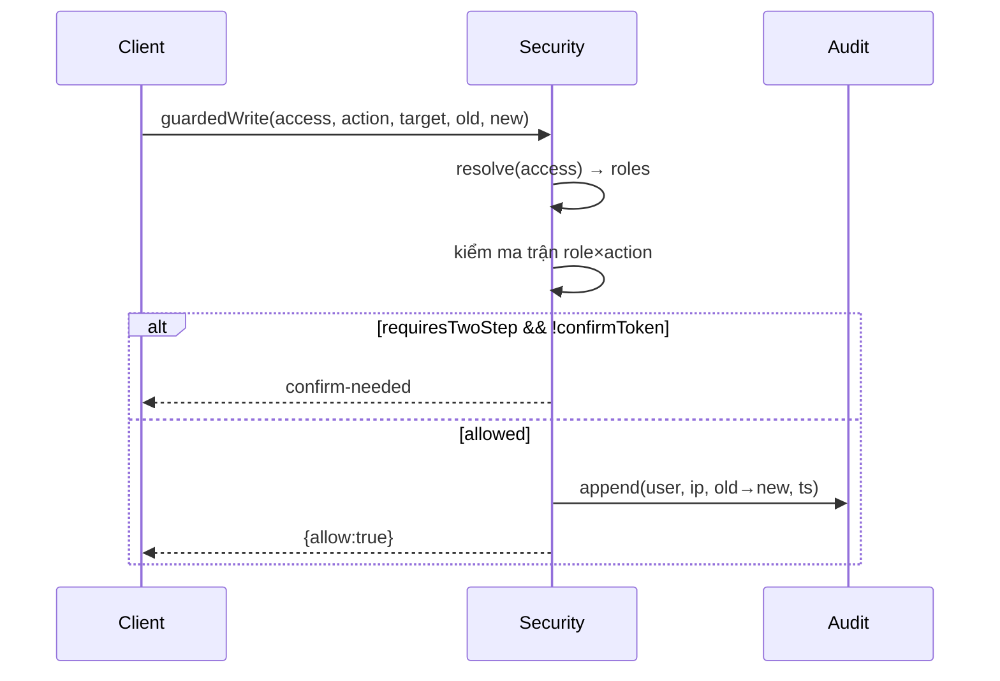
5. **Cấu hình:** `roles: [Viewer, Operator, ShiftSupervisor, Engineer, Maintenance, Admin]`; JWT access TTL 15 phút [GIẢ ĐỊNH] (v1 token đơn giản); `twoStepActions: [override, setpoint, mode]`.
6. **Phi chức năng:** guardedWrite < 1 ms; audit giữ ≥ 1 năm (doc 18); rate-limit login [GIẢ ĐỊNH].
7. **Lỗi & phục hồi:** token hết hạn → 401 (login lại); confirmToken sai/hết hạn → deny; audit không ghi được → chặn lệnh (fail-safe).
8. **Plugin mở rộng:** plugin KHÔNG mở rộng RBAC (kernel-only); chỉ khai báo action cần cho lệnh của mình qua map lệnh→action ở app.
9. **Kiểm thử:** unit ma trận role×action (Operator bị chặn override), 2-step (confirm→allow), audit append. (kernel test-suite).
10. **Quyết định:** RBAC ở API gateway (server), KHÔNG ở engine sim — tách enforcement khỏi mô phỏng; loại bỏ RBAC per-tag (quá mịn, dùng per-action + target).

## 5.2 Plugin Factory / Seed Generators (L1)

1. **Mục đích & ranh giới:** Sinh registry §10 (tag/alarm/screen/loop) từ spec KHAI BÁO của plugin — engine generic, không biết tên plugin. KHÔNG thuộc: nội dung plant (do plugin cấp).
2. **Interface:**
```typescript
function generateRegistry(spec: SeedSpec): { tags: TagRecord[]; alarms: AlarmDef[]; byCell: Record<string, number>; byScanClass: Record<ScanClass, number> };
function generateScreens(registry: Registry, instances: InstanceSpec[]): ScreenDef[];
function generateControlLoops(registry: Registry): ControlLoopDef[];
```
3. **Mô hình dữ liệu:** template `{cell, prefix, count, tagTemplates, alarmTemplates}`; id = UUID tất định (cyrb53→splitmix, KHÔNG Math.random — GĐ-42).
4. **Luồng:**
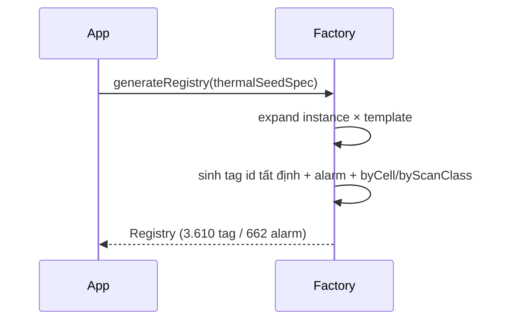
5. **Cấu hình:** `thermalSeedSpec` (dữ liệu plugin) — 18 cell (boiler…system), scan_class fast/process/slow/diag.
6. **Phi chức năng:** sinh 3.610 tag < 50 ms; tất định (cùng spec → cùng id).
7. **Lỗi & phục hồi:** template thiếu trường → validate ném lỗi build-time; id trùng → phát hiện qua Set.
8. **Plugin mở rộng:** plugin thêm cell/template = thêm DỮ LIỆU; engine/kernel KHÔNG đổi (bài test generic M-05).
9. **Kiểm thử:** roll-up ≥ 3.000 tag/≥ 600 alarm; phân bố scan_class; id tất định. (engines test).
10. **Quyết định:** registry là DANH MỤC (catalog) — không nạp cả 3.610 tag vào Tag Engine live (chỉ subset rationalized chạy); tránh Math.random để reproducible.

## 5.3 Tag / Realtime Engine (L2)

1. **Mục đích & ranh giới:** Kho current-value + report-by-exception theo deadband + subscribe-by-screen. KHÔNG thuộc: lịch sử (Historian §5.10), logic alarm (§5.5).
2. **Interface:**
```typescript
class TagRealtimeEngine {
  ingest(values: ReadonlyArray<{ tagId: TagId; value: number | boolean; quality: Quality; ts: Iso8601 }>): void;
  getCurrent(tagId: TagId): { value: number | boolean; quality: Quality; ts: Iso8601 } | undefined;
}
```
3. **Mô hình dữ liệu:** `Map<tagId, {value, quality, ts}>`; quality = Good/Uncertain/Bad/Substituted.
4. **Luồng:**
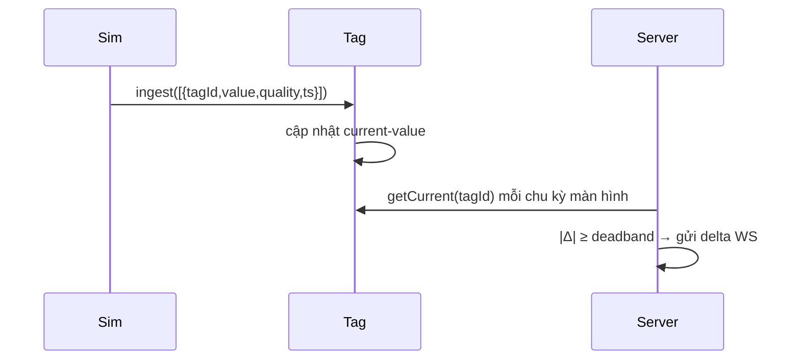
5. **Cấu hình:** deadband mặc định 0,01 (ở server sendScreen); scan_class theo tag (registry).
6. **Phi chức năng:** getCurrent O(1); server stream **delta-only theo màn hình**; trễ sim→pixel < 500 ms p95 (doc 02).
7. **Lỗi & phục hồi:** tag chưa có → undefined (client giữ giá trị cũ); quality Bad → client tô `--bad-quality`.
8. **Plugin mở rộng:** plugin cấp tag qua sim outputs/registry; engine không biết ngữ nghĩa tag.
9. **Kiểm thử:** ingest→getCurrent; delta chỉ gửi khi vượt deadband (server faceplate/screen test).
10. **Quyết định:** current-value in-memory (Redis ở deploy — doc 02); report-by-exception thay vì stream toàn bộ (giảm payload); alias hoá đẩy sang transport/Sparkplug (§5.19).

## 5.4 Graphics Runtime (L2)

1. **Mục đích & ranh giới:** Render màn hình từ `*.screen.json` KHAI BÁO qua binding; **cấm hardcode màn hình process trong React**. KHÔNG thuộc: bố cục thủ công (do JSON), dữ liệu (Tag Engine).
2. **Interface (SDK types + client render):**
```typescript
interface ScreenDef { screenId: string; level: 'D1'|'D2'|'D3'|'D4'; title: {vi:string;en:string}; elements: ScreenElement[] }
interface ScreenElement { id: string; symbol: string; x: number; y: number; w: number; h: number; label?: string; unit?: string; bindings: Binding[] }
interface Binding { property: string; tag: string; transform?: Transform; condition?: Condition }
function screenTags(screen: ScreenDef): string[]; // tag để subscribe
```
3. **Mô hình dữ liệu:** symbol (value/bar/…), binding `{property, tag, transform:{kind,scale}, condition:{when,value,then}}`.
4. **Luồng:**
```mermaid
sequenceDiagram
  Client->>Server: GET /screen/{id}
  Server-->>Client: ScreenDef JSON
  Client->>Client: render symbol theo x/y/w/h
  Server->>Client: delta {tag:value}
  Client->>Client: áp binding (property←transform(value)); đổi fill khi condition
```
5. **Cấu hình:** `screen.json` (SVG ≤ 2.000 phần tử động → chuyển Canvas/WebGL khi vượt [GIẢ ĐỊNH]).
6. **Phi chức năng:** screen call-up < 1 s; 60 fps animation, CPU < 30% laptop i5 (doc 02).
7. **Lỗi & phục hồi:** tag Bad → fill `--bad-quality`; symbol lạ → bỏ qua (không crash); mất WS → reconnect + full refresh.
8. **Plugin mở rộng:** plugin cấp `boilerScreens` + catalog screens (generateScreens); kernel render generic theo symbol.
9. **Kiểm thử:** screenTags gom đúng tag; binding transform/condition (client). (plugin graphics test).
10. **Quyết định:** màn hình = DỮ LIỆU JSON, render generic (mọi nhà máy là plugin); loại bỏ component React per-screen (không scale, không generic).

## 5.5 Alarm Engine (L2)

1. **Mục đích & ranh giới:** State machine ISA-18.2 (deadband + on/off delay + shelve/suppress) từ alarm KHAI BÁO. KHÔNG thuộc: hành động trip (C&E §5.8), ghi lịch sử.
2. **Interface:**
```typescript
class AlarmEngine {
  constructor(defs: ReadonlyArray<AlarmDef>, opts: { formatTs: (ms: number) => string });
  evaluate(tagId: TagId, value: number, quality: Quality, nowMs: number): void;
  ack(alarmId: string, user: string, nowMs: number): AlarmEvent;
  getActive(): ReadonlyArray<AlarmEvent>;
  kpi(nowMs: number): AlarmKpi;
  onTransition(cb: (e: AlarmEvent) => void): void;
  setSuppressionEvaluator(fn: (expr: string) => boolean): void;
}
```
3. **Mô hình dữ liệu:** state per alarm ∈ {Normal, UnackAlarm, AckAlarm, RtnUnack, Shelved, Suppressed, OutOfService}; priority P1–P4; deadband + onDelay/offDelay (chống chattering).
4. **Luồng:**
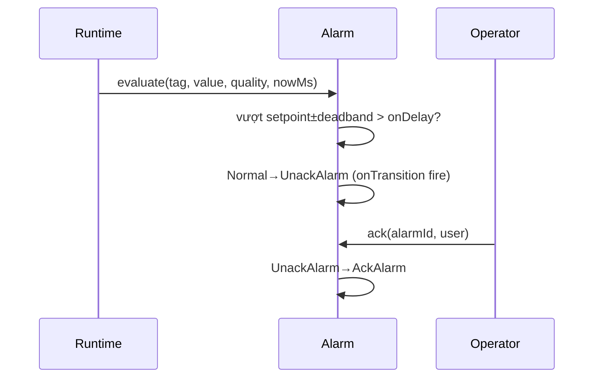
5. **Cấu hình:** `AlarmDef {alarmId, tagId, condition:HH/H/L/LL/DEV/ROC, setpoint, deadband, onDelayMs, offDelayMs, priority, suppressWhen?, consequence}`.
6. **Phi chức năng:** evaluate O(1)/tag; alarm luôn có deadband + delay (luật cứng); EEMUA 191 rate.
7. **Lỗi & phục hồi:** quality Bad → không đánh giá (giữ trạng thái); suppression theo unit_state (SHUTDOWN); flood → rationalization (662 alarm).
8. **Plugin mở rộng:** plugin cấp `boilerAlarms`; suppressionEvaluator do app cấp (unit_state).
9. **Kiểm thử:** raise/RTN/ack theo delay; suppression; **alarm-runtime test** (LOW xuất hiện lúc drum tụt trước MFT — GĐ-48).
10. **Quyết định:** state machine ISA-18.2 đầy đủ (không chỉ on/off); onTransition callback để Maintenance/Journal bắt (§5.15/5.18); loại bỏ alarm không deadband (chattering).

## 5.6 Control Loop Engine (L2)

1. **Mục đích & ranh giới:** PID có anti-windup + bumpless MAN/AUTO/CASCADE. KHÔNG thuộc: SFC (§5.7), interlock trip (§5.8).
2. **Interface:**
```typescript
class ControlLoopEngine {
  constructor(loops: ReadonlyArray<ControlLoopDef>);
  step(io: { getTag: (id: string) => number }, dtSec: number): Array<{ outTag: string; value: number }>;
  setMode(loopId: string, mode: LoopMode): void;      // MAN | AUTO | CASCADE
  getMode(loopId: string): LoopMode | undefined;
  getOutput(loopId: string): number | undefined;
  setManualOutput(loopId: string, value: number): void;
}
```
3. **Mô hình dữ liệu:** per loop {kp,ki,kd, integral, lastPV, mode, sp, out}; anti-windup clamp integral; bumpless (khớp OP khi chuyển mode).
4. **Luồng:**
```mermaid
sequenceDiagram
  Runtime->>Control: step({getTag}, dt)
  Control->>Control: PV=getTag(pv); e=SP-PV
  Control->>Control: PID + anti-windup (nếu AUTO/CASCADE)
  Control-->>Runtime: [{outTag, value}] → ghi OP
```
5. **Cấu hình:** `ControlLoopDef {loopId, pvTag, outTag, kp, ki, kd, sp, mode}`; 7 loop CCS live (boiler) + 29 loop catalog (LoopGenerator).
6. **Phi chức năng:** step tất cả loop < 1 ms; dt = 100 ms (đồng bộ sim).
7. **Lỗi & phục hồi:** PV Bad → giữ OP (hold); chuyển MAN khi mất PV; anti-windup chống tích luỹ khi OP bão hoà.
8. **Plugin mở rộng:** plugin cấp `boilerControlLoops` + seed loop; tuning trong def.
9. **Kiểm thử:** PID hội tụ SP; bumpless MAN→AUTO; anti-windup. (engines control test).
10. **Quyết định:** permissive/interlock là first-class (hiển thị lý do chặn — doc 02); loại bỏ điều khiển hardcode (mọi loop khai báo).

## 5.7 Sequence Engine — SFC (L2)

1. **Mục đích & ranh giới:** Thông dịch SequenceDef (SFC) theo tinh thần IEC 61131-3 / ISA-88 — permissive-gate, action có audit, transition theo tag + holdMs, timeout→failed. KHÔNG thuộc: logic bước hardcode.
2. **Interface:**
```typescript
class SequenceEngine {
  constructor(def: SequenceDef, io: { getTag: (id) => number|boolean; command: (cmd:{tagId,value}) => void; now: () => number });
  start(): void;
  tick(): void;
  state(): SeqRunState; // {status: idle|running|done|failed|aborted, stepIndex, stepId, message?}
}
```
3. **Mô hình dữ liệu:** step {permissive, actions[], transition:{tag,op,value,holdMs}, timeoutMs}; con trỏ bước + đồng hồ hold.
4. **Luồng:**
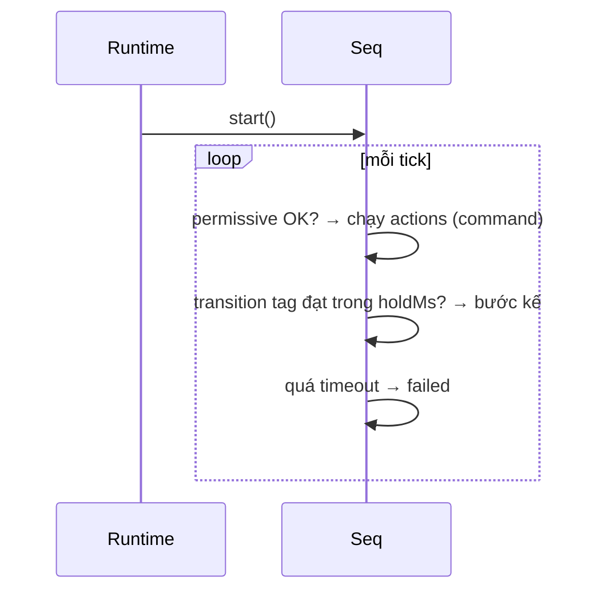
5. **Cấu hình:** `thermalSequences` (8 SFC: mill start/stop · purge · light-off · fill · turbine roll · gen sync · runback).
6. **Phi chức năng:** tick O(1); chạy live theo nhịp sim (đồng hồ THẬT) hoặc runToCompletion (đồng hồ ảo).
7. **Lỗi & phục hồi:** permissive fail → giữ bước; timeout → failed (+abortOnFail→aborted); action ghi có audit.
8. **Plugin mở rộng:** plugin cấp SequenceDef; tag lệnh `*_CMD` là điểm nối sim (GĐ-49).
9. **Kiểm thử:** chạy 8 SFC tới done; timeout→failed; live execution (runtime live-sequence test).
10. **Quyết định:** SFC khai báo (không hardcode); tách runToCompletion (đồng hồ ảo, không bước sim) khỏi live (tick theo sim) — GĐ-45/49.

## 5.8 Cause & Effect Engine (L2)

1. **Mục đích & ranh giới:** Latch trip theo ma trận C&E (NFPA 85) — nguyên nhân→hệ quả, reset chỉ khi hết nguyên nhân. KHÔNG thuộc: alarm (§5.5), điều khiển liên tục.
2. **Interface:**
```typescript
class CauseEffectEngine {
  constructor(matrix: CauseEffectMatrix, io: { command: (cmd:{tagId,value}) => void });
  readonly matrixId: string;
  evaluate(getTag: (id: string) => number): void;
  state(): CeState; // {activeCauses[], trippedEffects[]}
  reset(): boolean; // chỉ true khi hết nguyên nhân
}
```
3. **Mô hình dữ liệu:** matrix {causes[{tag,op,setpoint}], effects[{tag}], map cause→effect}; latched effects (giữ tới reset).
4. **Luồng:**
```mermaid
sequenceDiagram
  Runtime->>CE: evaluate(getTag) mỗi bước
  CE->>CE: cause active? → latch effect + command(effectTag=1)
  Operator->>CE: reset()
  CE->>CE: còn nguyên nhân? → từ chối; hết → xoá latch
```
5. **Cấu hình:** `thermalCauseEffect` (boiler-MFT 6×4 + turbine-trip 3×2).
6. **Phi chức năng:** evaluate mỗi bước trên CCS live; latch tất định.
7. **Lỗi & phục hồi:** trip latch tới reset (an toàn); reset thất bại khi còn nguyên nhân; flag effect nối sim (GĐ-48).
8. **Plugin mở rộng:** plugin cấp ma trận C&E; effect tag `*_TRIP` (actuation nối sim ở app).
9. **Kiểm thử:** inject loss-of-vacuum → turbine trip chốt; reset chỉ khi hết nguyên nhân (engines + runtime).
10. **Quyết định:** C&E generic latch (không hardcode logic trip); hệ quả ghi flag tag (actuation sâu = app/sim); ngưỡng ngoài DB = [GIẢ ĐỊNH].

## 5.9 Simulation Host (L2)

1. **Mục đích & ranh giới:** Chạy các `ISimModel` của plugin (solver step 100 ms tách publish), inject malfunction, snapshot/restore/freeze (OTS). KHÔNG thuộc: mô hình vật lý (nằm trong plugin).
2. **Interface:**
```typescript
class SimulationHost {
  constructor(dtMs: number, io: { now: () => Iso8601; getTag: (id) => number; onOutputs: (outs) => void });
  register(model: ISimModel, opts?: { warmStart?: unknown }): void;
  step(): void;
  inject(modelId: string, m: IMalfunction): void;
  clear(modelId: string, id: string): void;
  snapshotAll(): ReadonlyMap<string, ISimSnapshot>;
  restoreAll(snap: ReadonlyMap<string, ISimSnapshot>): void;
  freeze(on: boolean): void;
}
interface ISimModel { id: string; tagsProvided: TagId[]; init(); step(ctx): ISimStepResult; snapshot(); restore(s); injectMalfunction(m); clearMalfunction(id); dispose() }
```
3. **Mô hình dữ liệu:** danh sách model đăng ký (thứ tự = thứ tự đọc tag tươi); ctx {dtMs, getTag, now}.
4. **Luồng:**
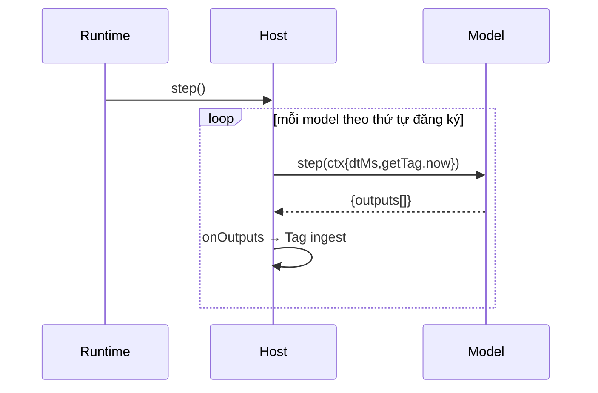
5. **Cấu hình:** dt = 100 ms; 12 model plugin (boiler→plant-balance); warmStart điểm vận hành.
6. **Phi chức năng:** step 12 model < vài ms; tất định (không Math.random); solver tách chu kỳ publish.
7. **Lỗi & phục hồi:** freeze dừng toàn bộ (OTS); snapshot/restore khôi phục trạng thái; model additive không hồi quy nhau (đăng ký sau đọc tag trước).
8. **Plugin mở rộng:** plugin hiện `ISimModel`; đăng ký thêm model = thêm tag (additive) — GĐ-59/65/67…73.
9. **Kiểm thử:** từng model unit (đầy tải/MFT/snapshot); runtime tích hợp (cân bằng năng lượng khép ~100%).
10. **Quyết định:** ISimModel interface trong SDK (plugin chỉ import SDK); model additive registration (đọc tag tươi của model trước) thay vì solver đồng thời — đơn giản, tất định.

## 5.10 Historian Engine + Timescale adapter (L2)

1. **Mục đích & ranh giới:** Ghi/truy vấn lịch sử + snapshot + DATA REPLAY; adapter Timescale cho deploy. KHÔNG thuộc: current-value (Tag §5.3).
2. **Interface:**
```typescript
class MemoryHistorian {
  write(values: ReadonlyArray<WritePoint>): void;
  query(tagId, from, to, agg: 'avg'|'min'|'max'|'last', bucketMs?): Promise<HistPoint[]>;
  dataRange(): { from: Iso8601; to: Iso8601 } | undefined;
  size(): number;
  snapshot(ts: Iso8601): Promise<void>;
  openReplay(from, to, speed): ReplaySession; advanceReplay(id, dtMs); seek(id, ts); setSpeed(id, s); closeReplay(id);
  frameAt(tsMs, tagIds): Record<string, HistPoint>; valueAt(tagId, tsMs): HistPoint | undefined;
}
class TimescaleHistorian { /* cùng write/query, SQL qua SqlExecutor INJECT */ }
```
3. **Mô hình dữ liệu:** ring theo tag (memory) / hypertable (Timescale); bucket aggregate; replay session {clock, speed}.
4. **Luồng:**
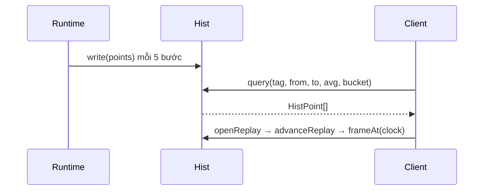
5. **Cấu hình:** REC_EVERY 5 bước (~2 Hz); Timescale 2.17-pg16 (docker-compose); bucket/flush = [GIẢ ĐỊNH].
6. **Phi chức năng:** ghi ≥ 50.000 điểm/s (benchmark loadgen: memory ~772k, timescale-đệm ~4,37M — GĐ-51); query bucket < 300 ms.
7. **Lỗi & phục hồi:** SqlExecutor lỗi → buffer store-and-forward [GIẢ ĐỊNH deploy]; replay chặn lệnh ghi thiết bị (an toàn).
8. **Plugin mở rộng:** plugin cấp danh sách recordedTags (app); adapter inject (không phụ thuộc `pg`).
9. **Kiểm thử:** write→query agg; dataRange/size; replay frameAt; benchmark ≥ 50k (loadgen). 
10. **Quyết định:** SqlExecutor INJECT → lõi không phụ thuộc pg (kiểm được không cần DB); gộp Replay vào Historian (doc 02); write đệm + flush BATCH đạt mốc ghi.

## 5.11 Navigation Engine (L2)

1. **Mục đích & ranh giới:** Cây điều hướng ISA-101 (tách khỏi cây thiết bị ISA-95) + index alarm→màn hình. KHÔNG thuộc: render (Graphics §5.4).
2. **Interface:**
```typescript
class NavigationEngine {
  constructor(nav: NavSpec, ctx: { alarms: AlarmDef[]; screens: ScreenDef[] });
  tree(): ReadonlyArray<NavNode>;
  alarmIndex(): Record<string, string>; // alarmId/tag → screenId
  home(): string;
  breadcrumb(screenId: string): ReadonlyArray<NavNode>;
}
```
3. **Mô hình dữ liệu:** cây NavNode {id, title, screenId?, children}; index alarm→D3 từ tag alarm + tag màn hình.
4. **Luồng:**
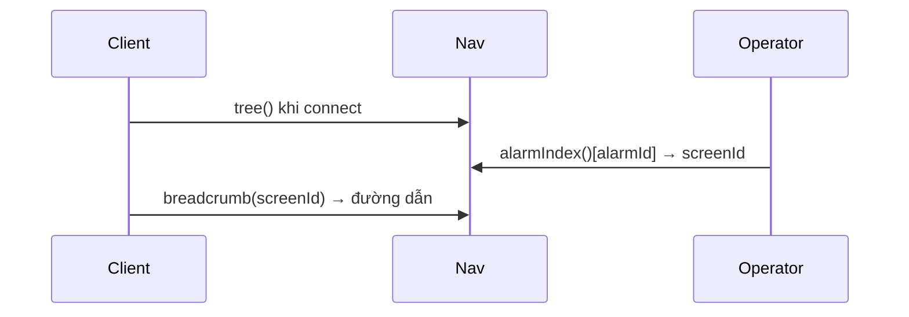
5. **Cấu hình:** `thermalNav` (cây điều hướng khai báo của plugin).
6. **Phi chức năng:** tree/index build 1 lần khi connect; O(1) tra cứu.
7. **Lỗi & phục hồi:** alarm không có màn hình → về home; screen lạ → breadcrumb rỗng.
8. **Plugin mở rộng:** plugin cấp `thermalNav`; kernel render + index generic.
9. **Kiểm thử:** tree/home/breadcrumb; alarmIndex ánh xạ đúng D3 (navigation test).
10. **Quyết định:** KHÔNG gộp cây thiết bị (ISA-95) với cây điều hướng (ISA-101) — luật cứng; nav do plugin khai báo.

## 5.12 Faceplate Engine (L2)

1. **Mục đích & ranh giới:** Ráp 4 tab faceplate (overview/alarms/detail/trend) từ Tag/Loop/Alarm/Maintenance. KHÔNG thuộc: lệnh ghi (server RBAC).
2. **Interface:**
```typescript
class FaceplateEngine {
  constructor(defs: ReadonlyArray<FaceplateDef>);
  list(): ReadonlyArray<FaceplateDef>;
  open(assetId: string): FaceplateDef | undefined;
  overview(def, resolvers): FaceplateOverview;
  alarms(def, resolvers): FaceplateAlarmRow[];
  detail(def, resolvers): FaceplateDetail;
}
// resolvers: { read, loopMode, loopOutput, alarmDef, activeAlarmIds, runtime, blockedReason }
```
3. **Mô hình dữ liệu:** FaceplateDef {faceplateId, assetId, title, pvTag, trendTags[]}; resolvers cắm nguồn.
4. **Luồng:**
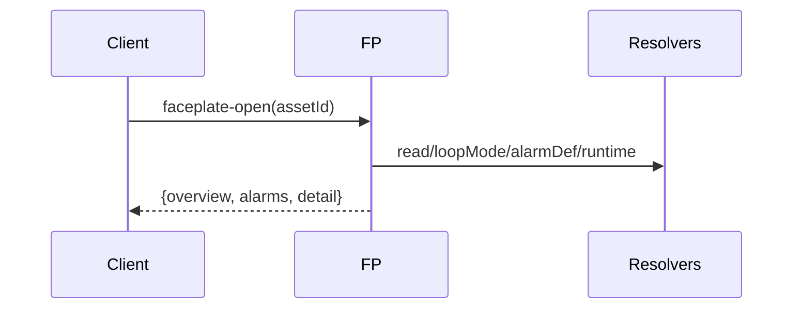
5. **Cấu hình:** `thermalFaceplates`; trendTags cho tab Trend (từ Historian).
6. **Phi chức năng:** ráp faceplate < vài ms; trend query theo giờ.
7. **Lỗi & phục hồi:** tag/loop thiếu → ô rỗng; blockedReason = null v1 (interlock first-class = pha sau — GĐ-41).
8. **Plugin mở rộng:** plugin cấp FaceplateDef; resolvers do app nối engine thật.
9. **Kiểm thử:** fp-list/fp-data; set-mode 2 bước (Operator ok, Viewer chặn) — faceplate test.
10. **Quyết định:** faceplate = ráp từ resolvers (không trùng lặp dữ liệu); interlock blockedReason để pha sau (lý do chặn vẫn hiện qua Control/Security).

## 5.13 KPI Engine (L2)

1. **Mục đích & ranh giới:** Tính KPI (heat rate, aux power, availability…) từ Historian theo công thức KHAI BÁO. KHÔNG thuộc: báo cáo bố cục (Report §5.14).
2. **Interface:**
```typescript
class KpiEngine {
  constructor(defs: ReadonlyArray<KpiDef>);
  computeAll(input: KpiInput): Promise<IKpiResult[]>;
}
function historianKpiInput(hist, from, to): KpiInput;
```
3. **Mô hình dữ liệu:** KpiDef {id, title, unit, formula(reads)}; đọc aggregate qua input.
4. **Luồng:**
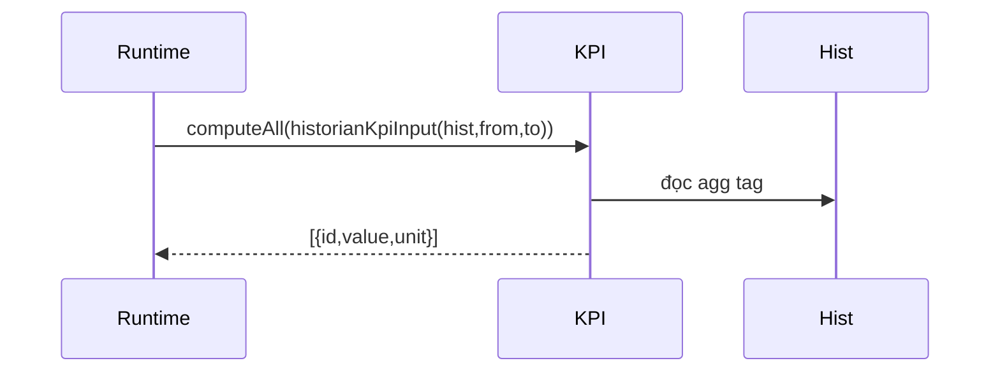
5. **Cấu hình:** `thermalKpis` (heat rate, aux power, availability…).
6. **Phi chức năng:** compute theo chu kỳ (server mỗi 50 tick); query agg.
7. **Lỗi & phục hồi:** thiếu dữ liệu range → [] (không bịa).
8. **Plugin mở rộng:** plugin cấp KpiDef (công thức); engine generic tính.
9. **Kiểm thử:** computeAll trả KPI có giá trị ở điểm vận hành (kpi test).
10. **Quyết định:** KPI khai báo (công thức trong plugin); loại bỏ KPI hardcode; nguồn = Historian (nhất quán report).

## 5.14 Report Engine (L2)

1. **Mục đích & ranh giới:** Ráp báo cáo ca/ngày từ section KHAI BÁO (table/text/trend), đọc Historian. KHÔNG thuộc: designer kéo-thả (v2), xuất PDF/Excel (v2).
2. **Interface:**
```typescript
class ReportEngine {
  constructor(sections: ReadonlyArray<IReportSection>);
  generate(ctx: IReportContext, title: {vi,en}): Promise<Report>;
}
interface IReportContext { range: {from,to}; read(tagId, agg): Promise<number> }
interface IReportSection { sectionId; title; render(ctx): Promise<ReportBlock[]> }
```
3. **Mô hình dữ liệu:** ReportBlock = table | text | trend; section render → blocks.
4. **Luồng:**
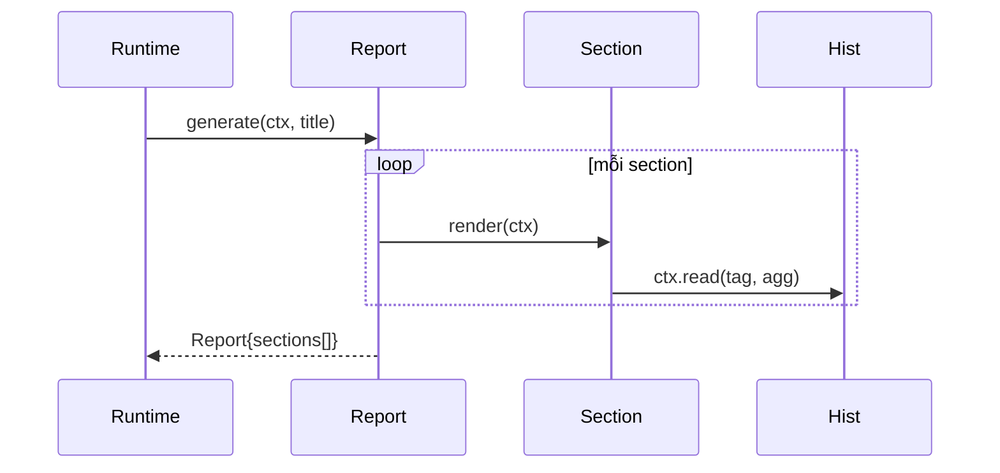
5. **Cấu hình:** `thermalReportSections` (operating-summary · narrative · trend).
6. **Phi chức năng:** generate < 1 s (query agg); read-only.
7. **Lỗi & phục hồi:** không có range → báo cáo rỗng (from/to='').
8. **Plugin mở rộng:** plugin cấp `IReportSection[]`; `IReportContext` CHỈ ở SDK (plugin không phụ thuộc engine).
9. **Kiểm thử:** ráp từ section; đọc aggregate; bảng nhiều dòng + trend range (engines + plugin + runtime).
10. **Quyết định:** IReportContext trong SDK (tách plugin↔engine); READ-ONLY tuyệt đối; designer + PDF/Excel = v2.

## 5.15 Maintenance Engine (L2)

1. **Mục đích & ranh giới:** Giờ chạy, số khởi động, MTBF/MTTR, work order, liên kết tag↔asset. KHÔNG thuộc: CMMS thật (v3).
2. **Interface:**
```typescript
class MaintenanceEngine {
  constructor(defs, opts:{formatTs});
  sample(getTag, nowMs): void;
  allRuntime(): EquipmentRuntime[]; mtbf(assetId): number; recordFailure(assetId, nowMs): void;
  createWorkOrder(spec, user, nowMs): WorkOrder; updateWorkOrder(woId, status, user, nowMs): WorkOrder | {error};
  workOrders(): WorkOrder[];
}
```
3. **Mô hình dữ liệu:** per asset {runningHours, startCount}; work order {id, assetId, type PM/CM, status, reason}; run-state suy từ tag > ngưỡng.
4. **Luồng:**
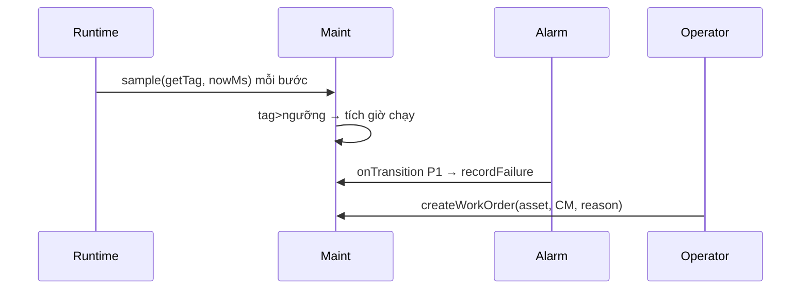
5. **Cấu hình:** `thermalMaintenance`; ngưỡng PM (UNIT1 8000h · MILL 2000h · BFP 4000h) = [GIẢ ĐỊNH] (GĐ-40).
6. **Phi chức năng:** sample O(assets)/bước; MTBF = giờ chạy/số hỏng.
7. **Lỗi & phục hồi:** event hỏng lấy alarm P1 (v1 đơn giản hoá); CMMS thật = v3.
8. **Plugin mở rộng:** plugin cấp asset + ngưỡng PM; work order type.
9. **Kiểm thử:** tích giờ chạy, MTBF, work order lifecycle (maintenance test).
10. **Quyết định:** run-state suy từ tag (không cần cảm biến giờ chạy riêng); MTBF từ alarm P1 (đơn giản v1); CMMS đầy đủ = v3.

## 5.16 Predictive Maintenance Engine (L2)

1. **Mục đích & ranh giới:** Cảnh báo sớm READ-ONLY từ 3 loại luật (ngưỡng · xu hướng · giờ chạy). KHÔNG thuộc: ML thật (v3), ghi thiết bị.
2. **Interface:**
```typescript
class PredictiveMaintenance {
  constructor(rules: ReadonlyArray<PredictiveRule>);
  evaluate(input: { nowMs; getTag; runningHours }): PredictiveAdvisory[];
}
```
3. **Mô hình dữ liệu:** rule {type: threshold|trend|runhours, tag, warn/limit, ...}; trạng thái mẫu tag trước để tính rate.
4. **Luồng:**
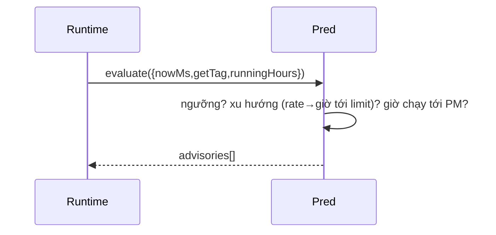
5. **Cấu hình:** `thermalPredictiveRules` (5 luật: vacuum trend+threshold, SH temp trend, PM UNIT1/MILL).
6. **Phi chức năng:** evaluate theo chu kỳ; READ-ONLY.
7. **Lỗi & phục hồi:** thiếu mẫu trước → bỏ qua rate; ở điểm vận hành không cảnh báo.
8. **Plugin mở rộng:** plugin cấp PredictiveRule; ngưỡng/mốc = [GIẢ ĐỊNH] (GĐ-38/40).
9. **Kiểm thử:** mất chân không → cảnh báo; điểm vận hành im lặng (predictive test).
10. **Quyết định:** rule-based v1 (ML = v3); READ-ONLY (không ghi); trạng thái nhẹ để tính rate.

## 5.17 AI Advisor Engine (L2, rule-based v1)

1. **Mục đích & ranh giới:** Giải thích alarm READ-ONLY tuyệt đối (hậu quả + nguyên nhân + khắc phục + leo thang + TRÍCH DẪN nguồn). KHÔNG ghi tag/setpoint/ACK. RAG/LLM thật = v2.
2. **Interface:**
```typescript
class AiAdvisor {
  constructor(kb: { alarms: AlarmDef[]; matrices: CauseEffectMatrix[]; knowledge: KnowledgeDoc[] });
  explainAlarm(alarmId: string, ctx: { value?: number; nowIso: string }): Advice | undefined;
}
```
3. **Mô hình dữ liệu:** knowledge (SOP/C&E/narrative); Advice {consequence, cause, corrective, escalation, citations[]}.
4. **Luồng:**
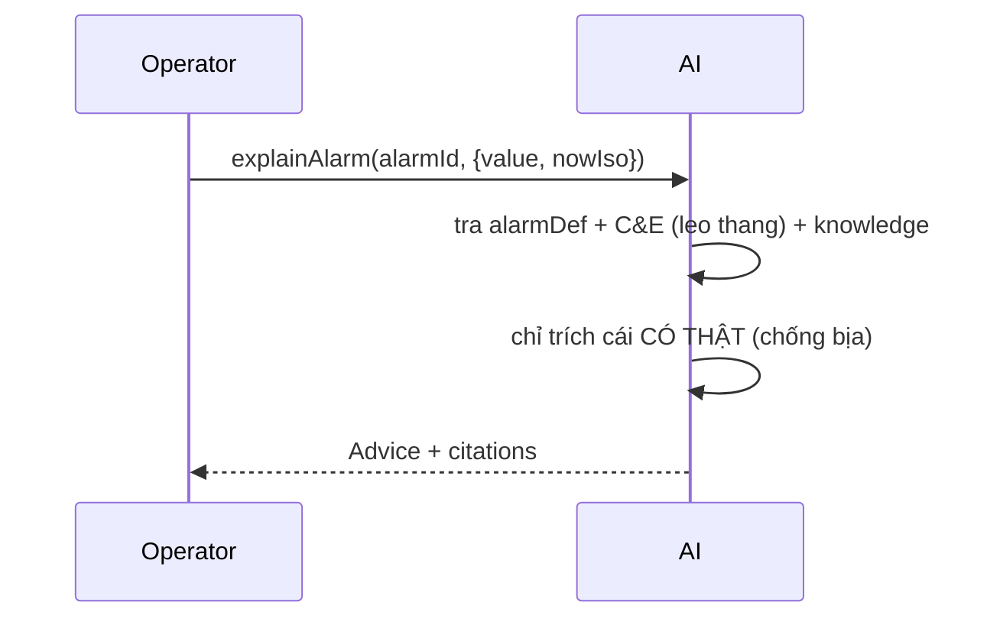
5. **Cấu hình:** `thermalKnowledge` (4 doc SOP/C&E/narrative).
6. **Phi chức năng:** explain < vài ms (tra cứu); read-only, không chặn replay.
7. **Lỗi & phục hồi:** alarm không có tri thức → advice tối thiểu (không bịa); citation chỉ nguồn thật.
8. **Plugin mở rộng:** plugin cấp knowledge base; engine tra generic.
9. **Kiểm thử:** giải thích = hậu quả+nguyên nhân+khắc phục+leo thang+trích dẫn; chống bịa (ai-advisor test).
10. **Quyết định:** rule-based + citation (chống bịa) v1; RAG/LLM thật = v2; READ-ONLY tuyệt đối (luật cứng AI).

## 5.18 Event Journal Engine — SOE (L2)

1. **Mục đích & ranh giới:** Nhật ký sự kiện generic (ring buffer, seq đơn điệu) — 6 danh mục trung tính. READ-ONLY với process. KHÔNG thuộc: audit RBAC (Security §5.1).
2. **Interface:**
```typescript
class EventJournal {
  constructor(cap?: number);
  record(e: Omit<JournalEntry,'seq'>): JournalEntry;
  query(opts?: { category?; severity?; sinceSeq?; limit? }): ReadonlyArray<JournalEntry>;
  summary(notableLimit?: number): JournalSummary;
  get lastSeq(): number;
}
```
3. **Mô hình dữ liệu:** JournalEntry {seq, at, category: alarm|trip|command|sequence|security|system, severity, message, actor?, source?}; ring cap 5000.
4. **Luồng:**
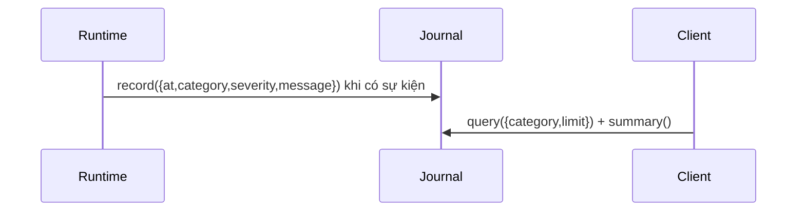
5. **Cấu hình:** cap 5000 [GIẢ ĐỊNH]; danh mục cố định trung tính (không tên plugin → generic).
6. **Phi chức năng:** record O(1); query newest-first + lọc; summary O(n).
7. **Lỗi & phục hồi:** vượt cap → bỏ entry cũ (ring); seq đơn điệu (feed report-by-exception).
8. **Plugin mở rộng:** không cần dữ liệu plugin (hạ tầng generic như Historian); runtime/app bơm sự kiện.
9. **Kiểm thử:** seq/query/lọc/summary/ring; runtime tự ghi command/system/security/trip (engine + runtime test).
10. **Quyết định:** danh mục trung tính (giữ generic); READ-ONLY (chỉ quan sát); denial lệnh ở audit RBAC riêng (tách vai trò).

## 5.19 Protocol Gateway — Sparkplug Driver (L0/L2)

1. **Mục đích & ranh giới:** Driver MQTT Sparkplug B (HOST): NBIRTH/NDATA alias, lọc theo interest → kernel; write→NCMD. KHÔNG thuộc: OPC UA/Modbus thật (v3).
2. **Interface:**
```typescript
class SparkplugDriver implements IProtocolDriver {
  constructor(deps: { transport: MqttTransport; codec: SpCodec; metricMap; interest }, ctx: { publish });
  start(): void; stop(): void;
  write(tagId, value): void; // → NCMD
}
```
3. **Mô hình dữ liệu:** alias map (name↔alias từ BIRTH), metricMap (name↔tag id), interest filter.
4. **Luồng:**
```mermaid
sequenceDiagram
  Broker->>Driver: NBIRTH (name↔alias)
  Broker->>Driver: NDATA (alias, value)
  Driver->>Driver: alias→name→tag id; lọc interest
  Driver->>Kernel: ctx.publish(tag, value)
```
5. **Cấu hình:** serialize JSON mặc định (deploy: protobuf Eclipse Tahu); metricMap do cấu hình cấp.
6. **Phi chức năng:** xử lý NDATA theo alias (payload nhỏ); throughput theo broker.
7. **Lỗi & phục hồi:** mất broker → reconnect; DATA trước BIRTH → giữ chờ alias; interest lọc giảm tải.
8. **Plugin mở rộng:** metricMap ánh xạ name↔tag của plugin; driver generic.
9. **Kiểm thử:** BIRTH lập alias, DATA giải alias, write→NCMD (MqttTransport/SpCodec giả — không cần broker) (sparkplug test).
10. **Quyết định:** MqttTransport + SpCodec INJECT (lõi không phụ thuộc mqtt.js/protobuf, kiểm được không broker); OPC UA/Modbus thật = v3.

## 5.20 Scenario Runner — OTS (L2)

1. **Mục đích & ranh giới:** Chạy kịch bản end-to-end (SFC + malfunction + tải) qua ScenarioHost trên CCS thật. KHÔNG thuộc: mô hình vật lý (plugin).
2. **Interface:**
```typescript
function executeScenario(def: ScenarioDef, io: {
  step; setLoad; inject; clear; set; runSequence; getTag;
}): ScenarioPhaseResult[];
```
3. **Mô hình dữ liệu:** ScenarioDef {phases[{phaseId, actions, settleSteps, checks}]}; ráp SFC + malfunction + tải.
4. **Luồng:**
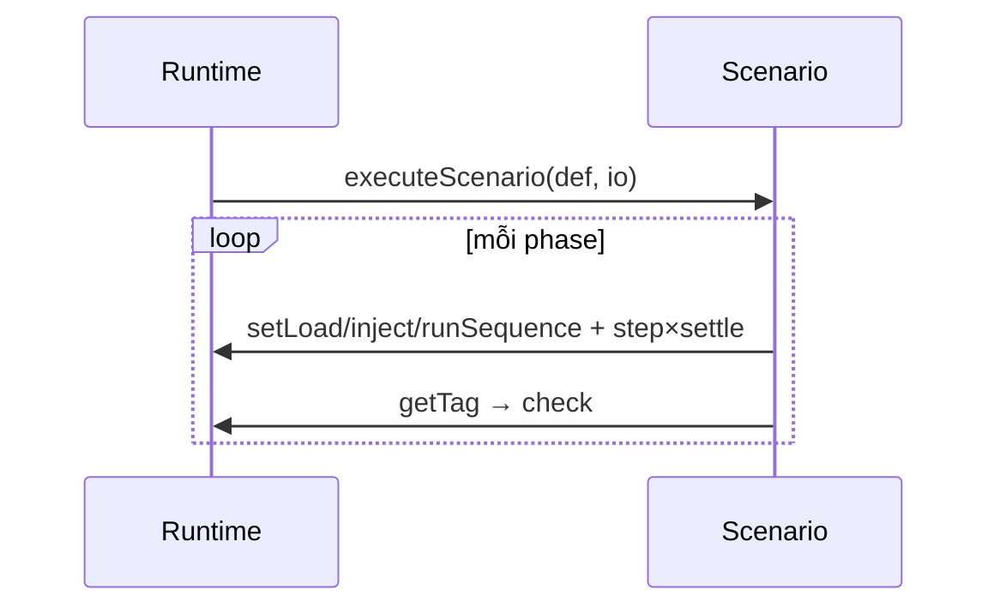
5. **Cấu hình:** `thermalScenarios` (cold-start→light-off→…→MFT/coast-down, 10 pha).
6. **Phi chức năng:** chạy trên CCS thật; số bước settle = [GIẢ ĐỊNH].
7. **Lỗi & phục hồi:** phase check fail → ghi kết quả fail (không dừng cứng trừ khi cấu hình).
8. **Plugin mở rộng:** plugin cấp ScenarioDef; io do app nối runtime.
9. **Kiểm thử:** kịch bản chạy end-to-end, quỹ đạo MW (ramp lên, coast-down xuống) (scenario test).
10. **Quyết định:** scenario = SFC + malfunction + tải (dùng lại engine khác); pha cold-start là điều phối (physics cold-start đầy đủ = pha sau).

## 5.21 Screen Builder Engine (L5, v1 core)

1. **Mục đích & ranh giới:** Dựng ScreenDef từ spec (người không code liệt kê tag + nhãn) → kernel render. UI kéo-thả đầy đủ = v2. KHÔNG thuộc: render (Graphics §5.4).
2. **Interface:**
```typescript
function buildScreen(spec: ScreenBuildSpec): ScreenDef; // ném lỗi nếu spec sai
interface ScreenBuildSpec { screenId; title; tiles: [{ tag; label; unit?; kind?: 'value'|'bar'; alarm? }]; columns? }
```
3. **Mô hình dữ liệu:** spec → engine tự dàn lưới (grid) + sinh binding → ScreenDef hợp lệ.
4. **Luồng:**
```mermaid
sequenceDiagram
  Engineer->>Builder: buildScreen(spec{tiles})
  Builder->>Builder: dàn lưới + sinh binding {property,tag,transform}
  Builder-->>Server: ScreenDef → đăng ký /screen/{id}
```
5. **Cấu hình:** spec do người dùng nhập (HMI Screen Builder UI, kéo-thả — GĐ-58).
6. **Phi chức năng:** build < vài ms; ScreenDef hợp lệ (validate).
7. **Lỗi & phục hồi:** spec thiếu tag/screenId → ném lỗi (server trả denied); action `engineer` (RBAC).
8. **Plugin mở rộng:** dùng tag bất kỳ của plugin (picker từ recordedTags).
9. **Kiểm thử:** buildScreen(spec) → ScreenDef hợp lệ, render được (screen-builder test).
10. **Quyết định:** v1 = engine buildScreen + UI kéo-thả cơ bản (bỏ gõ toạ độ/binding tay); Engineering Engine đầy đủ = v2 (doc 02 §4).

---

## 6. Chỉ tiêu phi chức năng chung (doc 02 §7.2) — ánh xạ

| Chỉ tiêu | Mục tiêu (doc 02) | Trạng thái |
|---|---|---|
| Số tag mô phỏng | 8.000–15.000 | registry 3.610 catalog; live subset (17 tag sim lõi + tag model) |
| Chu kỳ quét | 250/500/1000/5000 ms | scan_class fast/process/slow/diag (registry) |
| Trễ sim→pixel | < 500 ms p95 | delta-only + report-by-exception (§5.3) |
| Ghi historian | ≥ 10.000 điểm/s | benchmark ≥ 50.000 (GĐ-51) ✓ |
| Uptime | reconnect + store-and-forward | WS reconnect; buffer = [GIẢ ĐỊNH deploy] |

## 7. Quyết định kiến trúc xuyên suốt (loại bỏ, kèm lý do)

- **Injected-dependency cho adapter hạ tầng** (SqlExecutor, MqttTransport/SpCodec) → lõi engine KHÔNG phụ thuộc `pg`/`mqtt.js`/protobuf → **kiểm được không cần DB/broker**. Loại bỏ: hard-depend infra (không test được).
- **Mọi năng lực plugin = DỮ LIỆU KHAI BÁO** chạy bởi engine generic → thêm plugin không sửa kernel (bài test generic M-05). Loại bỏ: logic plant trong kernel.
- **KHÔNG Math.random** cho dữ liệu process → tất định, reproducible (id UUID tất định, noise LCG có seed). Loại bỏ: random nguồn dữ liệu.
- **AI/nhật ký/chẩn đoán READ-ONLY tuyệt đối** → không ghi tag/setpoint/ACK (luật cứng). Loại bỏ: AI ghi thiết bị.
- **Đồng hồ Time Service** (không `Date.now` trong vòng process) → sim/deploy nhất quán. Loại bỏ: Date.now trong solver.

## 8. Còn mở (đăng ký doc 25)
- **Engineering Engine đầy đủ (L5)** = v2 (Screen Builder §5.21 hiện core + UI cơ bản).
- **AI Engine RAG/LLM** = v2 (AI Advisor §5.17 hiện rule-based).
- **Protocol Gateway OPC UA/Modbus thật** = v3 (§5.19 hiện MQTT Sparkplug).
- **Interlock first-class object** (Faceplate blockedReason §5.12) = pha sau (GĐ-41).
- Chỉ tiêu phi chức năng đo tải thật (p95 trễ, throughput DB thật) = pha triển khai.
