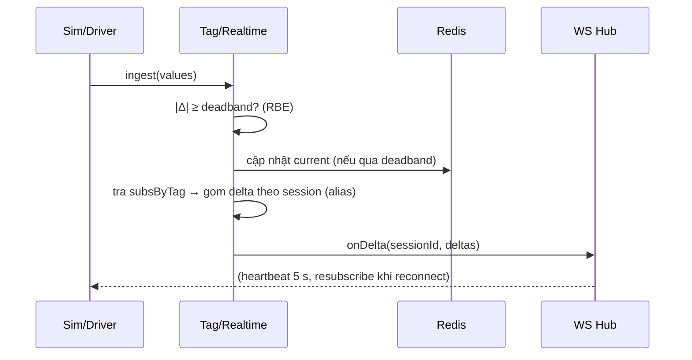

# 05‑01 — Tag/Realtime Engine (L2)

> Đặc tả theo khung 10 mục §8. Types dùng chung: `@idtp/sdk` (doc 03). Registry: doc 04/07.

## 1. Mục đích & ranh giới trách nhiệm

Quản lý **current value** của tag, chuẩn hoá EU + quality, phân phối realtime tới client **theo màn
hình** (subscribe‑by‑screen), áp **report‑by‑exception (RBE)** theo deadband, **alias hoá** payload.

| KHÔNG thuộc engine này | Thuộc về |
|---|---|
| Lưu lịch sử | Historian (05‑04) |
| Render đồ hoạ | Graphics Runtime (05‑02) |
| Sinh dữ liệu process | Simulation (05‑05) / Driver (L0) |
| Logic alarm | Alarm (05‑03) |
| Điều khiển/ghi setpoint | Control (05‑06) |

## 2. Interface công bố

```typescript
import type { TagId, TagValue, Quality, Iso8601 } from '@idtp/sdk';

export type SubscriptionHandle = string;
export interface TagDelta { alias: number; value: number | boolean | string; quality: Quality; ts: Iso8601; }

export interface ITagRealtimeEngine {
  ingest(values: ReadonlyArray<TagValue>): void;                 // từ sim/driver; áp RBE
  getCurrent(tagId: TagId): TagValue | undefined;
  subscribeScreen(sessionId: string, screenId: string, tagIds: ReadonlyArray<TagId>): SubscriptionHandle;
  unsubscribe(handle: SubscriptionHandle): void;
  onDelta(cb: (sessionId: string, deltas: ReadonlyArray<TagDelta>) => void): void;
  substitute(tagId: TagId, value: number | boolean | string, user: string, reason: string): void; // manual + audit
}
```

## 3. Mô hình dữ liệu nội bộ

| Cấu trúc | Kiểu | Vai trò |
|---|---|---|
| `current` | `Map<TagId, TagValue>` (+ Redis mirror) | giá trị hiện tại |
| `lastPublished` | `Map<TagId, number\|boolean\|string>` | mốc so deadband (RBE) |
| `aliasOf` | `Map<TagId, number>` | alias số hoá giảm payload |
| `subsByTag` | `Map<TagId, Set<sessionId>>` | fanout ngược |
| `tagsBySession` | `Map<sessionId, Set<TagId>>` | dọn khi disconnect |

## 4. Luồng xử lý



## 5. Cấu hình (YAML + ví dụ)

```yaml
tagRealtime:
  scanClasses: { fast: 250, process: 500, slow: 1000, diag: 5000 }   # ms
  defaultDeadbandPct: 1.0            # % dải nếu tag không khai báo
  maxTagsPerScreen: 800
  aliasStrategy: per-session          # cấp alias khi subscribe
  coalesceWindowMs: 100               # gộp delta trong 1 cửa sổ
```

## 6. Chỉ tiêu phi chức năng

| Chỉ tiêu | Mục tiêu |
|---|---|
| Tag định nghĩa | 200.000 |
| Tag hoạt động/giây | 50.000 |
| Trễ ingest→onDelta (p95) | < 150 ms (ngân sách trong 500 ms sim→pixel) |
| Fanout | 20 client (gồm 2 video wall 4K) |
| RAM engine (15k tag thermal) | < 512 MB `[GIẢ ĐỊNH]` |

## 7. Chế độ lỗi & phục hồi

| Sự cố | Hệ quả | Phục hồi |
|---|---|---|
| Mất kết nối sim/driver | quality → `Bad`, giữ giá trị cuối | store‑and‑forward; auto‑reconnect |
| Quá tải | tăng độ trễ | coalesce delta theo `coalesceWindowMs`; backpressure |
| Dữ liệu xấu (NaN/ngoài dải) | có thể lệch hiển thị | clamp về dải + quality `Uncertain`/`Bad` |
| Redis down | mất mirror | fallback in‑memory + reconnect; không mất realtime |

## 8. Cách plugin mở rộng

Plugin **chỉ** cung cấp `tagRegistry` (định nghĩa tag: deadband, scan_class, EU…) + nguồn qua
`ISimModel`/`IProtocolDriver`. **Không** cần viết code cho engine. Alias/subscribe do kernel lo.

## 9. Kế hoạch kiểm thử

| Loại | Nội dung |
|---|---|
| Unit | logic RBE deadband; cấp alias; ánh xạ quality; clamp dải |
| Integration | sim → ingest → subscribeScreen → onDelta (assert delta đúng tag đang hiển thị) |
| Load | 50.000 tag/s, 20 client → đo p95 (apps/loadgen), báo cáo `docs/benchmark.md` |

## 10. Quyết định & phương án đã loại bỏ

| Quyết định | Chọn | Loại bỏ | Lý do |
|---|---|---|---|
| Phạm vi stream | **Subscribe‑by‑screen** | Stream tất cả tag | Payload nhỏ, đạt p95 < 500 ms |
| Payload | **Alias số** | Gửi full tag id | Giảm băng thông tới video wall |
| Cập nhật | **RBE theo deadband** | Gửi mọi chu kỳ quét | Giảm tải mạng/CPU client |
| Current value | **Redis + in‑memory** | Đọc thẳng TimescaleDB | Latency thấp cho realtime |
