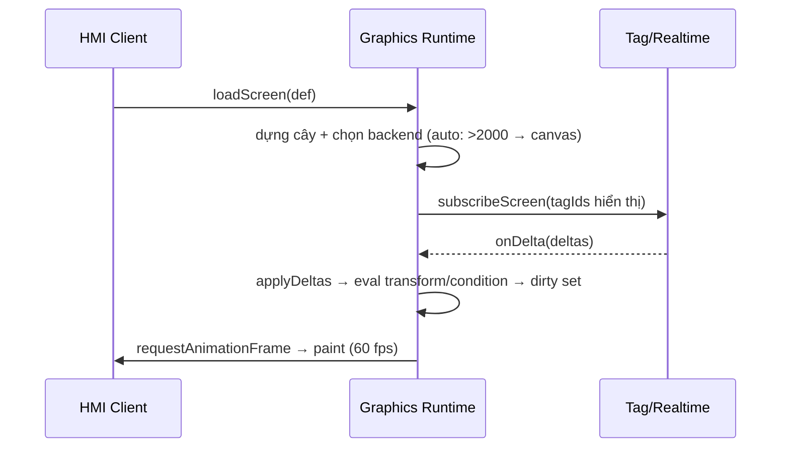

# 05‑02 — Graphics Runtime (L2)

> Đặc tả theo khung 10 mục §8. Đọc `*.screen.json` → render. **Cấm hardcode màn hình process trong
> React** (N2). Types: `@idtp/sdk` + `TagDelta` (05‑01). Palette/symbol: doc 11/14.

## 1. Mục đích & ranh giới trách nhiệm

Parse `screen.json` → dựng cây render (SVG/Canvas), gắn **binding khai báo** `{property, tag,
transform, condition}` vào giá trị tag sống, chạy animation 60 fps.

| KHÔNG thuộc engine này | Thuộc về |
|---|---|
| Nội dung màn hình | Plugin (`screens/*.screen.json`) |
| Giá trị tag | Tag/Realtime (05‑01) |
| Định tuyến điều hướng | Navigation (05‑16) |
| Logic/priority alarm | Alarm (05‑03) |
| Physics của symbol đặc thù | Plugin qua `ICustomSymbol` |

## 2. Interface công bố

```typescript
import type { TagId, Quality } from '@idtp/sdk';
import type { TagDelta } from './05-01';

export type ScreenLevel = 'D1' | 'D2' | 'D3' | 'D4' | 'S';
export interface TransformSpec { kind: 'linear' | 'map'; scale?: number; offset?: number; map?: Record<string, string>; }
export interface ConditionSpec { when: 'gt' | 'lt' | 'eq' | 'bad'; value?: number; then: Record<string, string>; }
export interface Binding { property: string; tag: TagId; transform?: TransformSpec; condition?: ConditionSpec; }
export interface ScreenElement { id: string; symbol: string; x: number; y: number; w?: number; h?: number; bindings: ReadonlyArray<Binding>; }
export interface ScreenDef { screenId: string; level: ScreenLevel; backend?: 'svg' | 'canvas' | 'auto'; elements: ReadonlyArray<ScreenElement>; }

export type RenderHandle = string;
export interface IGraphicsRuntime {
  loadScreen(def: ScreenDef): RenderHandle;                       // dựng cây + chọn backend
  applyDeltas(handle: RenderHandle, deltas: ReadonlyArray<TagDelta>): void;
  dispose(handle: RenderHandle): void;
}
```

## 3. Mô hình dữ liệu nội bộ

| Cấu trúc | Vai trò |
|---|---|
| `renderTree` | phần tử đã dựng (SVG node/Canvas record) |
| `bindingIndex: Map<TagId, Element[]>` | tag đổi → phần tử cần cập nhật |
| `dirty: Set<ElementId>` | gom cập nhật trong 1 khung rAF |
| `backend` | `svg` (≤ 2.000 phần tử động) hoặc `canvas` |

## 4. Luồng xử lý



## 5. Cấu hình (screen.json — Zod + ví dụ)

```typescript
export const BindingSchema = z.object({
  property: z.string(),
  tag: z.string(),
  transform: z.object({ kind: z.enum(['linear','map']), scale: z.number().optional(), offset: z.number().optional(), map: z.record(z.string()).optional() }).optional(),
  condition: z.object({ when: z.enum(['gt','lt','eq','bad']), value: z.number().optional(), then: z.record(z.string()) }).optional(),
});
export const ScreenDefSchema = z.object({
  screenId: z.string(), level: z.enum(['D1','D2','D3','D4','S']),
  backend: z.enum(['svg','canvas','auto']).default('auto'),
  elements: z.array(z.object({ id: z.string(), symbol: z.string(), x: z.number(), y: z.number(), w: z.number().optional(), h: z.number().optional(), bindings: z.array(BindingSchema) })),
});
```

Ví dụ — NumericDisplay mức bao hơi (LT‑001), đổi màu khi vượt ±250 mm (trip):

```json
{
  "screenId": "D3-steam-drum", "level": "D3", "backend": "auto",
  "elements": [{
    "id": "drum-level-pv", "symbol": "NumericDisplay", "x": 640, "y": 220,
    "bindings": [
      { "property": "text", "tag": "BLR_DRUM_LEVEL_01", "transform": { "kind": "linear", "scale": 1, "offset": 0 } },
      { "property": "color", "tag": "BLR_DRUM_LEVEL_01", "condition": { "when": "gt", "value": 250, "then": { "color": "var(--alarm-1)" } } },
      { "property": "color", "tag": "BLR_DRUM_LEVEL_01", "condition": { "when": "bad", "then": { "color": "var(--bad-quality)" } } }
    ]
  }]
}
```

## 6. Chỉ tiêu phi chức năng

| Chỉ tiêu | Mục tiêu |
|---|---|
| Screen call‑up | < 1 s |
| First paint client | < 2 s |
| Animation | 60 fps, CPU < 30% (laptop i5) |
| Ngưỡng SVG→Canvas | 2.000 phần tử động |
| RAM client | < 1,5 GB |

## 7. Chế độ lỗi & phục hồi

| Sự cố | Hệ quả | Phục hồi |
|---|---|---|
| Bad quality | giá trị không tin | phủ màu `--bad-quality` (#B14CFF) + gạch chéo |
| Tag thiếu trong delta | phần tử không cập nhật | giữ giá trị cuối + placeholder; log |
| Vượt 2.000 phần tử | SVG chậm | tự chuyển `canvas` |
| Binding lỗi (property lạ) | có thể vỡ render | bỏ qua binding + log, không đổ màn hình |

## 8. Cách plugin mở rộng

Plugin cung cấp `screens/*.screen.json` (+ `ICustomSymbol` nếu symbol đặc thù). **Không** viết React.
Symbol resolver: `symbol` id → thư viện built‑in (doc 14) hoặc `ICustomSymbol` đã đăng ký.

## 9. Kế hoạch kiểm thử

| Loại | Nội dung |
|---|---|
| Unit | eval `transform` (linear/map) & `condition` (gt/lt/eq/bad) |
| Integration | loadScreen + applyDeltas → assert DOM/property (jsdom) |
| Load | 2.000 phần tử động → đo fps/CPU (loadgen + trace) |
| Visual | Storybook: normal/running/fault/bad‑quality/shelved |

## 10. Quyết định & phương án đã loại bỏ

| Quyết định | Chọn | Loại bỏ | Lý do |
|---|---|---|---|
| Backend | **SVG ≤ 2.000, rồi Canvas** | Luôn Canvas | SVG sắc nét + accessible ở mật độ thấp; Canvas khi cần scale |
| Binding | **Khai báo JSON** | Imperative trong React | Plugin không chứa code UI (N2) |
| Cập nhật | **Gom theo rAF** | Cập nhật mỗi delta | Giữ 60 fps, tránh layout thrash |
| Màu/điều kiện | **Token CSS (`var(--alarm-1)`)** | Hardcode hex trong plugin | Theme hp‑hmi/classic đổi được (doc 11) |
