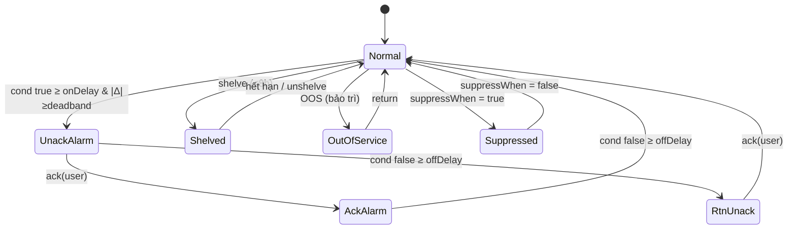

# 05‑03 — Alarm Engine (L2, ISA‑18.2 / EEMUA 191)

> Đặc tả theo khung 10 mục §8. Types: `@idtp/sdk` (doc 03). Alarm ids khớp doc 04/08.

## 1. Mục đích & ranh giới trách nhiệm

Quản lý **vòng đời alarm** theo state machine ISA‑18.2; đánh giá điều kiện với **deadband + on/off
delay**; gán priority P1–P4; giữ metadata rationalization; đo **chỉ tiêu chất lượng alarm**.

| KHÔNG thuộc engine này | Thuộc về |
|---|---|
| Lấy giá trị thô | Tag/Realtime (05‑01) |
| Vẽ alarm banner/ribbon | HMI / Graphics (05‑02) |
| Lưu lịch sử alarm | Historian (`alarm_event`, 05‑04) |
| Hành động điều khiển | Control (05‑06) |

## 2. Interface công bố

```typescript
import type { TagId, Iso8601, Quality } from '@idtp/sdk';

export type Priority = 'P1' | 'P2' | 'P3' | 'P4';
export type AlarmCondition = 'HH' | 'H' | 'L' | 'LL' | 'DEV' | 'ROC' | 'DISCRETE';
export type AlarmStateName = 'Normal' | 'UnackAlarm' | 'AckAlarm' | 'RtnUnack' | 'Shelved' | 'Suppressed' | 'OutOfService';

export interface AlarmDef {
  alarmId: string; tagId: TagId; condition: AlarmCondition; priority: Priority;
  setpoint: number; deadband: number; onDelayMs: number; offDelayMs: number;
  suppressWhen?: string;                       // điều kiện suppression theo trạng thái thiết bị
  consequence: { vi: string; en: string };     // hậu quả nếu bỏ qua
}
export interface AlarmEvent { alarmId: string; state: AlarmStateName; ts: Iso8601; value?: number; user?: string; }

export interface IAlarmEngine {
  evaluate(tagId: TagId, value: number | boolean, quality: Quality, ts: Iso8601): void;
  ack(alarmId: string, user: string): AlarmEvent;
  shelve(alarmId: string, user: string, durationMin: number, reason: string): AlarmEvent | { blockedReason: string };
  outOfService(alarmId: string, user: string, on: boolean): AlarmEvent;
  getActive(): ReadonlyArray<AlarmEvent>;
  onTransition(cb: (e: AlarmEvent) => void): void;
}
```

## 3. Mô hình dữ liệu nội bộ

| Cấu trúc | Vai trò |
|---|---|
| `defs: Map<alarmId, AlarmDef>` | định nghĩa (từ plugin) |
| `state: Map<alarmId, AlarmStateName>` | trạng thái hiện tại |
| `timers` | on/off‑delay đang chạy |
| `shelfQueue` | hàng chờ tự bung (≤ 8 h) |
| `kpi` | đếm rate/10 phút, phân bố priority, bad‑actor |

## 4. Luồng xử lý — state machine ISA‑18.2



## 5. Cấu hình (YAML + ví dụ)

```yaml
alarm:
  alarmId: BLR-DRUM-LVL-HH
  tagId: BLR_DRUM_LEVEL_01
  condition: HH
  priority: P1
  setpoint: 250          # mm — trip (Design Basis §3.2)
  deadband: 5            # mm
  onDelayMs: 2000        # 2 s (chống chattering)
  offDelayMs: 8000       # 8 s
  suppressWhen: "unit_state == SHUTDOWN"
  consequence: { vi: "Bao hơi quá cao → cuốn nước sang turbine", en: "Drum HH → water carryover to turbine" }
```

## 6. Chỉ tiêu phi chức năng (Phụ lục A §10.2)

| Chỉ tiêu | Mục tiêu |
|---|---|
| Priority + thời gian đáp ứng | P1 30 s · P2 10 phút · P3 30 phút · P4 ∞ |
| Deadband · on‑delay · off‑delay | 2–5 % dải · 2–5 s · 5–10 s |
| Tần suất ổn định | ≤ 1 alarm / 10 phút / operator (~144/ngày) |
| Ngưỡng flood | > 10 alarm / 10 phút |
| Phân bố mục tiêu | P1 ≈ 5 % · P2 ≈ 15 % · P3/P4 ≈ 80 % |
| Bad actor report | top 10 tag gây nhiều alarm nhất |

## 7. Chế độ lỗi & phục hồi

| Sự cố | Hệ quả | Phục hồi |
|---|---|---|
| Chattering | alarm nhấp nháy | deadband + on/off‑delay |
| Alarm flood | > 10/10 phút | phát hiện flood + gợi ý shelve, ghi Diagnostic |
| Bad quality tag | alarm giả | không phát process alarm; báo Diagnostic |
| Shelve hết hạn | quên bung | tự bung + audit (≤ 8 h) |

## 8. Cách plugin mở rộng

Plugin cung cấp `alarms/**/*.yaml` (định nghĩa + priority + rationalization + `suppressWhen`) và có
thể cung cấp `IAlarmShelvingPolicy`. **Không** viết code engine.

## 9. Kế hoạch kiểm thử

| Loại | Nội dung |
|---|---|
| Unit | chuyển trạng thái state machine; on/off‑delay; deadband; ép shelve ≤ 8 h |
| Integration | tag stream → evaluate → onTransition (assert chuỗi event) |
| Load | kịch bản flood > 10/10 phút → đo phát hiện + KPI |

## 10. Quyết định & phương án đã loại bỏ

| Quyết định | Chọn | Loại bỏ | Lý do |
|---|---|---|---|
| State machine | **ISA‑18.2 đầy đủ** | Rút gọn Normal/Alarm | Có Shelved/Suppressed/OOS mới đúng chuẩn |
| Ẩn alarm | **Suppression theo trạng thái** | Disable cứng | Auditable, tự bật lại khi điều kiện đổi |
| Shelve | **Max 8 h + tự bung** | Không giới hạn | EEMUA 191; tránh ẩn vĩnh viễn |
| Delay | **On & off tách riêng** | Một delay chung | Kiểm soát chatter vào/ra độc lập |
