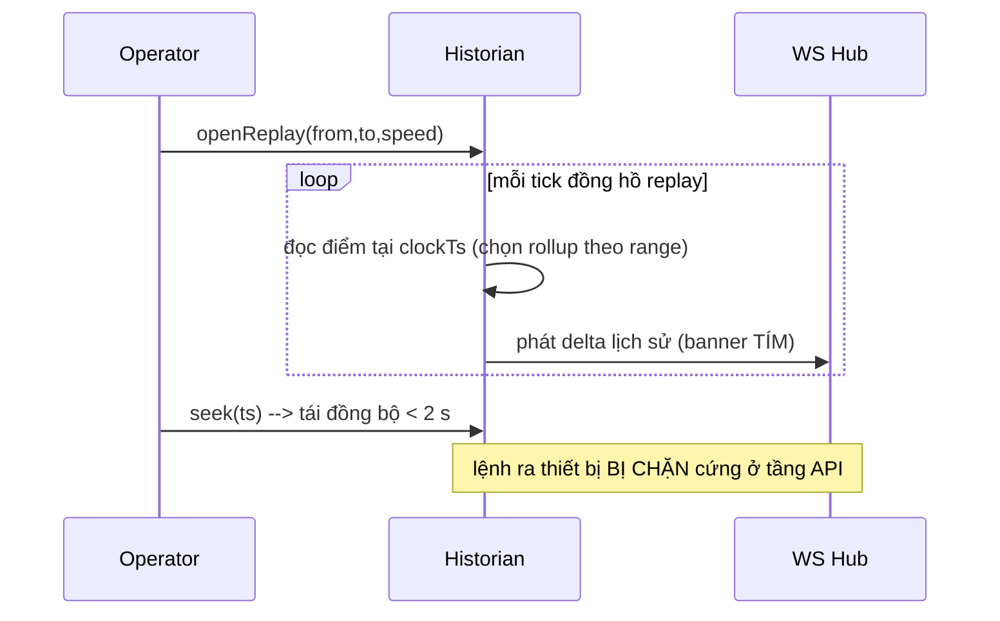

# 05‑04 — Historian + Replay (L2)

> Đặc tả theo khung 10 mục §8. Types: `@idtp/sdk`. Chi tiết lớp lưu trữ & replay: doc 19.

## 1. Mục đích & ranh giới trách nhiệm

Lưu giá trị tag theo **lớp rollup**, chụp **snapshot**, phục vụ **truy vấn lịch sử** + **DATA REPLAY**
(banner tím). Mọi giá trị kèm quality; giá trị substituted đánh dấu **vĩnh viễn** + audit.

| KHÔNG thuộc engine này | Thuộc về |
|---|---|
| Giá trị hiện tại | Tag/Realtime (05‑01) |
| Tính lại mô phỏng (re‑sim) | Simulation (05‑05); Historian chỉ ghi **nhánh** |
| Logic alarm | Alarm (05‑03) |

## 2. Interface công bố

```typescript
import type { TagId, Quality, Iso8601 } from '@idtp/sdk';

export type Aggregate = 'avg' | 'min' | 'max' | 'stddev' | 'count' | 'last' | 'total';
export interface HistPoint { ts: Iso8601; value: number; quality: Quality; }
export interface ReplaySession { id: string; from: Iso8601; to: Iso8601; speed: number; clockTs: Iso8601; }

export interface IHistorian {
  write(values: ReadonlyArray<{ tagId: TagId; value: number; quality: Quality; ts: Iso8601 }>): void; // batch/COPY
  query(tagId: TagId, from: Iso8601, to: Iso8601, agg: Aggregate, bucketMs?: number): Promise<ReadonlyArray<HistPoint>>;
  snapshot(ts: Iso8601): Promise<void>;                        // toàn tag mỗi 5 phút
  openReplay(from: Iso8601, to: Iso8601, speed: number): ReplaySession;
  seek(sessionId: string, ts: Iso8601): void;                 // < 2 s
  substituteMark(tagId: TagId, ts: Iso8601, user: string, reason: string): void;  // vĩnh viễn + audit
}
```

## 3. Mô hình dữ liệu nội bộ (TimescaleDB)

| Lớp | Chu kỳ | Giữ | Nén |
|---|---|---|---|
| Raw fast | 1 s | 7 ngày | swinging‑door + deadband theo tag |
| Rollup 1 | 1 phút | 90 ngày | avg/min/max/stddev/count |
| Rollup 2 | 15 phút | 2 năm | avg/min/max |
| Rollup 3 | 1 giờ | 5 năm | avg/min/max |
| Rollup 4 | 1 ngày | 10 năm | avg + totalizer |

Hypertable + continuous aggregate + compression policy; đồng hồ replay **độc lập**.

## 4. Luồng xử lý — DATA REPLAY



## 5. Cấu hình (YAML + ví dụ)

```yaml
historian:
  batchSize: 5000
  flush: COPY
  snapshotEveryMin: 5
  replay: { minSpeed: 0.25, maxSpeed: 60 }
  retentionClasses:
    standard:  { rawSec: 1, rawDays: 7 }
    extended:  { rawSec: 1, rawDays: 30 }
    totalizer: { rollup4: "avg+total" }
  swingingDoorDeadbandPct: 0.5
```

## 6. Chỉ tiêu phi chức năng

| Chỉ tiêu | Mục tiêu |
|---|---|
| Ghi historian | ≥ 50.000 điểm/s (batch COPY) |
| Truy vấn 24 h / 8 tag | < 2 s |
| Seek replay | < 2 s |
| Snapshot toàn tag | mỗi 5 phút |
| Tốc độ replay | 0,25× → 60× |

## 7. Chế độ lỗi & phục hồi

| Sự cố | Hệ quả | Phục hồi |
|---|---|---|
| Ghi dồn (backlog) | trễ ghi | buffer store‑and‑forward |
| DB down | mất ghi | WAL buffer cục bộ + phát lại khi reconnect |
| Query timeout | chậm | hạ xuống rollup thô hơn |
| Seek ngoài dải dữ liệu | lỗi | clamp về biên dữ liệu |

## 8. Cách plugin mở rộng

Plugin đặt `retention_class` cho từng tag (doc 04). Snapshot dùng `ISimModel.snapshot()` cho nhánh
re‑simulation (v2). **Không** viết code engine.

## 9. Kế hoạch kiểm thử

| Loại | Nội dung |
|---|---|
| Unit | chọn rollup theo range; nén swinging‑door; đánh dấu substituted |
| Integration | write → query khứ hồi; replay đồng bộ màn hình + trend + alarm |
| Load | 50.000 điểm/s ghi; truy vấn 24 h/8 tag < 2 s |

## 10. Quyết định & phương án đã loại bỏ

| Quyết định | Chọn | Loại bỏ | Lý do |
|---|---|---|---|
| Nén | **Swinging‑door + deadband** | Lưu mọi mẫu | Giảm dung lượng, giữ hình dạng |
| Rollup | **Continuous aggregate** | Tính on‑the‑fly | Truy vấn 24 h < 2 s |
| Đồng hồ replay | **Độc lập** | Dùng chung đồng hồ sim | Replay tự do 0,25×–60× |
| Lệnh khi replay | **Chặn cứng tầng API** | Cho phép có điều kiện | An toàn tuyệt đối (§12.2) |
