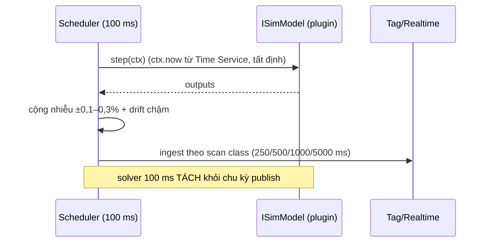

# 05‑05 — Simulation Host (L2)

> Đặc tả theo khung 10 mục §8. Host cho plugin `ISimModel` (doc 03). Mô hình vật lý cụ thể **nằm
> trong plugin** (doc 10), engine này **generic**.

## 1. Mục đích & ranh giới trách nhiệm

Chạy **solver loop 100 ms** (tách khỏi chu kỳ publish), nạp/gọi các `ISimModel` của plugin, đẩy
output vào Tag/Realtime, quản lý **snapshot/restore + malfunction injection** (OTS).

| KHÔNG thuộc engine này | Thuộc về |
|---|---|
| Phương trình vật lý | Plugin `ISimModel` (doc 10) |
| Transport MQTT/WS | L0 / Tag‑Realtime |
| Luật điều khiển (PID) | Control (05‑06) — sim **đọc** OP từ Control |
| Lưu snapshot dài hạn | Historian (05‑04) |

## 2. Interface công bố

```typescript
import type { IMalfunction } from '@idtp/sdk';
import type { ISimModel } from '@idtp/sdk';

export interface ISimulationHost {
  register(model: ISimModel): void;
  start(): void;
  stop(): void;
  freeze(on: boolean): void;                 // OTS: đóng băng thời gian
  setSpeed(factor: number): void;            // hệ số thời gian thực (≥ 0.25)
  snapshotAll(): Promise<string>;            // trả snapshotId
  restoreAll(snapshotId: string): Promise<void>;
  inject(modelId: string, m: IMalfunction): void;
  clear(modelId: string, malfId: string): void;
}
```

## 3. Mô hình dữ liệu nội bộ

| Cấu trúc | Vai trò |
|---|---|
| `models: Map<id, ISimModel>` | model đã đăng ký (từ plugin) |
| `scheduler` | tick 100 ms tất định |
| `inputResolver` | `getTag` (SP/OP từ Control + Tag store) |
| `outputBuffer` | gom output, publish theo scan class |
| `snapshots` | ảnh trạng thái để restore/re‑sim |
| `malfunctions` | malfunction đang hoạt động (OTS) |

## 4. Luồng xử lý



## 5. Cấu hình (YAML + ví dụ)

```yaml
simulation:
  dtMs: 100
  publishByScanClass: true
  noise: { pct: 0.2, driftPerHour: 0.05 }     # tránh giá trị "chết cứng"
  realtimeFactor: 1.0
  malfunctions: [mill-trip, tube-leak, loss-of-vacuum, fan-trip, bfp-trip]
```

## 6. Chỉ tiêu phi chức năng

| Chỉ tiêu | Mục tiêu |
|---|---|
| Solver step | 100 ms, tất định |
| Real‑time factor | ≥ 1 (step compute < 100 ms wall) |
| Quy mô | 15.000 tag thermal |
| Freeze / restore | < 2 s |
| Nguồn dữ liệu | **không `Math.random()`** làm nguồn process (nhiễu có seed) |

## 7. Chế độ lỗi & phục hồi

| Sự cố | Hệ quả | Phục hồi |
|---|---|---|
| Solver overrun (> 100 ms) | trôi thời gian | log + bù có giới hạn (catch‑up bounded) |
| NaN trong model | tag hỏng | cô lập model, gán quality `Bad` |
| Malfunction lạ | không rõ | bỏ qua + log |
| Restore snapshot lỗi | mất trạng thái | giữ trạng thái hiện tại, báo lỗi |

## 8. Cách plugin mở rộng

Plugin cung cấp `ISimModel` (physics) + `scenarios/*.yaml` + danh sách malfunction id. Host generic,
gọi vòng đời `init → step → snapshot/restore → inject/clear → dispose`.

## 9. Kế hoạch kiểm thử

| Loại | Nội dung |
|---|---|
| Unit | timing scheduler; tính tất định snapshot/restore; cộng nhiễu có seed |
| Integration | model → Tag/Realtime → Historian |
| Scenario | Cold start → ramp 0→600 MW không dao động (dải slice) |
| Load | 15.000 tag @ 100 ms → đo real‑time factor |

## 10. Quyết định & phương án đã loại bỏ

| Quyết định | Chọn | Loại bỏ | Lý do |
|---|---|---|---|
| Nhịp solver | **100 ms tách publish** | Solver = chu kỳ publish | §8 Phụ lục A; publish theo scan class |
| Nơi chạy | **Worker threads** | Main thread | Cô lập CPU, không chặn API |
| Thời gian | **Tất định (`ctx.now`)** | `Date.now()` trong model | Replay/re‑sim tái lập được |
| Nhiễu | **Có seed + drift** | Không nhiễu / `Math.random()` | Thật + tái lập; cấm random nguồn process |
