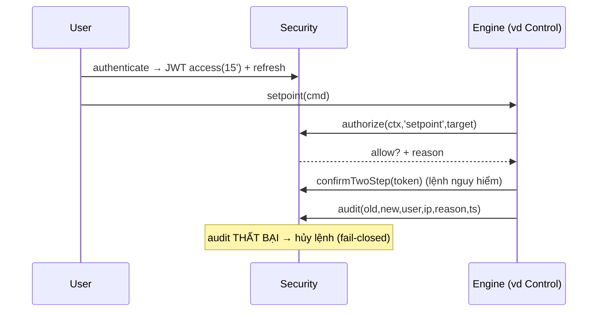

# 05‑07 — Security/RBAC + Audit (L1/L2, IEC 62443 nguyên tắc)

> Đặc tả theo khung 10 mục §8. Types: `@idtp/sdk`. Chi tiết zone/conduit → doc 18. RBAC **6 vai** đã
> chốt (CLAUDE.md).

## 1. Mục đích & ranh giới trách nhiệm

Xác thực (authN), phân quyền RBAC **6 vai × hành động**, ép **xác nhận 2 bước** cho lệnh ghi, ghi
**audit bất biến**. AI **read‑only tuyệt đối** (không có action ghi).

| KHÔNG thuộc engine này | Thuộc về |
|---|---|
| Logic nghiệp vụ engine | các engine (gọi `authorize`) |
| Zone/conduit mạng | doc 18 (hạ tầng) |
| Lưu dữ liệu process | Historian |

## 2. Interface công bố

```typescript
import type { Iso8601 } from '@idtp/sdk';

export type Role = 'Viewer' | 'Operator' | 'ShiftSupervisor' | 'Engineer' | 'Maintenance' | 'Admin';
export type Action = 'view' | 'ack' | 'shelve' | 'setpoint' | 'mode' | 'override' | 'oos' | 'engineer' | 'admin';
export interface AuthContext { userId: string; roles: ReadonlyArray<Role>; ip: string; sessionId: string; }
export interface AuditEntry { ts: Iso8601; user: string; ip: string; action: Action; target: string; oldValue?: unknown; newValue?: unknown; reason: string; }

export interface ISecurityEngine {
  authenticate(user: string, pass: string): Promise<{ access: string; refresh: string } | { error: string }>;
  authorize(ctx: AuthContext, action: Action, target: string): { allow: boolean; reason?: string };
  confirmTwoStep(ctx: AuthContext, action: Action, target: string, token: string): boolean;
  audit(entry: AuditEntry): void;                    // append-only, bất biến
  refresh(token: string): { access: string; refresh: string } | { error: string };
}
```

## 3. Mô hình dữ liệu — Ma trận quyền × hành động (đầy đủ, không mô tả bằng lời)

| Action | Viewer | Operator | ShiftSup | Engineer | Maint | Admin |
|---|:--:|:--:|:--:|:--:|:--:|:--:|
| `view` | ✔ | ✔ | ✔ | ✔ | ✔ | ✔ |
| `ack` (alarm) | – | ✔ | ✔ | ✔ | – | ✔ |
| `shelve` | – | ✔ | ✔ | ✔ | – | ✔ |
| `setpoint` | – | ✔ | ✔ | ✔ | – | ✔ |
| `mode` (MAN/AUTO/CAS) | – | ✔ | ✔ | ✔ | – | ✔ |
| `override` (interlock) | – | – | ✔ | ✔ | – | ✔ |
| `oos` (out‑of‑service) | – | – | ✔ | ✔ | ✔ | ✔ |
| `engineer` (config/screen/tag) | – | – | – | ✔ | – | ✔ |
| `admin` (user/role) | – | – | – | – | – | ✔ |

> Bảng: `user`, `role`, `permission`, `user_role`, `audit_trail` (append‑only). Lệnh nguy hiểm
> (`setpoint`,`mode`,`override`) yêu cầu `confirmTwoStep`.

## 4. Luồng xử lý



## 5. Cấu hình (YAML + ví dụ)

```yaml
security:
  roles: [Viewer, Operator, ShiftSupervisor, Engineer, Maintenance, Admin]
  jwt: { accessTtlMin: 15, refreshRotating: true }
  sessionLockMin: 10          # KHÓA thao tác, KHÔNG khóa hiển thị alarm
  twoStepActions: [setpoint, mode, override]
  rateLimit: { windowSec: 60, maxWrites: 30 }
  auditRetentionYears: 1
```

## 6. Chỉ tiêu phi chức năng

| Chỉ tiêu | Mục tiêu |
|---|---|
| JWT access / refresh | 15 phút / xoay vòng |
| Session lock | 10 phút không thao tác (**không** khóa alarm) |
| Audit | bất biến, giữ ≥ 1 năm, UTC + offset |
| Xác nhận 2 bước | mọi lệnh ghi nguy hiểm |

## 7. Chế độ lỗi & phục hồi

| Sự cố | Hệ quả | Phục hồi |
|---|---|---|
| Access token hết hạn | 401 | dùng refresh (xoay vòng) |
| Refresh dùng lại (đánh cắp) | rủi ro | thu hồi cả chuỗi token |
| Audit ghi lỗi | không truy vết | **fail‑closed**: hủy lệnh ghi |
| Brute force | dò mật khẩu | rate limit + khóa tạm |

## 8. Cách plugin mở rộng

Plugin đặt `security_level` cho tag (doc 04) → ánh xạ vai tối thiểu để ghi. **Không** tạo vai mới ở
v1 (6 vai cố định).

## 9. Kế hoạch kiểm thử

| Loại | Nội dung |
|---|---|
| Unit | ma trận authorize; 2‑step; JWT phát/refresh |
| Integration | đường ghi bắt buộc qua audit (fail‑closed) |
| Security | tái dùng refresh token; rate limit; session lock giữ alarm hiển thị |

## 10. Quyết định & phương án đã loại bỏ

| Quyết định | Chọn | Loại bỏ | Lý do |
|---|---|---|---|
| Vai | **6 vai cố định** | RBAC tùy biến | Đơn giản v1; khớp §13 |
| Audit | **Fail‑closed** | Fail‑open | Không ghi = không cho lệnh |
| Token | **Access 15' + refresh xoay** | Token dài hạn | Giảm cửa sổ đánh cắp |
| Session lock | **Không khóa hiển thị alarm** | Khóa toàn màn hình | An toàn: luôn thấy alarm |
