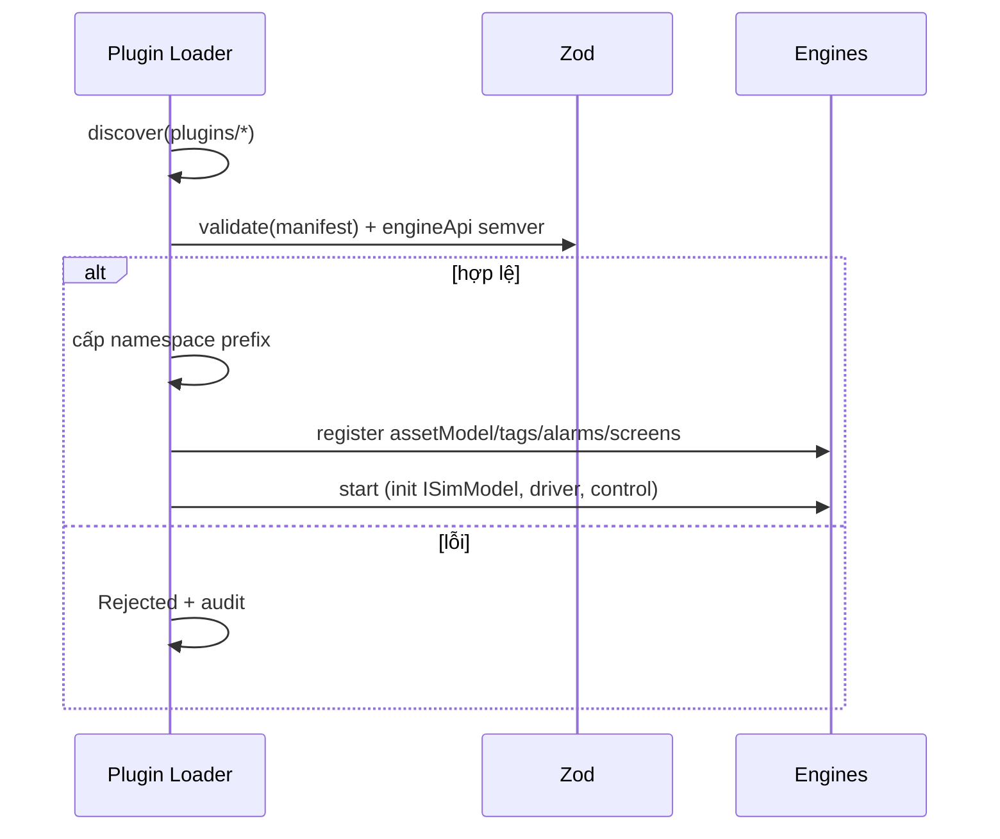

# 05‑08 — Plugin Loader / Factory (L1)

> Đặc tả theo khung 10 mục §8. **Quan trọng nhất** (§4). Vòng đời & manifest: doc 03.

## 1. Mục đích & ranh giới trách nhiệm

Discover → validate → register → start/stop → **hot‑unload** plugin; ép `engineApi` semver; cấp
**namespace** riêng; ép cách ly. Là **cơ chế mở rộng** của platform.

| KHÔNG thuộc engine này | Thuộc về |
|---|---|
| Ngữ nghĩa nội dung plugin | các engine tiêu thụ (tag/alarm/graphics) |
| Ghi DB | Data Contract (05‑11) |
| Biết tên plugin cụ thể | — (kernel **không** hardcode tên plugin) |

## 2. Interface công bố

```typescript
import type { PluginManifest } from '@idtp/sdk';

export type PluginPhase = 'Discovered' | 'Validated' | 'Registered' | 'Started' | 'Stopped' | 'Unloaded' | 'Rejected';
export interface LoadedPlugin { id: string; version: string; phase: PluginPhase; namespace: string; }

export interface IPluginLoader {
  discover(dir: string): Promise<ReadonlyArray<string>>;
  validate(manifestPath: string): { ok: true; manifest: PluginManifest } | { ok: false; errors: ReadonlyArray<string> };
  register(id: string): Promise<LoadedPlugin>;
  start(id: string): Promise<void>;
  stop(id: string): Promise<void>;
  unload(id: string): Promise<void>;          // hot-unload, KHÔNG đổ engine
  list(): ReadonlyArray<LoadedPlugin>;
}
```

## 3. Mô hình dữ liệu nội bộ

| Cấu trúc | Vai trò |
|---|---|
| `registry: Map<id, LoadedPlugin>` | trạng thái vòng đời |
| `namespaces: Map<id, prefix>` | cấp phát namespace (cách ly) |
| `engineApi` | phiên bản kernel (so semver) |
| `capabilityIndex` | plugin cung cấp gì (`provides`) |

## 4. Luồng xử lý



## 5. Cấu hình (YAML + ví dụ)

```yaml
pluginLoader:
  dir: plugins/
  engineApi: "1.0.0"           # kernel công bố; plugin khai báo range ^1.0.0
  isolation: namespace-prefix  # thermal → hoantran/.../unit1 ; wtp → .../wtp
  hotUnload: true
```

## 6. Chỉ tiêu phi chức năng

| Chỉ tiêu | Mục tiêu |
|---|---|
| Nạp plugin mới | < 10 s, **không restart kernel** |
| Unload | không làm đổ engine đang chạy |
| Cách ly | plugin B không đọc/ghi tag plugin A |
| Bài test generic | thêm `water-treatment-demo` = 0 dòng sửa `kernel`/`apps` |

## 7. Chế độ lỗi & phục hồi

| Sự cố | Hệ quả | Phục hồi |
|---|---|---|
| Manifest sai schema | không nạp | `Rejected` + audit, bỏ qua plugin |
| `engineApi` lệch | không tương thích | reject (semver) |
| Namespace trùng | đụng tag | reject + báo lỗi |
| Plugin start throw | plugin lỗi | dừng **riêng** plugin đó, engine vẫn chạy (L‑P4) |

## 8. Cách plugin mở rộng

Đây **chính là** cơ chế mở rộng: plugin tuân manifest (doc 03) → được nạp. Không cần thay đổi kernel.

## 9. Kế hoạch kiểm thử

| Loại | Nội dung |
|---|---|
| Unit | so semver; cấp/không đụng namespace; parse manifest |
| Integration | nạp thermal + wtp; **generic test** `git diff --stat` = 0 ngoài `plugins/` |
| Load | hot‑load < 10 s; unload không crash engine |

## 10. Quyết định & phương án đã loại bỏ

| Quyết định | Chọn | Loại bỏ | Lý do |
|---|---|---|---|
| Khai báo | **Manifest YAML + Zod** | `register()` bằng code | Kernel không chạy code plugin để biết `provides` |
| Nạp | **Hot‑load < 10 s** | Restart kernel | Yêu cầu §9 |
| Cách ly | **Namespace‑prefix ép buộc** | Tin plugin tự giữ | An toàn đa plugin (L‑P5) |
| Không khớp semver | **Reject** | Best‑effort nạp | Tránh chạy sai engineApi |
