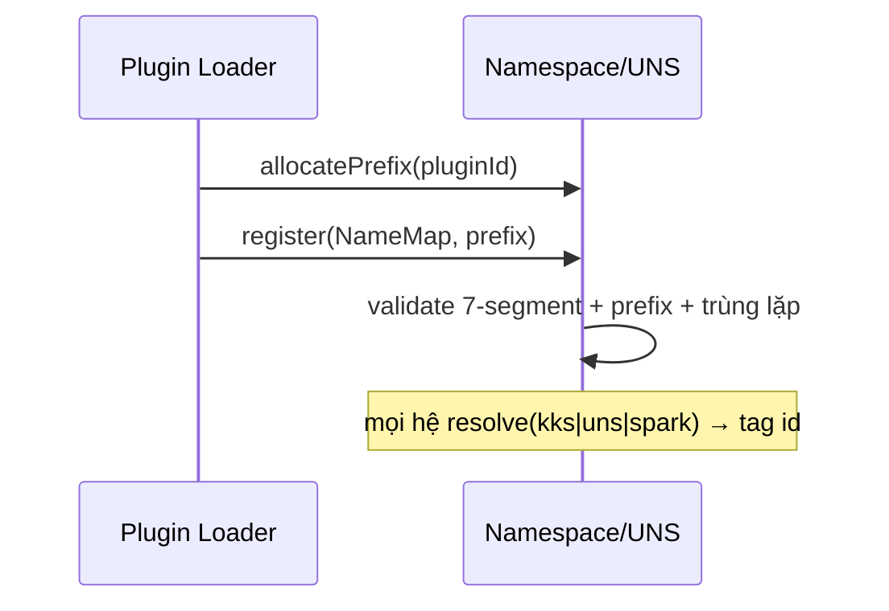

# 05‑09 — Namespace / UNS (L1)

> Đặc tả theo khung 10 mục §8. Registry gốc: doc 04. Types: `@idtp/sdk`.

## 1. Mục đích & ranh giới trách nhiệm

Quản lý **Unified Namespace**: parse/validate UNS 7 segment, ánh xạ **KKS↔UNS↔Sparkplug↔tag id**,
resolve tên → tag id, cấp **namespace prefix** cách ly theo plugin.

| KHÔNG thuộc engine này | Thuộc về |
|---|---|
| Giá trị tag | Tag/Realtime (05‑01) |
| Cây thiết bị | Asset Model (05‑10) — UNS **tham chiếu** |
| Lưu DB | Data Contract (05‑11) |

## 2. Interface công bố

```typescript
import type { TagId } from '@idtp/sdk';

export interface UnsPath { enterprise: string; site: string; area: string; cell: string; unit: string; equipment: string; signal: string; }
export interface NameMap { tagId: TagId; kks: string; uns: string; sparkplug: string; }

export interface INamespace {
  parse(uns: string): UnsPath | { error: string };
  resolve(ref: { kks?: string; uns?: string; sparkplug?: string }): TagId | undefined;
  register(map: NameMap, pluginNamespace: string): { ok: true } | { ok: false; reason: string };
  toSparkplug(tagId: TagId): string | undefined;
  allocatePrefix(pluginId: string): string;      // vd thermal → hoantran/haiphong/unit1
}
```

## 3. Mô hình dữ liệu nội bộ

| Cấu trúc | Vai trò |
|---|---|
| `byTagId: Map<TagId, NameMap>` | tra xuôi |
| `byKks / byUns / bySpark` | tra ngược 3 chiều |
| `prefixes: Map<pluginId, prefix>` | cách ly namespace |

## 4. Luồng xử lý



## 5. Cấu hình (ví dụ)

```yaml
namespace:
  unsPattern: "{enterprise}/{site}/{area}/{cell}/{unit}/{equipment}/{signal}"
  regex: "^[a-z0-9-]+(/[a-z0-9-]+){6}$"
  prefixStrategy: by-plugin        # thermal → .../unit1 ; wtp → .../wtp
```

## 6. Chỉ tiêu phi chức năng

| Chỉ tiêu | Mục tiêu |
|---|---|
| Resolve | O(1) |
| Quy mô | 200.000 tag |
| Validate | tại thời điểm register |

## 7. Chế độ lỗi & phục hồi

| Sự cố | Hệ quả | Phục hồi |
|---|---|---|
| UNS trùng / KKS trùng | nhập nhằng | reject register |
| Sai số segment (≠ 7) | địa chỉ sai | reject + báo lỗi |
| Vi phạm prefix chéo plugin | đụng namespace | reject (L‑P5) |

## 8. Cách plugin mở rộng

`tagRegistry` của plugin cung cấp `kks`/`uns`; Plugin Loader register dưới prefix của plugin.

## 9. Kế hoạch kiểm thử

| Loại | Nội dung |
|---|---|
| Unit | parse/validate 7 segment; resolve 3 chiều |
| Integration | thermal + wtp không đụng namespace |

## 10. Quyết định & phương án đã loại bỏ

| Quyết định | Chọn | Loại bỏ | Lý do |
|---|---|---|---|
| Khoá | **tag id nội bộ** | KKS/UNS làm khoá | KKS/UNS đổi được; id bất biến |
| Segment | **7 cố định (equip module = attribute)** | Số segment thay đổi | Khớp §6.2 / doc 04 |
| Trùng lặp | **Reject** | Last‑wins | Tránh nhập nhằng resolve |
