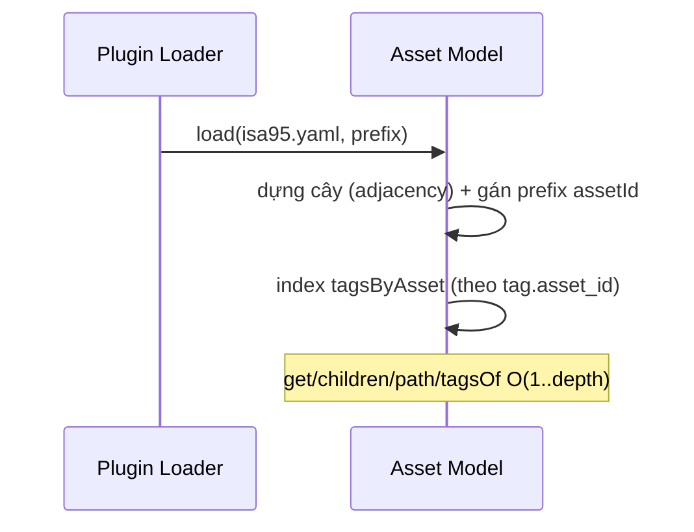

# 05‑10 — Asset Model (L1, ISA‑95/88)

> Đặc tả theo khung 10 mục §8. Cây thiết bị: doc 04. **Tách khỏi** cây điều hướng ISA‑101 (Navigation).

## 1. Mục đích & ranh giới trách nhiệm

Nạp/phục vụ **cây thiết bị ISA‑95/88** (7 cấp), ánh xạ **asset↔tag**, cấp thuộc tính asset
(`equipment_module`, liên kết giờ chạy). Cung cấp breadcrumb thiết bị.

| KHÔNG thuộc engine này | Thuộc về |
|---|---|
| Cây điều hướng màn hình | Navigation (05‑16, ISA‑101) |
| Giá trị tag | Tag/Realtime |
| Ánh xạ asset↔screen | Navigation / doc 13 (N‑N) |

## 2. Interface công bố

```typescript
import type { TagId } from '@idtp/sdk';

export type AssetLevel = 'Enterprise' | 'Site' | 'Area' | 'Cell' | 'Unit' | 'EquipmentModule' | 'ControlModule';
export interface AssetNode { assetId: string; level: AssetLevel; name: string; parentId?: string; kks?: string; equipmentModule?: string; }

export interface IAssetModel {
  load(model: unknown, pluginNamespace: string): void;      // từ model/isa95.yaml
  get(assetId: string): AssetNode | undefined;
  children(assetId: string): ReadonlyArray<AssetNode>;
  tagsOf(assetId: string): ReadonlyArray<TagId>;
  path(assetId: string): ReadonlyArray<AssetNode>;          // breadcrumb thiết bị
}
```

## 3. Mô hình dữ liệu nội bộ

| Cấu trúc | Vai trò |
|---|---|
| `nodes: Map<assetId, AssetNode>` | adjacency (parentId) |
| `tagsByAsset: Map<assetId, TagId[]>` | index asset↔tag |
| `equipmentModule` | attribute nhóm loop/faceplate |

## 4. Luồng xử lý



## 5. Cấu hình (ví dụ — doc 04)

```yaml
asset:
  - { assetId: UNIT1, level: Area, name: "UNIT1", parentId: HAIPHONG }
  - { assetId: BOILER_ISLAND, level: Cell, name: "BOILER_ISLAND", parentId: UNIT1 }
  - { assetId: STEAM_DRUM, level: Unit, name: "STEAM_DRUM", parentId: BOILER_ISLAND }
  - { assetId: DRUM_LEVEL_CONTROL, level: EquipmentModule, name: "DRUM_LEVEL_CONTROL", parentId: STEAM_DRUM }
  - { assetId: LT-001, level: ControlModule, name: "LT-001", parentId: STEAM_DRUM, equipmentModule: DRUM_LEVEL_CONTROL }
```

## 6. Chỉ tiêu phi chức năng

| Chỉ tiêu | Mục tiêu |
|---|---|
| Truy vấn cây | O(depth) |
| Quy mô | cây toàn nhà máy (≥ 40 hệ ở v1‑complete) |

## 7. Chế độ lỗi & phục hồi

| Sự cố | Hệ quả | Phục hồi |
|---|---|---|
| Node mồ côi (parent sai) | cây gãy | reject load |
| assetId trùng chéo plugin | đụng | prefix theo plugin |

## 8. Cách plugin mở rộng

Plugin cung cấp `model/isa95.yaml` + `asset_id` trên tag. **Không** viết code engine.

## 9. Kế hoạch kiểm thử

| Loại | Nội dung |
|---|---|
| Unit | dựng cây; `path`/`children`; `equipmentModule` |
| Integration | `tagsOf(LT-001)` trả đúng tag drum level |

## 10. Quyết định & phương án đã loại bỏ

| Quyết định | Chọn | Loại bỏ | Lý do |
|---|---|---|---|
| Cấu trúc | **Adjacency (parentId)** | Lồng nhau cứng | Linh hoạt, dễ query path |
| Tách nav | **ISA‑95 ≠ ISA‑101** | Gộp cây | §17 cấm gộp (N4) |
| Equip module | **Attribute** | Node trên UNS path | Nhất quán doc 04 |
