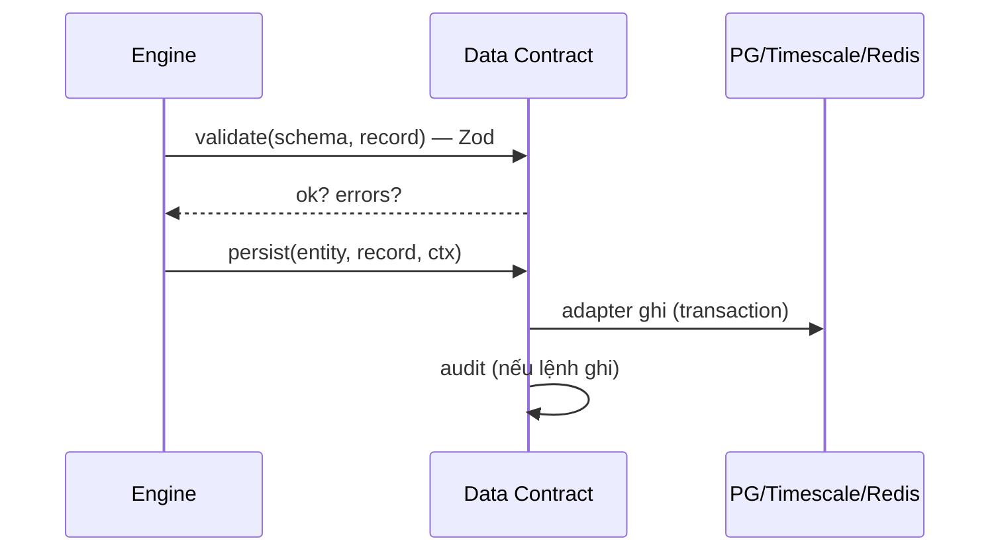

# 05‑11 — Data Contract + Persistence (L1)

> Đặc tả theo khung 10 mục §8 (đổi tên từ "Database Engine", §4). Schema DB đầy đủ: doc 15.

## 1. Mục đích & ranh giới trách nhiệm

Định nghĩa **schema chuẩn (Zod)**, cung cấp **persistence adapter** (PostgreSQL config/RBAC ·
TimescaleDB history · Redis current), migration, seed. **Đường ghi duy nhất** — plugin **không** ghi
thẳng DB (L‑P3).

| KHÔNG thuộc engine này | Thuộc về |
|---|---|
| Truy vấn thời gian | Historian (05‑04) |
| Giá trị hiện tại | Tag/Realtime (05‑01) |
| Logic nghiệp vụ | các engine |

## 2. Interface công bố

```typescript
export interface IDataContract {
  validate<T>(schema: string, data: unknown): { ok: true; value: T } | { ok: false; errors: ReadonlyArray<string> };
  persist(entity: string, record: unknown, ctx: { user: string; ip: string }): Promise<{ id: string }>;
  read(entity: string, id: string): Promise<unknown | undefined>;
  migrate(): Promise<void>;
  seed(from: string): Promise<number>;         // seed tag từ registry
}
```

## 3. Mô hình dữ liệu — bảng lõi (Phụ lục A §10.4)

| Nhóm | Bảng |
|---|---|
| Tag | `tag_master`, `tag_value` (hypertable) |
| Alarm | `alarm_definition`, `alarm_event`, `alarm_state`, `shelve_log` |
| Sự kiện | `event_log`, `audit_trail` |
| RBAC | `user`, `role`, `permission`, `user_role` |
| Asset | `equipment`, `equipment_runtime`, `maintenance_order` |
| HMI/Report | `trend_group`, `trend_pen`, `report_template`, `report_instance`, `screen_registry`, `sim_scenario` |

Index: `(tag_id, ts DESC)`; khóa ngoại đầy đủ; migration Prisma/TypeORM.

## 4. Luồng xử lý



## 5. Cấu hình (ví dụ)

```yaml
persistence:
  postgres: { dsn: "env:PG_DSN" }
  timescale: { dsn: "env:TS_DSN" }
  redis: { url: "env:REDIS_URL" }
  migrations: prisma
  seedFrom: plugins/thermal-power-600/tags
```

## 6. Chỉ tiêu phi chức năng

| Chỉ tiêu | Mục tiêu |
|---|---|
| Toàn vẹn FK | đầy đủ |
| Index | `(tag_id, ts DESC)` |
| Migration | idempotent, transactional |
| Validate biên | 100% qua Zod |

## 7. Chế độ lỗi & phục hồi

| Sự cố | Hệ quả | Phục hồi |
|---|---|---|
| Validate fail | dữ liệu xấu | reject (Zod) trước khi ghi |
| DB down | không ghi | báo lỗi + buffer (Historian) |
| Migration nửa chừng | schema lệch | transactional rollback |

## 8. Cách plugin mở rộng

Dữ liệu plugin đi qua SDK → Data Contract (không ghi DB trực tiếp, L‑P3). Seed tag từ `tagRegistry`.

## 9. Kế hoạch kiểm thử

| Loại | Nội dung |
|---|---|
| Unit | Zod validate mỗi entity |
| Integration | migrate + seed + read khứ hồi |
| Constraint | FK vi phạm → lỗi |

## 10. Quyết định & phương án đã loại bỏ

| Quyết định | Chọn | Loại bỏ | Lý do |
|---|---|---|---|
| Đường ghi | **Duy nhất qua Data Contract** | Plugin ghi thẳng DB | L‑P3, kiểm soát + audit |
| Validate | **Zod ở biên** | Tin dữ liệu | Không tin client/plugin |
| Store | **PG(config) + Timescale(history) tách** | Một DB gộp | Tách workload OLTP/time‑series |
| Migration | **Prisma/TypeORM** | SQL thủ công | Idempotent, versioned |
