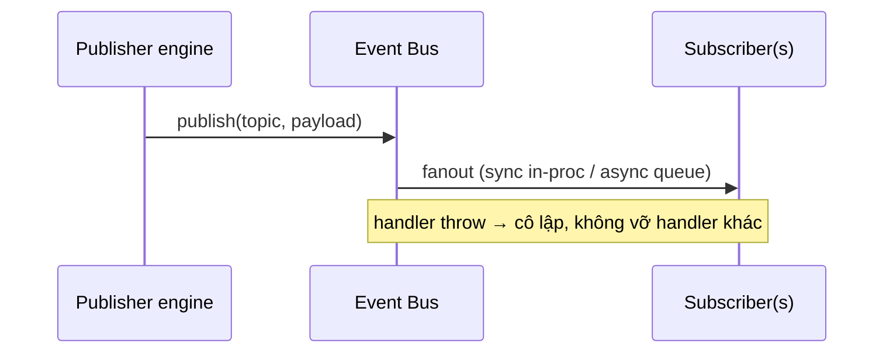

# 05‑12 — Event Bus (L1)

> Đặc tả theo khung 10 mục §8. Pub/sub **nội bộ giữa các engine**. Khác MQTT ngoài (L0) và WS client
> (API hub).

## 1. Mục đích & ranh giới trách nhiệm

Pub/sub nội bộ giữa engine: tag update, alarm transition, audit write, plugin lifecycle, sim step.
Tách rời (decoupling) engine với nhau.

| KHÔNG thuộc engine này | Thuộc về |
|---|---|
| MQTT ngoài | L0 Protocol Gateway |
| WS tới client | API WS Hub |
| Lưu sự kiện | Historian / `event_log` |

## 2. Interface công bố

```typescript
export type EventTopic = 'tag.update' | 'alarm.transition' | 'audit.write' | 'plugin.lifecycle' | 'sim.step';

export interface IEventBus {
  publish<T>(topic: EventTopic, payload: T): void;
  subscribe<T>(topic: EventTopic, handler: (payload: T) => void): () => void;   // trả unsubscribe
  request<Req, Res>(topic: string, req: Req, timeoutMs: number): Promise<Res>;  // req/reply
}
```

## 3. Mô hình dữ liệu nội bộ

| Cấu trúc | Vai trò |
|---|---|
| `handlers: Map<topic, Set<fn>>` | fanout |
| `pending: Map<corrId, resolver>` | req/reply |
| `queue` | async cho topic tải cao (bounded) |

## 4. Luồng xử lý



## 5. Cấu hình (ví dụ)

```yaml
eventBus:
  mode:
    tag.update: async
    alarm.transition: sync
  queueBound: 100000
  overflow: drop-oldest      # topic không tới hạn
```

## 6. Chỉ tiêu phi chức năng

| Chỉ tiêu | Mục tiêu |
|---|---|
| Độ trễ | in‑proc, thấp |
| Thứ tự | giữ theo topic |
| Hàng đợi | bounded |

## 7. Chế độ lỗi & phục hồi

| Sự cố | Hệ quả | Phục hồi |
|---|---|---|
| Handler throw | có thể lan | **cô lập** handler, log |
| Queue tràn | mất event | drop‑oldest (non‑critical) / backpressure (critical) |
| Req/reply timeout | treo | reject sau `timeoutMs` |

## 8. Cách plugin mở rộng

Plugin **không** dùng Event Bus trực tiếp (nội bộ kernel); plugin dùng SDK. 

## 9. Kế hoạch kiểm thử

| Loại | Nội dung |
|---|---|
| Unit | publish/subscribe/unsubscribe; req/reply timeout |
| Load | fanout throughput; hành vi tràn queue |

## 10. Quyết định & phương án đã loại bỏ

| Quyết định | Chọn | Loại bỏ | Lý do |
|---|---|---|---|
| Bus nội bộ | **In‑proc** | Broker ngoài cho nội bộ | Độ trễ thấp; MQTT chỉ cho L0 |
| Topic | **Enum có kiểu** | Chuỗi tự do | An toàn kiểu, tránh sai topic |
| Mẫu | **Pub/sub + req/reply** | Chỉ pub/sub | Một số ca cần phản hồi |
| Lỗi handler | **Cô lập** | Lan lỗi | Một handler hỏng không đổ engine |
