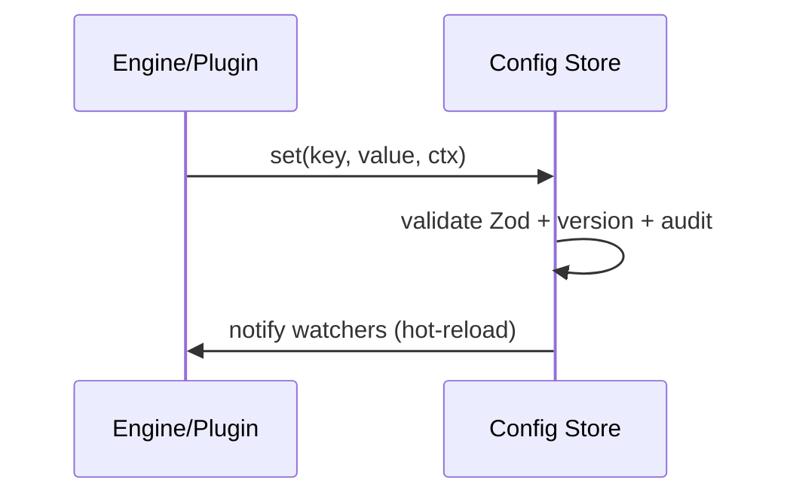

# 05‑13 — Config Store (L1)

> Đặc tả theo khung 10 mục §8. Types: `@idtp/sdk`.

## 1. Mục đích & ranh giới trách nhiệm

Lưu/phục vụ cấu hình kernel + plugin (versioned, validated), cấp config cho engine, **hot‑reload**
khi đổi. **Không** chứa dữ liệu process, **không** quản lý secret (dùng env).

| KHÔNG thuộc engine này | Thuộc về |
|---|---|
| Giá trị process | Tag/Realtime |
| Secret/credential | env / hạ tầng (doc 18) |
| Lưu lịch sử giá trị | Historian |

## 2. Interface công bố

```typescript
export interface IConfigStore {
  get<T>(key: string): T | undefined;
  set<T>(key: string, value: T, ctx: { user: string; ip: string }): { ok: true } | { ok: false; errors: ReadonlyArray<string> };
  watch<T>(key: string, cb: (value: T) => void): () => void;    // hot-reload
  namespace(pluginId: string): IConfigStore;                    // config theo plugin
}
```

## 3. Mô hình dữ liệu nội bộ

| Cấu trúc | Vai trò |
|---|---|
| `values` | key→value (PG‑backed) + cache |
| `schemas` | Zod theo key |
| `versions` | lịch sử thay đổi (audit) |
| `watchers` | callback hot‑reload |

## 4. Luồng xử lý



## 5. Cấu hình (ví dụ)

```yaml
configStore:
  backend: postgres
  versioned: true
  hotReload: true
```

## 6. Chỉ tiêu phi chức năng

| Chỉ tiêu | Mục tiêu |
|---|---|
| get | O(1) (cache) |
| Lan truyền đổi | < 1 s |
| Versioned | có, kèm audit |

## 7. Chế độ lỗi & phục hồi

| Sự cố | Hệ quả | Phục hồi |
|---|---|---|
| Config sai schema | lỗi cấu hình | reject, giữ bản tốt cuối |
| Store down | không đọc mới | phục vụ cache |

## 8. Cách plugin mở rộng

Config plugin nằm dưới `namespace(pluginId)`, validate bằng schema plugin khai báo.

## 9. Kế hoạch kiểm thử

| Loại | Nội dung |
|---|---|
| Unit | get/set/validate; version |
| Integration | watch hot‑reload |

## 10. Quyết định & phương án đã loại bỏ

| Quyết định | Chọn | Loại bỏ | Lý do |
|---|---|---|---|
| Backend | **PostgreSQL** | File cấu hình | Audit + đa instance |
| Kiểu | **Zod theo key** | Không kiểu | Bắt lỗi sớm |
| Áp dụng đổi | **watch hot‑reload** | Restart | Không gián đoạn |
| Phạm vi | **Namespaced theo plugin** | Global phẳng | Cách ly plugin |
