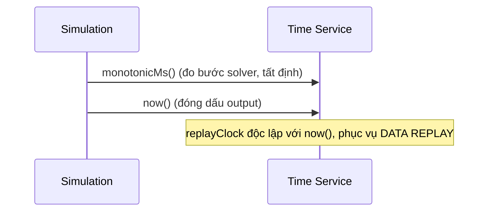

# 05‑14 — Time Service (L1)

> Đặc tả theo khung 10 mục §8. Nguồn thời gian **duy nhất** của hệ. Types: `@idtp/sdk`.

## 1. Mục đích & ranh giới trách nhiệm

Nguồn thời gian duy nhất: `now()` (UTC + offset), đồng hồ **monotonic** cho solver, điều phối **đồng
hồ replay**, đồng bộ NTP.

| KHÔNG thuộc engine này | Thuộc về |
|---|---|
| Lập lịch nghiệp vụ | Report/scheduler |
| Ngữ nghĩa timestamp historian | Historian (dùng service này) |

## 2. Interface công bố

```typescript
import type { Iso8601 } from '@idtp/sdk';

export interface IReplayClock { at(): Iso8601; setSpeed(factor: number): void; seek(ts: Iso8601): void; }
export interface ITimeService {
  now(): Iso8601;                 // UTC + offset (vd 2026-07-24T10:00:00+07:00)
  monotonicMs(): number;          // cho solver — KHÔNG nhảy khi NTP chỉnh
  offset(): string;               // vd +07:00
  replayClock(sessionId: string): IReplayClock;   // độc lập, 0.25×–60×
}
```

## 3. Mô hình dữ liệu nội bộ

| Cấu trúc | Vai trò |
|---|---|
| `wallBase` + NTP | thời gian thực đã đồng bộ |
| `monotonicBase` | mốc monotonic (interval solver) |
| `offset` | múi giờ (UTC+07:00) |
| `replayClocks` | đồng hồ replay theo session |

## 4. Luồng xử lý



## 5. Cấu hình (ví dụ)

```yaml
timeService:
  ntp: [pool.ntp.org]
  offset: "+07:00"
  replay: { minSpeed: 0.25, maxSpeed: 60 }
```

## 6. Chỉ tiêu phi chức năng

| Chỉ tiêu | Mục tiêu |
|---|---|
| Monotonic | không bao giờ giảm |
| Đồng bộ NTP | có |
| Đồng hồ replay | 0,25× → 60× |

## 7. Chế độ lỗi & phục hồi

| Sự cố | Hệ quả | Phục hồi |
|---|---|---|
| Mất NTP | trôi giờ | giữ offset cuối + cảnh báo |
| Clock skew | lệch | dùng `monotonicMs` cho interval |

## 8. Cách plugin mở rộng

`ISimModel` dùng `ctx.now()` (từ Time Service) → tất định, tái lập replay/re‑sim. Không config plugin.

## 9. Kế hoạch kiểm thử

| Loại | Nội dung |
|---|---|
| Unit | monotonic không giảm; offset đúng |
| Integration | đồng hồ replay đồng bộ màn hình |

## 10. Quyết định & phương án đã loại bỏ

| Quyết định | Chọn | Loại bỏ | Lý do |
|---|---|---|---|
| Đồng hồ | **Monotonic tách wall‑clock** | Một `Date.now()` | NTP nhảy không làm hỏng solver |
| Lưu giờ | **UTC + offset** | Local time | Nhất quán audit |
| Replay clock | **Trong Time Service** | Trong Historian | Một nguồn thời gian duy nhất |
