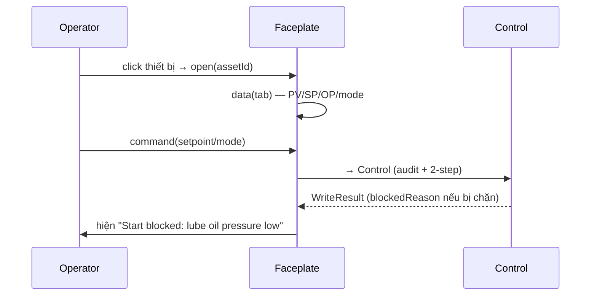

# 05‑15 — Faceplate (L2)

> Đặc tả theo khung 10 mục §8. 4 tab cố định (Phụ lục A §9.5). Types: `@idtp/sdk`.

## 1. Mục đích & ranh giới trách nhiệm

Render popup **faceplate 4 tab** khi click thiết bị (Overview/Trend/Alarm/Detail), hiển thị **lý do
bị chặn**, phát lệnh qua Control/Security.

| KHÔNG thuộc engine này | Thuộc về |
|---|---|
| Nội dung màn hình | Graphics (05‑02) |
| Luật điều khiển | Control (05‑06) |
| Phân quyền lệnh | Security (05‑07) |

## 2. Interface công bố

```typescript
import type { IWriteCommand, WriteResult } from '@idtp/sdk';

export type FaceplateTab = 'Overview' | 'Trend' | 'Alarm' | 'Detail';
export interface FaceplateDef { faceplateId: string; assetId: string; tabs: ReadonlyArray<FaceplateTab>; }

export interface IFaceplateEngine {
  open(assetId: string): FaceplateDef;
  data(faceplateId: string, tab: FaceplateTab): Promise<unknown>;   // PV/SP/OP · trend · alarms · detail
  command(cmd: IWriteCommand): Promise<WriteResult>;                // → Control (audit + 2-step)
  blockedReason(assetId: string): string | null;
}
```

## 3. Mô hình dữ liệu nội bộ

| Cấu trúc | Vai trò |
|---|---|
| `defs: Map<assetId, FaceplateDef>` | từ `faceplates/*.fp.json` |
| tab resolvers | Overview(PV/SP/OP,mode) · Trend(1h/8h/24h) · Alarm(limit) · Detail(KKS, giờ chạy, interlock) |

## 4. Luồng xử lý



## 5. Cấu hình (ví dụ)

```json
{ "faceplateId": "fp-drum-level", "assetId": "PID-001-drum-level",
  "tabs": ["Overview","Trend","Alarm","Detail"] }
```

## 6. Chỉ tiêu phi chức năng

| Chỉ tiêu | Mục tiêu |
|---|---|
| Mở faceplate | < 1 s |
| Trend nhúng | 1h / 8h / 24h |
| Hiện lý do chặn | bắt buộc |

## 7. Chế độ lỗi & phục hồi

| Sự cố | Hệ quả | Phục hồi |
|---|---|---|
| Bad quality | giá trị không tin | báo trên tab Overview |
| Lệnh bị chặn | không thực hiện | hiện `blockedReason` rõ ràng |

## 8. Cách plugin mở rộng

Plugin cung cấp `faceplates/*.fp.json` (+ `ICustomSymbol`). **4 tab cố định**, không đổi.

## 9. Kế hoạch kiểm thử

| Loại | Nội dung |
|---|---|
| Unit | resolve dữ liệu từng tab |
| Integration | lệnh bị chặn → đúng `blockedReason` |
| Visual | Storybook: normal/fault/blocked |

## 10. Quyết định & phương án đã loại bỏ

| Quyết định | Chọn | Loại bỏ | Lý do |
|---|---|---|---|
| Tab | **4 cố định** | Tùy biến số tab | Nhất quán vận hành (§9.5) |
| Định nghĩa | **fp.json khai báo** | Component React | Plugin không chứa code UI |
| Lệnh chặn | **Hiện lý do** | Fail im lặng | Operator biết vì sao |
