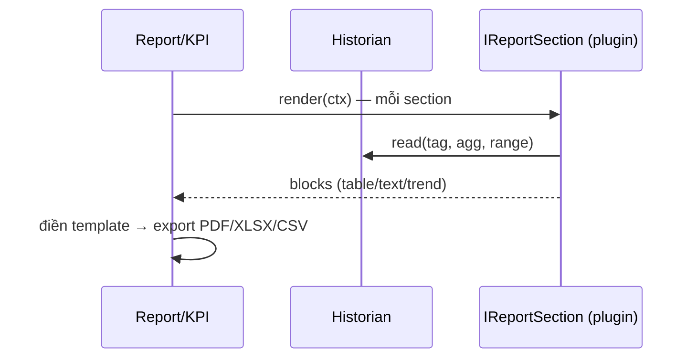

# 05‑17 — Report / KPI (L2)

> Đặc tả theo khung 10 mục §8. v1 = template cố định; designer = v2. Công thức KPI đầy đủ: doc 21.

## 1. Mục đích & ranh giới trách nhiệm

Điền **template báo cáo cố định** từ dữ liệu historian, tính **KPI** (heat rate, aux power,
availability), lập lịch báo cáo ca/ngày, xuất **PDF/Excel/CSV**.

| KHÔNG thuộc engine này | Thuộc về |
|---|---|
| Trình thiết kế report | v2 (Engineering L5) |
| Truy vấn thời gian | Historian (05‑04) |
| Nhận xét tự do | AI (đánh dấu `authoredByAi`) |

## 2. Interface công bố

```typescript
import type { Iso8601, EngineeringUnit } from '@idtp/sdk';

export interface ReportRequest { templateId: string; from: Iso8601; to: Iso8601; format: 'pdf' | 'xlsx' | 'csv'; }
export interface KpiResult { kpiId: string; value: number; unit: EngineeringUnit; }

export interface IReportEngine {
  render(req: ReportRequest): Promise<{ instanceId: string; uri: string }>;
  computeKpi(kpiId: string, from: Iso8601, to: Iso8601): Promise<KpiResult>;
  schedule(templateId: string, cron: string): string;      // báo cáo ca/ngày
  listTemplates(): ReadonlyArray<{ templateId: string; title: { vi: string; en: string } }>;
}
```

## 3. Mô hình dữ liệu nội bộ

| Cấu trúc | Vai trò |
|---|---|
| `templates` | từ plugin `reports/*.rpt.json` + `IReportSection` |
| `kpiCalculators` | `IKpiCalculator` của plugin |
| `report_instance` | báo cáo đã sinh (store) |
| `schedules` | cron ca/ngày |

## 4. Luồng xử lý



## 5. Cấu hình (ví dụ KPI — doc 21)

```yaml
kpi:
  - { kpiId: heat-rate, unit: "kJ/kWh", formula: "fuel_heat_input / net_power" }   # DB ~9.200
  - { kpiId: aux-power, unit: "%",      formula: "aux_power / gross_power * 100" }  # DB ~7%
  - { kpiId: availability, unit: "%",   formula: "running_hours / period_hours * 100" }
```

## 6. Chỉ tiêu phi chức năng

| Chỉ tiêu | Mục tiêu |
|---|---|
| Báo cáo ca/ngày | tự sinh theo lịch |
| Định dạng | PDF · Excel · CSV |
| KPI | tính từ historian, có đơn vị EU |

## 7. Chế độ lỗi & phục hồi

| Sự cố | Hệ quả | Phục hồi |
|---|---|---|
| Thiếu dữ liệu | báo cáo hụt | đánh dấu khoảng trống (gap) |
| Export lỗi | không xuất file | retry/queue |

## 8. Cách plugin mở rộng

Plugin cung cấp `reports/*.rpt.json` + `IReportSection` + `kpi/*.yaml` + `IKpiCalculator`.

## 9. Kế hoạch kiểm thử

| Loại | Nội dung |
|---|---|
| Unit | công thức KPI (heat rate, aux, availability) |
| Integration | render template khứ hồi + export |

## 10. Quyết định & phương án đã loại bỏ

| Quyết định | Chọn | Loại bỏ | Lý do |
|---|---|---|---|
| Template | **Cố định (v1)** | Designer ngay v1 | §14: designer là v2 |
| KPI | **`IKpiCalculator` plugin** | Hardcode trong engine | Generic theo ngành |
| Nhận xét AI | **Đánh dấu `authoredByAi`** | Trộn lẫn text người | §11 minh bạch nguồn |
