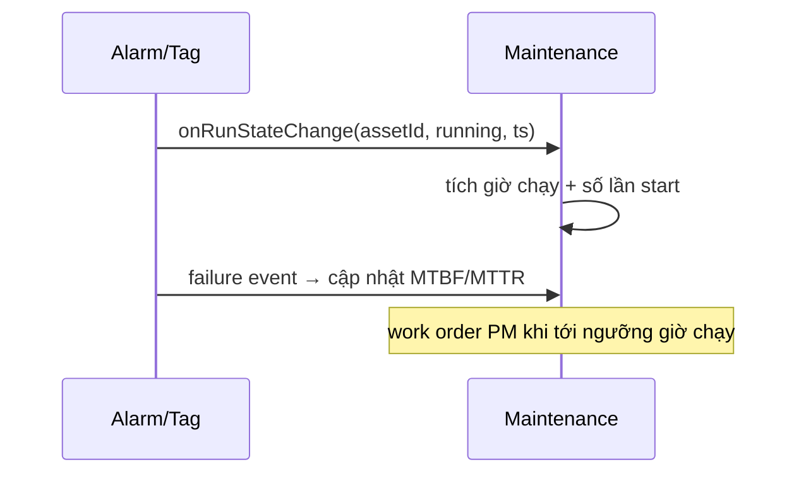

# 05‑18 — Maintenance (L2)

> Đặc tả theo khung 10 mục §8. Liên kết tag↔asset (doc 04). ERP/CMMS thật = ngoài phạm vi v1.

## 1. Mục đích & ranh giới trách nhiệm

Tích **giờ chạy**, đếm **số lần khởi động**, tính **MTBF/MTTR**, quản lý **work order**, liên kết
tag↔asset.

| KHÔNG thuộc engine này | Thuộc về |
|---|---|
| Điều khiển thiết bị | Control (05‑06) |
| Sinh alarm hỏng hóc | Alarm (05‑03) — Maintenance **tiêu thụ** event |
| ERP/CMMS · spare parts | ngoài phạm vi v1 (v3) |

## 2. Interface công bố

```typescript
import type { Iso8601 } from '@idtp/sdk';

export interface EquipmentRuntime { assetId: string; runningHours: number; startCount: number; lastStart?: Iso8601; }
export interface WorkOrder { woId: string; assetId: string; type: 'PM' | 'CM'; status: 'open' | 'in-progress' | 'done'; }

export interface IMaintenanceEngine {
  runtime(assetId: string): EquipmentRuntime;
  onRunStateChange(assetId: string, running: boolean, ts: Iso8601): void;   // tích giờ chạy
  mtbf(assetId: string): number;                                           // từ event hỏng
  createWorkOrder(wo: Omit<WorkOrder, 'woId' | 'status'>, user: string): WorkOrder;
  updateWorkOrder(woId: string, status: WorkOrder['status'], user: string): WorkOrder;
}
```

## 3. Mô hình dữ liệu nội bộ

| Cấu trúc | Vai trò |
|---|---|
| `equipment_runtime` | giờ chạy, số lần start |
| `maintenance_order` | work order (PM/CM) |
| `failureEvents` | từ alarm → tính MTBF/MTTR |

## 4. Luồng xử lý



## 5. Cấu hình (ví dụ)

```yaml
maintenance:
  pmByRunningHours:
    BFP: 4000        # PM mỗi 4000 h chạy [GIẢ ĐỊNH]
    MILL: 2000
```

## 6. Chỉ tiêu phi chức năng

| Chỉ tiêu | Mục tiêu |
|---|---|
| Tích giờ chạy | chính xác theo run‑state |
| MTBF/MTTR | từ lịch sử event |
| Work order | vòng đời open→in‑progress→done + audit |

## 7. Chế độ lỗi & phục hồi

| Sự cố | Hệ quả | Phục hồi |
|---|---|---|
| Thiếu run‑state | giờ chạy sai | ước lượng từ tag (dòng/tốc độ) |
| Xung đột work order | trạng thái lệch | audit + khoá lạc quan |

## 8. Cách plugin mở rộng

Plugin liên kết tag↔asset (doc 04) và đặt ngưỡng PM. Engine generic; không viết code plugin.

## 9. Kế hoạch kiểm thử

| Loại | Nội dung |
|---|---|
| Unit | tích giờ chạy; tính MTBF |
| Integration | run‑state → giờ chạy; tạo/đóng work order có audit |

## 10. Quyết định & phương án đã loại bỏ

| Quyết định | Chọn | Loại bỏ | Lý do |
|---|---|---|---|
| Giờ chạy | **Từ run‑state tag** | Nhập tay | Tự động, chính xác |
| MTBF | **Từ event hỏng** | Ước lượng tĩnh | Dựa dữ liệu thật |
| Work order | **Trong app (v1)** | Tích hợp ERP ngay | ERP/CMMS thật = v3 |
