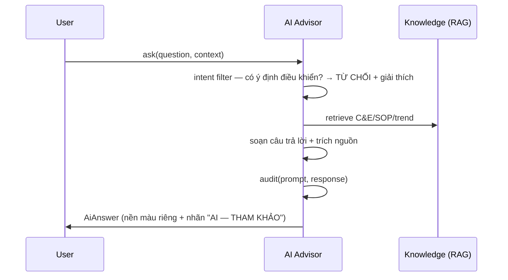

# 05‑19 — AI Advisor (L2, **v2**, read‑only tuyệt đối)

> Đặc tả theo khung 10 mục §8. Chi tiết guardrail + test: doc 20. **v1 chỉ rule‑based diagnostics;
> RAG/AI thật = v2.** Read‑only tuyệt đối (§11).

## 1. Mục đích & ranh giới trách nhiệm

(v2) Advisor **read‑only**: giải thích alarm (RAG trên C&E + SOP + trend), hướng dẫn SOP (trích
nguyên văn), phân tích trend (thống kê), điền nhận xét report (đánh dấu AI).

| CẤM TUYỆT ĐỐI (§11) | Ghi chú |
|---|---|
| Ghi tag / đổi setpoint / ACK / đổi mode / start‑stop | **Không có ngoại lệ, không "chế độ nâng cao"** |
| Sinh số liệu process không có trong historian | — |
| Trả lời không kèm nguồn | mọi câu phải có `docId`/`tagId`/khoảng thời gian |

## 2. Interface công bố

```typescript
import type { IAiKnowledgeSource, TagId, Iso8601 } from '@idtp/sdk';

export interface AiQuery { question: string; context?: { alarmId?: string; tagIds?: ReadonlyArray<TagId>; range?: { from: Iso8601; to: Iso8601 } }; }
export interface AiSource { docId?: string; tagId?: TagId; range?: { from: Iso8601; to: Iso8601 }; }
export interface AiAnswer { text: string; sources: ReadonlyArray<AiSource>; confidence: 'high' | 'medium' | 'insufficient-data'; }

export interface IAiAdvisor {
  registerSource(src: IAiKnowledgeSource): void;
  ask(q: AiQuery, ctx: { user: string }): Promise<AiAnswer>;   // read-only; audit prompt+response
  // KHÔNG có bất kỳ hàm ghi tag/setpoint/ack/mode — theo thiết kế (không phơi ra API ghi)
}
```

## 3. Mô hình dữ liệu nội bộ

| Cấu trúc | Vai trò |
|---|---|
| `knowledgeIndex` | RAG trên SOP/C&E (`IAiKnowledgeSource`) |
| `intentFilter` | chặn ý định điều khiển trước khi xử lý |
| `audit` | prompt + response, giữ ≥ 1 năm |

## 4. Luồng xử lý



## 5. Cấu hình (ví dụ)

```yaml
aiAdvisor:
  provider: pluggable          # Ollama/vLLM local (air-gap) hoặc cloud
  airGap: true
  auditRetentionYears: 1
  refuseControlIntent: true
```

## 6. Chỉ tiêu phi chức năng

| Chỉ tiêu | Mục tiêu |
|---|---|
| Nguồn trích | **bắt buộc** mọi câu trả lời |
| "Không đủ dữ liệu" | câu trả lời **hợp lệ** |
| Audit | prompt+response ≥ 1 năm |
| Hiển thị | nền màu riêng + nhãn "AI — THAM KHẢO, KHÔNG PHẢI LỆNH" |

## 7. Chế độ lỗi & phục hồi

| Sự cố | Hệ quả | Phục hồi |
|---|---|---|
| Không tìm được nguồn | không kết luận | trả `insufficient-data` |
| Phát hiện ý định điều khiển | rủi ro | **từ chối** + giải thích |
| Provider down | không trả lời | degrade, báo rõ |

## 8. Cách plugin mở rộng

Plugin cung cấp `IAiKnowledgeSource` (SOP, C&E). **Không** phơi bày khả năng ghi. Provider cắm‑rút
được (không khoá nhà cung cấp).

## 9. Kế hoạch kiểm thử

| Loại | Nội dung |
|---|---|
| Unit | intent filter chặn ý định điều khiển |
| Integration | câu trả lời trích đúng `docId`/`tagId` |
| Guardrail | ép AI ghi tag → **bị từ chối** (doc 20) |

## 10. Quyết định & phương án đã loại bỏ

| Quyết định | Chọn | Loại bỏ | Lý do |
|---|---|---|---|
| Quyền | **Read‑only tuyệt đối** | Có "chế độ ghi nâng cao" | §11: sai 1 lần mất niềm tin |
| Provider | **Cắm‑rút (air‑gap)** | Khoá 1 nhà cung cấp | Nhà máy không cho ra Internet |
| Nguồn | **Bắt buộc trích** | Trả lời tự do | Chống bịa số liệu process |
| Phiên bản | **v2** | Làm ngay v1 | v1 chỉ rule‑based (CLAUDE.md) |
